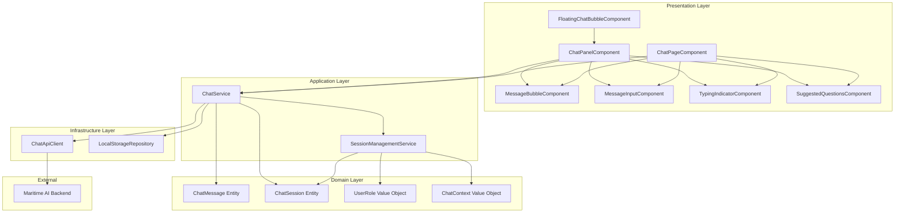

# Design Document: AI Chatbot Integration

## Overview

Tính năng AI Chatbot Integration tích hợp Maritime AI Chatbot vào LMS Hàng Hải với UX/UI lấy cảm hứng từ Notion. Hệ thống bao gồm hai chế độ tương tác chính: Floating Chat Bubble cho quick chat và Chat Page cho trò chuyện chi tiết. Thiết kế tuân thủ kiến trúc DDD của dự án, sử dụng Angular 20 với standalone components, signals, và OnPush change detection.

## Architecture



## Components and Interfaces

### 1. FloatingChatBubbleComponent
Standalone component hiển thị bubble cố định ở góc màn hình.

```typescript
interface FloatingChatBubbleConfig {
  position: 'bottom-right' | 'bottom-left';
  size: 'small' | 'medium' | 'large';
  tooltipText: string;
  iconType: 'ai' | 'chat' | 'custom';
}
```

### 2. ChatPanelComponent
Panel popup chat với kích thước cố định.

```typescript
interface ChatPanelConfig {
  width: number;
  height: number;
  maxHeight: number;
  showHeader: boolean;
  showExpandButton: boolean;
}
```

### 3. ChatPageComponent
Trang chat full-page với sidebar lịch sử.

```typescript
interface ChatPageConfig {
  showSidebar: boolean;
  showSources: boolean;
  enableNewConversation: boolean;
}
```

### 4. ChatService
Service chính quản lý logic chat.

```typescript
interface IChatService {
  // State signals
  messages: Signal<ChatMessage[]>;
  isLoading: Signal<boolean>;
  error: Signal<string | null>;
  suggestedQuestions: Signal<string[]>;
  
  // Methods
  sendMessage(content: string): Promise<void>;
  loadHistory(): Promise<void>;
  clearHistory(): void;
  startNewSession(): void;
  retryLastMessage(): Promise<void>;
}
```

### 5. ChatApiClient
HTTP client giao tiếp với Maritime AI Backend.

```typescript
interface IChatApiClient {
  sendChatMessage(request: ChatRequest): Observable<ChatResponse>;
  checkHealth(): Observable<HealthStatus>;
}

interface ChatRequest {
  user_id: string;
  message: string;
  role: 'student' | 'teacher' | 'admin' | 'guest';
  session_id?: string;
  context?: ChatContext;
}

interface ChatResponse {
  status: 'success' | 'error';
  data: {
    answer: string;
    sources?: MessageSource[];
    suggested_questions?: string[];
  };
  metadata: {
    processing_time: number;
    model: string;
    agent_type: string;
  };
}
```

### 6. SessionManagementService
Service quản lý session và context.

```typescript
interface ISessionManagementService {
  currentSessionId: Signal<string>;
  currentContext: Signal<ChatContext>;
  
  generateSessionId(): string;
  updateContext(context: Partial<ChatContext>): void;
  clearSession(): void;
}
```

## Data Models

### ChatMessage Entity
```typescript
interface ChatMessage {
  id: string;
  content: string;
  sender: 'user' | 'ai';
  timestamp: Date;
  status: 'sending' | 'sent' | 'error';
  metadata?: {
    sources?: MessageSource[];
    processingTime?: number;
  };
}
```

### ChatSession Entity
```typescript
interface ChatSession {
  id: string;
  userId: string;
  messages: ChatMessage[];
  context: ChatContext;
  createdAt: Date;
  updatedAt: Date;
}
```

### ChatContext Value Object
```typescript
interface ChatContext {
  courseId?: string;
  lessonId?: string;
  pageUrl?: string;
  additionalData?: Record<string, unknown>;
}
```

### MessageSource Value Object
```typescript
interface MessageSource {
  title: string;
  content: string;
  url?: string;
}
```

### UserRole Value Object
```typescript
type UserRole = 'student' | 'teacher' | 'admin' | 'guest';
```


## Correctness Properties

*A property is a characteristic or behavior that should hold true across all valid executions of a system-essentially, a formal statement about what the system should do. Properties serve as the bridge between human-readable specifications and machine-verifiable correctness guarantees.*

### Property 1: Role Mapping Consistency
*For any* user with a defined role (student, teacher, admin, or guest), when sending a message, the API request SHALL include the exact role string matching the user's authentication state.
**Validates: Requirements 5.1, 5.2, 5.3, 5.4**

### Property 2: User ID Inclusion
*For any* API request sent by the AI_Chatbot_System, the request SHALL include a non-empty user_id field derived from the authentication service.
**Validates: Requirements 5.5**

### Property 3: Session ID Uniqueness
*For any* two distinct calls to generate a new session, the resulting session_id values SHALL be different.
**Validates: Requirements 6.1**

### Property 4: Message Serialization Round-Trip
*For any* valid ChatMessage object, serializing to JSON and then deserializing back SHALL produce an equivalent ChatMessage with identical id, content, sender, timestamp, and metadata fields.
**Validates: Requirements 8.1, 8.2, 8.3**

### Property 5: Message Deserialization Validation
*For any* JSON string missing required fields (id, content, sender, timestamp), deserialization SHALL throw a validation error or return a failure result.
**Validates: Requirements 8.4**

### Property 6: Message Alignment by Sender
*For any* ChatMessage, if sender is 'user' then alignment SHALL be 'right', and if sender is 'ai' then alignment SHALL be 'left'.
**Validates: Requirements 4.1, 4.2**

### Property 7: Markdown Rendering Correctness
*For any* string containing Markdown syntax (headings, bold, italic, lists, code blocks), the rendered HTML output SHALL contain the corresponding HTML elements (h1-h6, strong, em, ul/ol/li, pre/code).
**Validates: Requirements 2.4, 4.3**

### Property 8: Suggested Questions Rendering
*For any* non-empty array of suggested questions, all questions SHALL be rendered as clickable elements in the UI.
**Validates: Requirements 2.5**

### Property 9: Error State Display
*For any* message with status 'error', the UI SHALL display an error indicator and a retry button.
**Validates: Requirements 2.8, 4.6**

### Property 10: Context Extraction from Route
*For any* route containing course_id parameter, the extracted context SHALL include that course_id. *For any* route containing lesson_id parameter, the extracted context SHALL include that lesson_id.
**Validates: Requirements 6.2, 6.3**

### Property 11: Session Restoration
*For any* stored ChatSession with messages, when the user returns to chat, all stored messages SHALL be restored and displayed in the same order.
**Validates: Requirements 2.2, 3.2, 6.4**

### Property 12: Source Citations Rendering
*For any* API response containing Message_Sources array, all sources SHALL be rendered as expandable citation elements.
**Validates: Requirements 3.4**

## Error Handling

### API Errors
| Error Code | Handling Strategy |
|------------|-------------------|
| 400 (Validation) | Display field-specific error message, highlight invalid input |
| 401 (Unauthorized) | Redirect to login, clear session |
| 429 (Rate Limited) | Display rate limit message with retry countdown |
| 500 (Server Error) | Display generic error with retry button |
| Timeout | Display timeout message with retry button |
| Network Error | Display offline message, queue message for retry |

### Cold Start Handling
```typescript
// Detect cold start by measuring first response time
if (responseTime > 10000 && isFirstRequest) {
  showWarmUpMessage();
}
```

### Graceful Degradation
- If health check fails: Show "Service temporarily unavailable" with estimated recovery
- If localStorage unavailable: Disable session persistence, continue with in-memory storage
- If Markdown rendering fails: Display raw text as fallback

## Testing Strategy

### Property-Based Testing Library
Sử dụng **fast-check** cho property-based testing trong TypeScript/Angular environment.

### Unit Tests
- ChatService: Test sendMessage, loadHistory, clearHistory methods
- SessionManagementService: Test generateSessionId, updateContext methods
- ChatApiClient: Test request/response handling with mocked HTTP
- Markdown rendering: Test specific markdown patterns

### Property-Based Tests
Mỗi correctness property sẽ được implement bằng một property-based test:

```typescript
// Example: Property 4 - Message Serialization Round-Trip
// **Feature: ai-chatbot-integration, Property 4: Message Serialization Round-Trip**
fc.assert(
  fc.property(
    chatMessageArbitrary,
    (message: ChatMessage) => {
      const serialized = JSON.stringify(message);
      const deserialized = JSON.parse(serialized) as ChatMessage;
      return (
        deserialized.id === message.id &&
        deserialized.content === message.content &&
        deserialized.sender === message.sender &&
        new Date(deserialized.timestamp).getTime() === message.timestamp.getTime()
      );
    }
  ),
  { numRuns: 100 }
);
```

### Integration Tests
- End-to-end chat flow: Send message → Receive response → Display in UI
- Session persistence: Create session → Close app → Reopen → Verify restoration
- Context extraction: Navigate to course → Open chat → Verify context includes course_id

### Test Data Generators (Arbitraries)
```typescript
// ChatMessage arbitrary
const chatMessageArbitrary = fc.record({
  id: fc.uuid(),
  content: fc.string({ minLength: 1, maxLength: 10000 }),
  sender: fc.constantFrom('user', 'ai'),
  timestamp: fc.date(),
  status: fc.constantFrom('sending', 'sent', 'error'),
  metadata: fc.option(fc.record({
    sources: fc.array(messageSourceArbitrary),
    processingTime: fc.float({ min: 0, max: 60 })
  }))
});

// UserRole arbitrary
const userRoleArbitrary = fc.constantFrom('student', 'teacher', 'admin', 'guest');

// ChatContext arbitrary
const chatContextArbitrary = fc.record({
  courseId: fc.option(fc.uuid()),
  lessonId: fc.option(fc.uuid()),
  pageUrl: fc.option(fc.webUrl())
});
```

## File Structure

```
fe/src/app/features/ai-chat/
├── domain/
│   ├── entities/
│   │   ├── chat-message.entity.ts
│   │   └── chat-session.entity.ts
│   ├── value-objects/
│   │   ├── chat-context.vo.ts
│   │   ├── message-source.vo.ts
│   │   └── user-role.vo.ts
│   └── types.ts
├── application/
│   └── services/
│       ├── chat.service.ts
│       └── session-management.service.ts
├── infrastructure/
│   ├── api/
│   │   └── chat-api.client.ts
│   └── repositories/
│       └── chat-storage.repository.ts
├── presentation/
│   ├── components/
│   │   ├── floating-chat-bubble/
│   │   │   └── floating-chat-bubble.component.ts
│   │   ├── chat-panel/
│   │   │   └── chat-panel.component.ts
│   │   ├── chat-message/
│   │   │   └── chat-message.component.ts
│   │   ├── message-input/
│   │   │   └── chat-message-input.component.ts
│   │   ├── typing-indicator/
│   │   │   └── typing-indicator.component.ts
│   │   ├── suggested-questions/
│   │   │   └── suggested-questions.component.ts
│   │   └── source-citation/
│   │       └── source-citation.component.ts
│   └── pages/
│       └── chat-page/
│           └── chat-page.component.ts
├── utils/
│   ├── markdown-renderer.util.ts
│   ├── message-serializer.util.ts
│   └── context-extractor.util.ts
└── ai-chat.routes.ts
```
