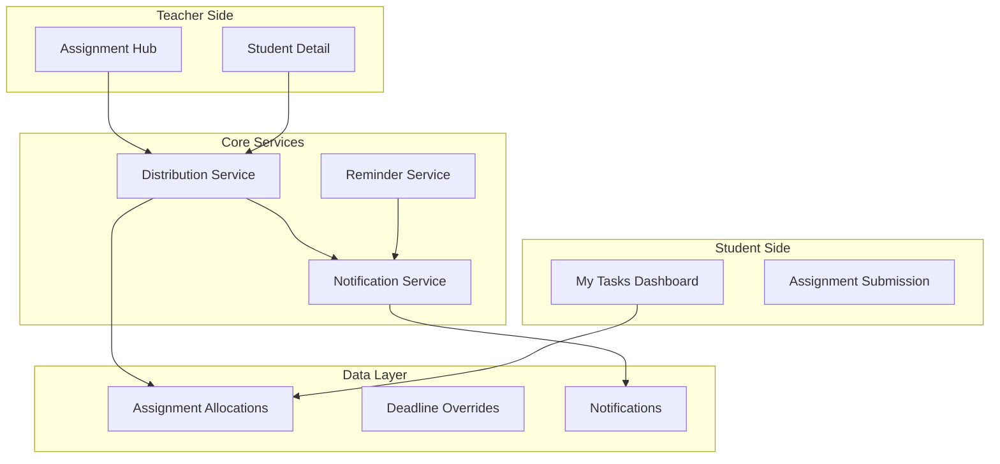
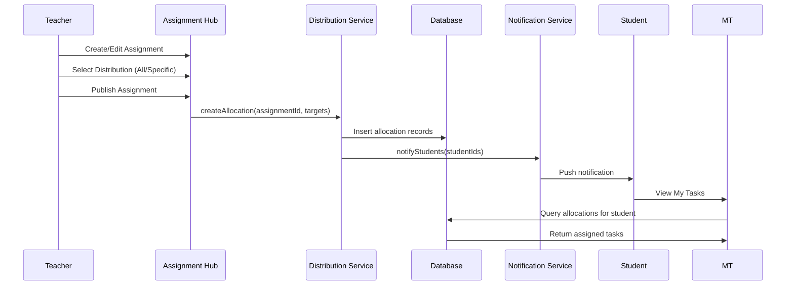

# Design Document: Assignment Distribution System

## Overview

Hệ thống Giao Bài tập (Assignment Distribution) cho LMS Maritime. Hệ thống được thiết kế theo mô hình Hybrid đơn giản hóa theo tư vấn của chuyên gia:

- **Logic đơn giản:** 1 Course - 1 Teacher - Many Students
- **Mặc định:** 1 Assignment → All Students
- **Nâng cao:** 1 Assignment → List of Student IDs

Thiết kế sử dụng Angular 20 với Signals, tích hợp với Assignment Hub hiện có.

## Architecture

### High-Level Architecture



### Distribution Flow



## Components and Interfaces

### 1. Teacher Components

#### AssignmentDistributionSelector (New)
- **Purpose**: UI component để chọn đối tượng giao bài
- **Location**: `fe/src/app/features/teacher/assignment-hub/components/distribution-selector.component.ts`
- **Features**:
  - Radio buttons: "All Students" / "Specific Students"
  - Multi-select dropdown với search cho specific students
  - Preview số lượng học viên được chọn

#### StudentIndividualAssignments (New)
- **Purpose**: Tab hiển thị bài tập riêng của học viên
- **Location**: `fe/src/app/features/teacher/students/student-assignments.component.ts`
- **Features**:
  - Danh sách bài tập đã giao cho học viên
  - Nút "Assign Task" để giao thêm
  - Modal chọn bài tập từ thư viện

#### DeadlineOverrideModal (New)
- **Purpose**: Modal gia hạn deadline cho học viên
- **Location**: `fe/src/app/features/teacher/assignment-hub/components/deadline-override-modal.component.ts`
- **Features**:
  - Date picker cho deadline mới
  - Textarea cho lý do gia hạn
  - Validation và confirmation

### 2. Student Components

#### MyTasksDashboard (New)
- **Purpose**: Dashboard hiển thị tất cả bài tập được giao
- **Location**: `fe/src/app/features/student/my-tasks/my-tasks-dashboard.component.ts`
- **Features**:
  - Kanban-style view: To Do | In Progress | Completed
  - Filter by course, status
  - Sort by due date
  - Quick navigation to submission

#### TaskCard (New)
- **Purpose**: Card hiển thị thông tin một task
- **Location**: `fe/src/app/features/student/my-tasks/task-card.component.ts`
- **Features**:
  - Assignment title, course name
  - Due date với countdown
  - Status badge (Pending, Submitted, Graded, Overdue)
  - Click to navigate

### 3. Shared Services

#### DistributionService (New)
- **Purpose**: Quản lý logic giao bài tập
- **Location**: `fe/src/app/core/services/distribution.service.ts`
- **Features**:
  - createAllocation() - Tạo allocation mới
  - getStudentTasks() - Lấy danh sách task của student
  - extendDeadline() - Gia hạn deadline
  - getAllocatedStudents() - Lấy danh sách học viên được giao

#### NotificationService (Enhanced)
- **Purpose**: Quản lý notifications
- **Location**: `fe/src/app/core/services/notification.service.ts`
- **Features**:
  - sendAssignmentNotification()
  - sendReminderNotification()
  - sendGradeNotification()
  - markAsRead()

## Data Models

### Allocation Models

```typescript
// Distribution type
type DistributionType = 'ALL_STUDENTS' | 'SPECIFIC_STUDENTS';

// Assignment Allocation (Simplified)
// IMPORTANT: Expert Note on Dynamic vs Static Logic
// - ALL_STUDENTS: studentIds = null, query dynamically at runtime
// - SPECIFIC_STUDENTS: studentIds = explicit list
// This ensures newly enrolled students automatically see assignments
interface AssignmentAllocation {
  id: string;
  assignmentId: string;
  courseId: string;
  distributionType: DistributionType;
  
  // Only used when distributionType = 'SPECIFIC_STUDENTS'
  // When ALL_STUDENTS, this is null - system queries enrolled students dynamically
  studentIds: string[] | null;
  
  // For individual assignments (remedial/supplementary)
  isIndividual?: boolean;
  
  // Metadata
  createdAt: string;
  createdBy: string;
}

// Query logic for student tasks (pseudo-code from expert):
// IF (Allocation.type == 'ALL' AND Student IN Course) 
// OR (Allocation.type == 'SPECIFIC' AND StudentID IN Allocation.list)
// THEN Show Task

// Deadline Override
interface DeadlineOverride {
  id: string;
  assignmentId: string;
  studentId: string;
  originalDeadline: string;
  newDeadline: string;
  reason: string;
  createdAt: string;
  createdBy: string;
}

// Student Task View (What student sees)
interface StudentTask {
  assignmentId: string;
  assignmentTitle: string;
  courseId: string;
  courseTitle: string;
  dueDate: string;
  personalDeadline?: string; // If override exists
  status: TaskStatus;
  submissionId?: string;
  grade?: number;
  maxScore: number;
  isOverdue: boolean;
}

type TaskStatus = 'NOT_STARTED' | 'IN_PROGRESS' | 'SUBMITTED' | 'GRADED' | 'OVERDUE';
```

### Notification Models

```typescript
interface Notification {
  id: string;
  userId: string;
  type: NotificationType;
  title: string;
  message: string;
  data: {
    assignmentId?: string;
    courseId?: string;
    submissionId?: string;
  };
  isRead: boolean;
  createdAt: string;
}

type NotificationType = 
  | 'ASSIGNMENT_PUBLISHED'
  | 'DEADLINE_REMINDER'
  | 'DEADLINE_EXTENDED'
  | 'SUBMISSION_GRADED'
  | 'ASSIGNMENT_OVERDUE';
```

### API DTOs

```typescript
// Create allocation request
interface CreateAllocationRequest {
  assignmentId: string;
  distributionType: DistributionType;
  studentIds?: string[]; // Required if SPECIFIC_STUDENTS
}

// Extend deadline request
interface ExtendDeadlineRequest {
  assignmentId: string;
  studentId: string;
  newDeadline: string;
  reason: string;
}

// Student tasks query params
interface StudentTasksParams {
  status?: TaskStatus;
  courseId?: string;
  sortBy?: 'dueDate' | 'courseName' | 'status';
  sortOrder?: 'asc' | 'desc';
}
```

## Correctness Properties

*A property is a characteristic or behavior that should hold true across all valid executions of a system-essentially, a formal statement about what the system should do. Properties serve as the bridge between human-readable specifications and machine-verifiable correctness guarantees.*

### Property 1: All Students Distribution Completeness
*For any* assignment with distributionType='ALL_STUDENTS', all currently enrolled students in the course SHALL appear in the allocated students list.
**Validates: Requirements 1.2, 6.3**

### Property 2: Specific Students Distribution Accuracy
*For any* assignment with distributionType='SPECIFIC_STUDENTS', only the explicitly specified studentIds SHALL appear in the allocated students list.
**Validates: Requirements 1.3, 6.4**

### Property 3: Deadline Override Priority
*For any* student with a deadline override, the personalDeadline SHALL be used instead of the original dueDate for all deadline-related calculations.
**Validates: Requirements 4.4**

### Property 4: Task Status Consistency
*For any* student task, the status SHALL accurately reflect the submission state: NOT_STARTED if no submission, SUBMITTED if submitted, GRADED if graded, OVERDUE if past deadline without submission.
**Validates: Requirements 3.2, 3.3**

### Property 5: Task Sort Order
*For any* list of student tasks sorted by due date, tasks SHALL be ordered with nearest deadline first (ascending order).
**Validates: Requirements 3.6**

### Property 6: Reminder Timing Accuracy
*For any* assignment with deadline D, reminders SHALL be sent at D-3 days, D-1 day, and D+0 (overdue) for students without submissions.
**Validates: Requirements 5.1, 5.2, 5.3**

### Property 7: Override Audit Trail Completeness
*For any* deadline override, the audit log SHALL contain teacher ID, student ID, original deadline, new deadline, reason, and timestamp.
**Validates: Requirements 4.5**

### Property 8: Notification Delivery Guarantee
*For any* published assignment, all allocated students SHALL receive exactly one ASSIGNMENT_PUBLISHED notification.
**Validates: Requirements 1.5, 7.1**

## Error Handling

### API Error Handling
- 400 Bad Request: Invalid distribution type or missing studentIds
- 403 Forbidden: Teacher not authorized for course
- 404 Not Found: Assignment or student not found
- 409 Conflict: Duplicate allocation attempt

### Validation Error Handling
- Empty studentIds when SPECIFIC_STUDENTS selected
- Invalid date for deadline override (past date)
- Missing reason for deadline extension

### State Error Handling
- Optimistic updates with rollback on failure
- Loading states for all async operations
- Empty states with helpful messages

## Testing Strategy

### Unit Testing Framework
- **Framework**: Jasmine + Karma (Angular default)
- **Coverage Target**: 80% for services and utilities

### Property-Based Testing Framework
- **Framework**: fast-check
- **Configuration**: Minimum 100 iterations per property test
- **Location**: `*.property.spec.ts` files alongside source files

### Test Categories

#### Unit Tests
- Distribution service methods
- Task status calculation
- Deadline override logic
- Notification creation

#### Property-Based Tests
- **Feature: assignment-distribution, Property 1: All Students Distribution Completeness**
- **Feature: assignment-distribution, Property 2: Specific Students Distribution Accuracy**
- **Feature: assignment-distribution, Property 3: Deadline Override Priority**
- **Feature: assignment-distribution, Property 4: Task Status Consistency**
- **Feature: assignment-distribution, Property 5: Task Sort Order**
- **Feature: assignment-distribution, Property 6: Reminder Timing Accuracy**
- **Feature: assignment-distribution, Property 7: Override Audit Trail Completeness**
- **Feature: assignment-distribution, Property 8: Notification Delivery Guarantee**

### Test File Structure
```
fe/src/app/
├── core/services/
│   ├── distribution.service.ts
│   ├── distribution.service.spec.ts
│   └── distribution.service.property.spec.ts
├── features/
│   ├── teacher/
│   │   └── assignment-hub/
│   │       └── utils/
│   │           ├── allocation-utils.ts
│   │           └── allocation-utils.property.spec.ts
│   └── student/
│       └── my-tasks/
│           └── utils/
│               ├── task-utils.ts
│               └── task-utils.property.spec.ts
```

