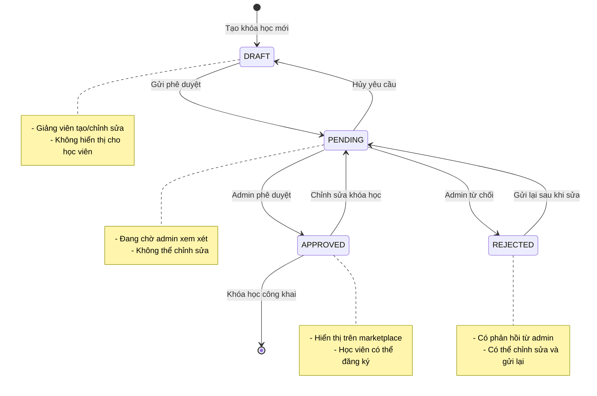

# Course Approval Workflow - Complete Documentation

## 📋 Tổng quan

Hệ thống quy trình phê duyệt khóa học cho phép quản lý chất lượng nội dung trước khi công bố cho học viên. Tất cả khóa học mới được tạo ở trạng thái DRAFT và cần được admin phê duyệt trước khi hiển thị trên marketplace.

**Trạng thái**: ✅ 95% Complete (Frontend & Backend Done)  
**Ngày cập nhật**: 01/12/2024

---

## 🔄 Workflow Diagram



---

## 🎯 Trạng thái Khóa học

| Trạng thái | Mô tả | Ai có thể thao tác | Hiển thị cho học viên |
|-----------|-------|-------------------|---------------------|
| **DRAFT** | Khóa học đang được tạo/chỉnh sửa | Teacher (owner) | ❌ Không |
| **PENDING** | Đang chờ admin xem xét | Admin only | ❌ Không |
| **APPROVED** | Đã được phê duyệt | Teacher (view), Admin | ✅ Có |
| **REJECTED** | Bị từ chối với phản hồi | Teacher (edit), Admin | ❌ Không |

---

## 📚 Tài liệu

### Cho Developers

1. **[API Documentation](./API_DOCUMENTATION.md)** 🔌
   - Tất cả API endpoints
   - Request/Response examples
   - Status codes và error handling
   - Postman collection

2. **[Design Document](./design.md)** 🎨
   - Architecture overview
   - Component design
   - Data models
   - Correctness properties
   - Testing strategy

3. **[Requirements](./requirements.md)** 📋
   - User stories
   - Acceptance criteria
   - Business rules

4. **[Tasks](./tasks.md)** ✅
   - Implementation checklist
   - Task status tracking
   - Dependencies

### Cho Users

5. **[Teacher User Guide](./TEACHER_USER_GUIDE.md)** 👨‍🏫
   - Hướng dẫn sử dụng cho giảng viên
   - Quy trình tạo và gửi khóa học
   - Xử lý phản hồi từ admin
   - FAQ và troubleshooting

6. **[Admin User Guide](./ADMIN_USER_GUIDE.md)** 👨‍💼
   - Hướng dẫn sử dụng cho quản trị viên
   - Quy trình phê duyệt khóa học
   - Checklist đánh giá
   - Best practices

### Báo cáo Tiến độ

7. **[Session Summary](./SESSION_SUMMARY.md)** 📊
   - Tổng kết công việc đã hoàn thành
   - Các task còn lại
   - Technical notes

8. **[Current Session Work](./CURRENT_SESSION_WORK.md)** 📝
   - Chi tiết công việc session hiện tại
   - Files modified
   - Testing recommendations

---

## 🚀 Quick Start

### Cho Giảng viên

1. **Tạo khóa học mới**
   ```
   Khóa học của tôi → Tạo khóa học mới → Điền thông tin
   ```

2. **Xây dựng nội dung**
   ```
   Thêm chương → Thêm bài học → Cấu hình chi tiết
   ```

3. **Gửi phê duyệt**
   ```
   Khóa học của tôi → Chọn khóa học → Gửi duyệt
   ```

4. **Chờ phản hồi**
   - ✅ Được duyệt: Khóa học công khai
   - ❌ Bị từ chối: Xem phản hồi → Sửa → Gửi lại

### Cho Admin

1. **Xem danh sách chờ duyệt**
   ```
   Admin → Duyệt khóa học → Xem danh sách PENDING
   ```

2. **Xem xét khóa học**
   ```
   Xem chi tiết → Đánh giá theo checklist
   ```

3. **Ra quyết định**
   - ✅ Phê duyệt: Click "Duyệt khóa học"
   - ❌ Từ chối: Click "Từ chối" → Nhập lý do chi tiết

---

## 🔧 Technical Stack

### Backend
- **Framework**: Spring Boot 3.x
- **Database**: PostgreSQL
- **Migration**: Flyway
- **API**: RESTful

### Frontend
- **Framework**: Angular 17+
- **State Management**: Signals
- **Styling**: Tailwind CSS
- **HTTP Client**: Angular HttpClient

---

## 📊 Implementation Status

### ✅ Completed (95%)

#### Backend (100%)
- [x] Course status enum (DRAFT, PENDING, APPROVED, REJECTED)
- [x] Status transition logic in CourseService
- [x] Admin review methods in AdminService
- [x] Teacher API endpoints (submit, cancel, review-status)
- [x] Admin API endpoints (pending, approve, reject, all courses)
- [x] Course visibility logic
- [x] DTOs (CourseReviewRequest, CourseReviewStatus, PendingCourseDTO)
- [x] Database migration V3 (review fields)

#### Frontend (100%)
- [x] Teacher course management UI (status badges, buttons)
- [x] Teacher course editor (status checks, warnings)
- [x] Admin course review dashboard (table, search, filter)
- [x] Admin course management updates (status column, filters)
- [x] API service methods (teacher + admin)
- [x] Course detail modal
- [x] Approve/Reject modals
- [x] Pagination

### 🔄 Remaining (5%)

#### Documentation (In Progress)
- [x] API documentation
- [x] User guides (Teacher + Admin)
- [x] README with workflow diagram
- [ ] Postman collection update
- [ ] Video tutorials (optional)

#### Testing (Pending)
- [ ] Manual end-to-end testing
- [ ] Edge case testing
- [ ] Performance testing
- [ ] Bug fixes

---

## 🧪 Testing Checklist

### Teacher Workflow
- [ ] Create new course (should be DRAFT)
- [ ] Submit for approval (DRAFT → PENDING)
- [ ] Cancel approval request (PENDING → DRAFT)
- [ ] View rejection feedback
- [ ] Edit and resubmit rejected course
- [ ] Edit approved course (should warn about re-approval)

### Admin Workflow
- [ ] View pending courses list
- [ ] Search and filter courses
- [ ] View course details
- [ ] Approve course (PENDING → APPROVED)
- [ ] Reject course with comment (PENDING → REJECTED)
- [ ] Verify rejection comment is required

### Student Visibility
- [ ] DRAFT courses not visible
- [ ] PENDING courses not visible
- [ ] APPROVED courses visible
- [ ] REJECTED courses not visible
- [ ] Cannot enroll in non-APPROVED courses

---

## 🐛 Known Issues

None currently. Report issues to: support@lms-maritime.com

---

## 📞 Support

**Technical Support**:
- 📧 Email: tech-support@lms-maritime.com
- 📞 Hotline: 1900-xxxx
- 💬 Chat: Available in-app

**Documentation**:
- 📖 API Docs: [API_DOCUMENTATION.md](./API_DOCUMENTATION.md)
- 👨‍🏫 Teacher Guide: [TEACHER_USER_GUIDE.md](./TEACHER_USER_GUIDE.md)
- 👨‍💼 Admin Guide: [ADMIN_USER_GUIDE.md](./ADMIN_USER_GUIDE.md)

---

## 🔄 Version History

### Version 1.0.0 (2024-12-01)
- ✅ Initial release
- ✅ Complete backend implementation
- ✅ Complete frontend implementation
- ✅ Documentation completed
- 🔄 Testing in progress

---

## 👥 Contributors

- **Backend Team**: Course approval workflow implementation
- **Frontend Team**: UI/UX implementation
- **QA Team**: Testing and validation
- **Documentation Team**: User guides and API docs

---

## 📄 License

Internal use only - LMS Maritime Platform

---

**Last Updated**: December 1, 2024  
**Maintained by**: LMS Maritime Development Team
