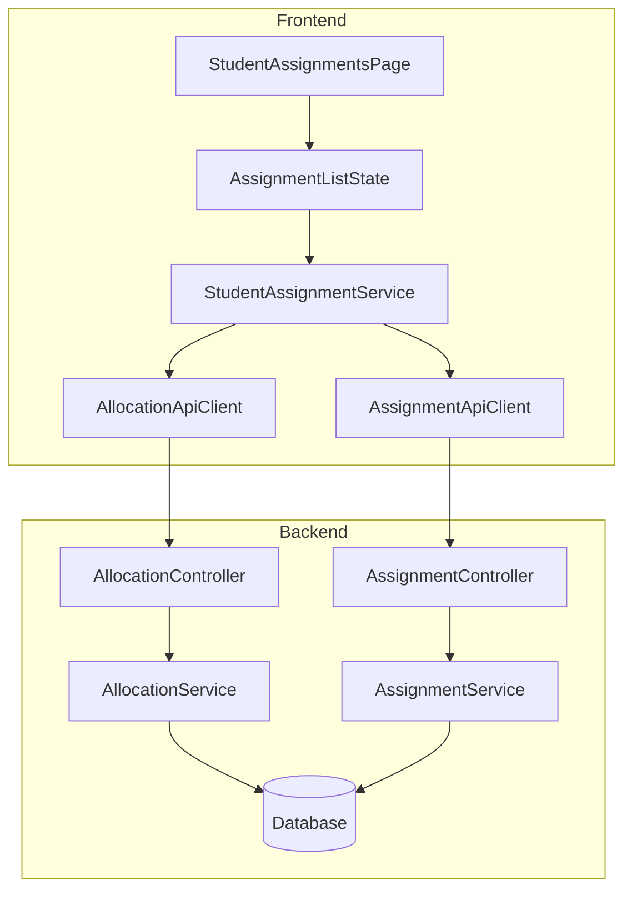
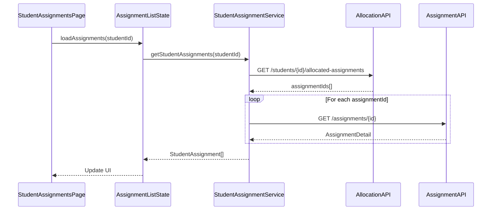

# Design Document: Student Assignments Integration

## Overview

Tài liệu này mô tả thiết kế kỹ thuật cho việc tích hợp và hợp nhất trang bài tập của học viên. Mục tiêu là tạo một trang duy nhất `/student/assignments` với UX chuyên nghiệp như Coursera/Canvas, kết nối với API thực và xóa bỏ mock data.

## Architecture

### High-Level Architecture



### Data Flow



## Components and Interfaces

### 1. StudentAssignmentService

Service mới để lấy bài tập được giao cho học viên từ API thực.

```typescript
interface StudentAssignmentService {
  // Lấy tất cả bài tập được giao cho học viên
  getStudentAssignments(studentId: string, courseId?: string): Observable<StudentAssignment[]>;
  
  // Lấy chi tiết một bài tập
  getAssignmentDetail(assignmentId: string): Observable<AssignmentDetail>;
  
  // Lấy submission của học viên cho một bài tập
  getMySubmission(assignmentId: string): Observable<SubmissionDetail | null>;
}
```

### 2. AllocationApiClient

API client để gọi Allocation endpoints.

```typescript
interface AllocationApiClient {
  // Lấy danh sách assignment IDs được giao cho học viên
  getStudentAllocatedAssignments(studentId: string, courseId: string): Observable<string[]>;
  
  // Lấy thông tin allocation của một assignment
  getAllocation(assignmentId: string): Observable<AllocationResponse>;
}
```

### 3. StudentAssignmentsPageComponent

Component chính hiển thị danh sách bài tập với nhiều chế độ xem.

```typescript
interface StudentAssignmentsPageComponent {
  // State
  assignments: Signal<StudentAssignment[]>;
  loading: Signal<boolean>;
  error: Signal<string | null>;
  viewMode: Signal<'kanban' | 'list'>;
  
  // Filters
  selectedCourse: string;
  selectedStatus: TaskStatus | '';
  searchQuery: string;
  
  // Computed
  filteredAssignments: Signal<StudentAssignment[]>;
  groupedByStatus: Signal<GroupedAssignments>;
  stats: Signal<AssignmentStats>;
  
  // Methods
  loadAssignments(): void;
  onFilterChange(): void;
  toggleViewMode(): void;
  navigateToAssignment(id: string): void;
}
```

## Data Models

### StudentAssignment

```typescript
interface StudentAssignment {
  assignmentId: string;
  assignmentTitle: string;
  description: string;
  courseId: string;
  courseTitle: string;
  instructorName: string;
  
  // Deadline
  dueDate: string;           // ISO date string
  personalDeadline?: string; // Deadline riêng nếu được gia hạn
  
  // Status
  status: TaskStatus;
  isOverdue: boolean;
  daysUntilDue: number;
  
  // Submission
  submissionId?: string;
  submittedAt?: string;
  
  // Grading
  grade?: number;
  maxScore: number;
  feedback?: string;
  
  // Flags
  isIndividual: boolean;     // Bài tập giao riêng
}

type TaskStatus = 'NOT_STARTED' | 'IN_PROGRESS' | 'SUBMITTED' | 'GRADED' | 'OVERDUE';
```

### GroupedAssignments

```typescript
interface GroupedAssignments {
  toDo: StudentAssignment[];      // NOT_STARTED + OVERDUE
  inProgress: StudentAssignment[]; // IN_PROGRESS
  completed: StudentAssignment[];  // SUBMITTED + GRADED
}
```

### AssignmentStats

```typescript
interface AssignmentStats {
  total: number;
  toDo: number;
  inProgress: number;
  completed: number;
  overdue: number;
}
```

## Correctness Properties

*A property is a characteristic or behavior that should hold true across all valid executions of a system-essentially, a formal statement about what the system should do. Properties serve as the bridge between human-readable specifications and machine-verifiable correctness guarantees.*

### Property 1: API call count matches assignment IDs
*For any* list of assignment IDs returned from allocation API, the number of detail API calls SHALL equal the number of IDs.
**Validates: Requirements 2.2**

### Property 2: Assignment display completeness
*For any* assignment data from API, the rendered output SHALL contain: title, description, courseName, dueDate, and status.
**Validates: Requirements 2.3**

### Property 3: Kanban grouping integrity
*For any* list of assignments, when displayed in Kanban view, the sum of items in all columns (toDo + inProgress + completed) SHALL equal the total number of assignments.
**Validates: Requirements 3.1**

### Property 4: View preference round-trip
*For any* view mode selection, saving to localStorage then reading back SHALL return the same view mode.
**Validates: Requirements 3.3, 3.4**

### Property 5: Status badge mapping
*For any* assignment status, the badge text and CSS class SHALL match the predefined mapping:
- NOT_STARTED → "Chưa bắt đầu", gray
- IN_PROGRESS → "Đang làm", blue
- SUBMITTED → "Đã nộp", yellow
- GRADED → "Đã chấm", green
- OVERDUE → "Quá hạn", red
**Validates: Requirements 4.1, 4.2, 4.3, 4.4, 4.5**

### Property 6: Deadline formatting
*For any* valid date, the formatted output SHALL follow Vietnamese format (dd/MM/yyyy HH:mm).
**Validates: Requirements 5.1**

### Property 7: Personal deadline indicator
*For any* assignment with personalDeadline set, the rendered output SHALL contain "(Gia hạn)" label.
**Validates: Requirements 5.2**

### Property 8: Deadline urgency styling
*For any* deadline:
- If daysUntilDue is between 0 and 3 → warning (orange) class
- If daysUntilDue < 0 → danger (red) class
**Validates: Requirements 5.3, 5.4**

### Property 9: Filter correctness
*For any* filter criteria (courseId, status, searchQuery), all displayed assignments SHALL satisfy the filter condition.
**Validates: Requirements 6.1, 6.2, 6.3**

### Property 10: Stats calculation
*For any* list of assignments, the stats SHALL be calculated correctly:
- total = assignments.length
- toDo = count where status is NOT_STARTED
- inProgress = count where status is IN_PROGRESS
- completed = count where status is SUBMITTED or GRADED
- overdue = count where isOverdue is true
**Validates: Requirements 7.1**

## Error Handling

### API Errors

1. **Network Error**: Hiển thị toast "Không thể kết nối server" với nút "Thử lại"
2. **401 Unauthorized**: Redirect về trang login
3. **404 Not Found**: Hiển thị empty state "Không tìm thấy bài tập"
4. **500 Server Error**: Hiển thị toast "Lỗi server, vui lòng thử lại sau"

### Empty States

1. **No assignments**: "Bạn chưa được giao bài tập nào. Hãy liên hệ giảng viên để được hỗ trợ."
2. **No results after filter**: "Không tìm thấy bài tập phù hợp với bộ lọc. Thử xóa bộ lọc để xem tất cả."

## Testing Strategy

### Unit Testing Framework
- **Framework**: Jasmine + Karma (Angular default)
- **Property-Based Testing**: fast-check library

### Unit Tests

1. **StudentAssignmentService**
   - Test API calls are made correctly
   - Test error handling
   - Test data transformation

2. **Utility Functions**
   - Test `groupTasksByStatus()`
   - Test `filterTasks()`
   - Test `calculateStats()`
   - Test `formatDeadline()`
   - Test `getStatusBadge()`

### Property-Based Tests

Each correctness property MUST be implemented as a property-based test using fast-check:

```typescript
// Example: Property 3 - Kanban grouping integrity
// **Feature: student-assignments-integration, Property 3: Kanban grouping integrity**
fc.assert(
  fc.property(
    fc.array(arbitraryStudentAssignment),
    (assignments) => {
      const grouped = groupTasksByStatus(assignments);
      const totalGrouped = grouped.toDo.length + grouped.inProgress.length + grouped.completed.length;
      return totalGrouped === assignments.length;
    }
  ),
  { numRuns: 100 }
);
```

### Integration Tests

1. Test full flow: Load page → API calls → Display data
2. Test filter interactions
3. Test view mode switching
4. Test navigation to assignment detail

### Test Configuration

- Property-based tests: minimum 100 iterations per property
- Each property test MUST reference the correctness property number in comments
