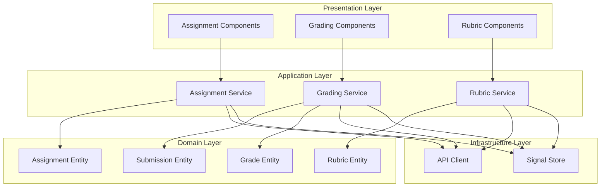
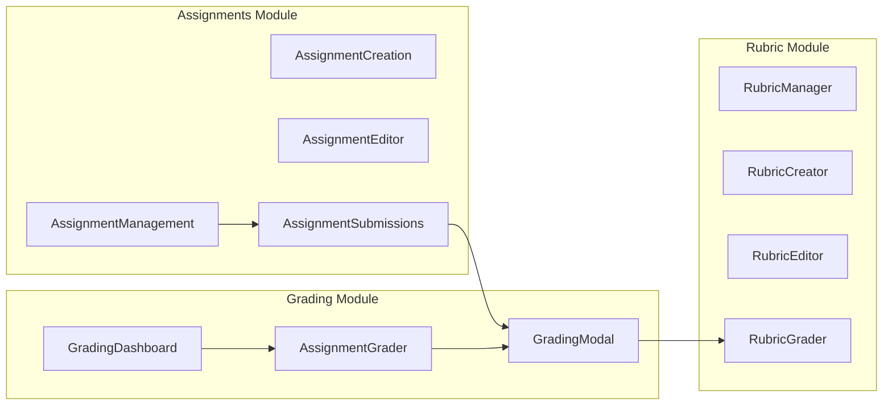

# Design Document: Teacher Assignments & Grading System

## Overview

Hệ thống Quản lý Bài tập và Chấm điểm cho Teacher trong LMS Maritime. Hệ thống được thiết kế theo kiến trúc DDD (Domain-Driven Design) với Angular 20, sử dụng Signals cho state management, và tuân thủ các best practices của Angular modern.

Thiết kế tham khảo UX/UI của Coursera với focus vào:
- Clean, professional interface
- Efficient workflow cho giảng viên
- Clear feedback và status indicators
- Responsive design cho mobile và desktop

## Architecture

### High-Level Architecture



### Component Architecture



## Components and Interfaces

### 1. Assignment Management Components

#### AssignmentManagementComponent (Refactored)
- **Purpose**: Hiển thị và quản lý danh sách bài tập
- **Location**: `fe/src/app/features/teacher/assignments/assignment-management.component.ts`
- **Features**:
  - Paginated list với real API integration
  - Filter by status, course, keyword
  - Sort by columns
  - Quick actions (view submissions, edit)

#### AssignmentCreationComponent (Enhanced)
- **Purpose**: Tạo bài tập mới
- **Location**: `fe/src/app/features/teacher/assignments/assignment-creation.component.ts`
- **Features**:
  - Form validation với reactive forms
  - File upload integration
  - Course selection
  - Rich text editor cho instructions

#### AssignmentEditorComponent (Enhanced)
- **Purpose**: Chỉnh sửa bài tập
- **Location**: `fe/src/app/features/teacher/assignments/assignment-editor.component.ts`
- **Features**:
  - Load existing assignment data
  - Update all fields
  - Status management

#### AssignmentSubmissionsComponent (Enhanced)
- **Purpose**: Quản lý bài nộp của học viên
- **Location**: `fe/src/app/features/teacher/assignments/assignment-submissions.component.ts`
- **Features**:
  - Submissions list với status indicators
  - Late submission detection
  - Inline grading modal
  - Export functionality

### 2. Grading Components

#### GradingDashboardComponent (New)
- **Purpose**: Dashboard tổng quan chấm điểm
- **Location**: `fe/src/app/features/teacher/grading/grading-dashboard.component.ts`
- **Features**:
  - Summary statistics
  - Pending submissions list
  - Quick navigation to grading

#### SpeedGraderLayoutComponent (Refactored from AssignmentGrader)
- **Purpose**: Split-view interface chấm điểm chi tiết (tham khảo Coursera SpeedGrader)
- **Location**: `fe/src/app/features/teacher/grading/speed-grader-layout.component.ts`
- **Features**:
  - Split-view layout: Left panel (file viewer with independent scroll), Right panel (grading form - fixed)
  - Full submission view with inline PDF/Image preview
  - Use `@defer` for lazy loading PDF Viewer (Angular v20 optimization)
  - Grading form with rubric integration
  - Feedback editor
  - Auto-save draft grades
  - Optimized for ultrawide monitors (maritime lab environments)

#### GradingModalComponent (New)
- **Purpose**: Modal chấm điểm inline
- **Location**: `fe/src/app/features/teacher/grading/grading-modal.component.ts`
- **Features**:
  - Compact grading interface
  - Score input với validation
  - Feedback textarea
  - Rubric quick-apply

### 3. Rubric Components

#### RubricManagerComponent (Refactored)
- **Purpose**: Quản lý danh sách rubric
- **Location**: `fe/src/app/features/teacher/grading/rubric-manager.component.ts`
- **Features**:
  - Rubric list
  - Create/Edit/Delete actions
  - Usage statistics

#### RubricCreatorComponent (Refactored)
- **Purpose**: Tạo rubric mới
- **Location**: `fe/src/app/features/teacher/grading/rubric-creator.component.ts`
- **Features**:
  - Dynamic criteria builder
  - Point value configuration
  - Preview mode

#### RubricEditorComponent (Refactored)
- **Purpose**: Chỉnh sửa rubric
- **Location**: `fe/src/app/features/teacher/grading/rubric-editor.component.ts`
- **Features**:
  - Load existing rubric
  - Modify criteria
  - Save changes

#### RubricGraderComponent (New)
- **Purpose**: Apply rubric khi chấm điểm
- **Location**: `fe/src/app/features/teacher/grading/rubric-grader.component.ts`
- **Features**:
  - Display rubric criteria
  - Select levels for each criterion
  - Auto-calculate total score

### 4. Shared Services

#### AssignmentStateService (New)
- **Purpose**: Manage assignment state với Signals
- **Location**: `fe/src/app/features/teacher/assignments/services/assignment-state.service.ts`
- **Features**:
  - Signal-based state management
  - Caching
  - Optimistic updates

#### GradingStateService (New)
- **Purpose**: Manage grading state với Signals
- **Location**: `fe/src/app/features/teacher/grading/services/grading-state.service.ts`
- **Features**:
  - Pending submissions tracking
  - Grade history
  - Statistics computation
  - Use `update()` of WritableSignal for realtime score updates without re-fetching API
  - Auto-save draft grades mechanism
  - Optimistic updates with rollback on failure

## Data Models

### Assignment Models

```typescript
// Domain Entity
interface Assignment {
  id: string;
  title: string;
  description?: string;
  instructions?: string;
  courseId: string;
  courseTitle: string;
  sectionId?: string;
  dueDate?: string; // ISO string
  maxScore: number;
  status: AssignmentStatus;
  attachments: Attachment[];
  rubricId?: string;
  createdAt: string;
  updatedAt?: string;
  createdBy: string;
}

type AssignmentStatus = 'DRAFT' | 'PUBLISHED' | 'CLOSED';

interface Attachment {
  id: string;
  fileName: string;
  fileUrl: string;
  fileSize: number;
  mimeType: string;
  metadata?: AttachmentMetadata; // Maritime-specific metadata
}

// Maritime-specific file metadata
interface AttachmentMetadata {
  scale?: string;           // Map scale (e.g., "1:50000")
  coordinates?: {           // GPS coordinates if applicable
    latitude: number;
    longitude: number;
  };
  captureDate?: string;     // Date when chart/image was captured
  chartType?: string;       // Type of nautical chart
  simulationType?: string;  // Type of simulation file
  customFields?: Record<string, string>; // Additional maritime-specific fields
}

// List View Model
interface AssignmentSummary {
  id: string;
  title: string;
  courseId: string;
  courseTitle: string;
  dueDate?: string;
  status: AssignmentStatus;
  submissionsCount: number;
  gradedCount: number;
  totalStudents: number;
  maxScore: number;
}

// Create/Update DTOs
interface CreateAssignmentRequest {
  title: string;
  description?: string;
  instructions?: string;
  courseId: string;
  sectionId?: string;
  dueDate?: string;
  maxScore: number;
  attachments?: AttachmentRequest[];
  rubricId?: string;
}

interface UpdateAssignmentRequest {
  title?: string;
  description?: string;
  instructions?: string;
  dueDate?: string;
  maxScore?: number;
  status?: AssignmentStatus;
  attachments?: AttachmentRequest[];
  rubricId?: string;
}
```

### Submission Models

```typescript
interface Submission {
  id: string;
  assignmentId: string;
  studentId: string;
  studentName: string;
  studentEmail: string;
  studentAvatar?: string;
  content?: string;
  attachments: Attachment[];
  submittedAt: string;
  status: SubmissionStatus;
  isLate: boolean;
  grade?: Grade;
}

type SubmissionStatus = 'PENDING' | 'SUBMITTED' | 'GRADED' | 'RETURNED';

interface Grade {
  score: number;
  maxScore: number;
  percentage: number;
  feedback?: string;
  rubricGrades?: RubricGrade[];
  gradedAt: string;
  gradedBy: string;
}

interface RubricGrade {
  criterionId: string;
  levelId: string;
  score: number;
  comment?: string;
}
```

### Rubric Models

```typescript
interface Rubric {
  id: string;
  name: string;
  description?: string;
  criteria: RubricCriterion[];
  totalPoints: number;
  createdAt: string;
  updatedAt?: string;
  createdBy: string;
  usageCount: number;
}

interface RubricCriterion {
  id: string;
  name: string;
  description?: string;
  weight: number; // percentage
  levels: RubricLevel[];
}

interface RubricLevel {
  id: string;
  name: string;
  description: string;
  points: number;
}

interface CreateRubricRequest {
  name: string;
  description?: string;
  criteria: CreateCriterionRequest[];
}

interface CreateCriterionRequest {
  name: string;
  description?: string;
  weight: number;
  levels: CreateLevelRequest[];
}

interface CreateLevelRequest {
  name: string;
  description: string;
  points: number;
}
```

### Dashboard Models

```typescript
interface GradingDashboardStats {
  totalPending: number;
  overdueSubmissions: number;
  recentlyGraded: number;
  averageGradingTime: number; // in hours
}

interface PendingSubmission {
  submissionId: string;
  assignmentId: string;
  assignmentTitle: string;
  courseTitle: string;
  studentName: string;
  submittedAt: string;
  dueDate?: string;
  isOverdue: boolean;
  priority: 'HIGH' | 'MEDIUM' | 'LOW';
}
```

## Correctness Properties

*A property is a characteristic or behavior that should hold true across all valid executions of a system-essentially, a formal statement about what the system should do. Properties serve as the bridge between human-readable specifications and machine-verifiable correctness guarantees.*

Based on the prework analysis, the following correctness properties have been identified:

### Property 1: Assignment List Filter Consistency
*For any* set of assignments and any filter criteria (status, course, keyword), all assignments returned by the filter function SHALL match the specified criteria.
**Validates: Requirements 1.2**

### Property 2: Assignment List Sort Order
*For any* set of assignments and any sort configuration (column, direction), the returned list SHALL be correctly ordered according to the specified column in the specified direction.
**Validates: Requirements 1.3**

### Property 3: Assignment Creation Validation
*For any* assignment creation request missing required fields (title, courseId, or dueDate), the validation function SHALL return an error and prevent creation.
**Validates: Requirements 2.2**

### Property 4: Max Score Range Validation
*For any* max score value, the validation function SHALL accept only values between 1 and 1000 inclusive.
**Validates: Requirements 2.4**

### Property 5: Assignment Data Round-Trip
*For any* valid assignment, loading it into the editor form and saving without changes SHALL preserve all original field values.
**Validates: Requirements 3.1, 3.2**

### Property 6: Late Submission Detection
*For any* submission with a submittedAt timestamp and an assignment with a dueDate, the isLate flag SHALL be true if and only if submittedAt is after dueDate.
**Validates: Requirements 4.3**

### Property 7: Grade Range Validation
*For any* grade value and assignment max score, the validation function SHALL accept only grades between 0 and maxScore inclusive.
**Validates: Requirements 5.2**

### Property 8: Grade Persistence
*For any* submission that receives a grade, after saving, the submission status SHALL be 'GRADED' and the grade values SHALL match the input.
**Validates: Requirements 5.3, 5.5**

### Property 9: Rubric Score Calculation
*For any* rubric with criteria and selected levels, the total score SHALL equal the sum of points from all selected levels.
**Validates: Requirements 6.4**

### Property 10: Rubric Deletion Guard
*For any* rubric that is currently associated with one or more assignments, the delete operation SHALL fail and return an error.
**Validates: Requirements 6.5**

### Property 11: Pending Submissions Sort Order
*For any* list of pending submissions, they SHALL be sorted by due date in ascending order (oldest first).
**Validates: Requirements 7.2**

### Property 12: Export Data Completeness
*For any* assignment export, the exported data SHALL contain student name, email, submission date, grade, and feedback for every submission.
**Validates: Requirements 8.1, 8.3**

### Property 13: Rubric Weight Sum Integrity
*For any* active rubric, the sum of weights of all criteria SHALL equal exactly 100 (percentage-based).
**Validates: Requirements 6.6**

### Property 14: Grading Idempotency
*For any* submission and rubric, applying the same rubric levels multiple times SHALL always produce the same final score (no cumulative errors).
**Validates: Requirements 6.7**

## Error Handling

### API Error Handling
- All API calls wrapped in try-catch with proper error messages
- Display user-friendly error messages in Vietnamese
- Retry mechanism for transient failures
- Offline detection and queue for later sync

### Validation Error Handling
- Real-time form validation with immediate feedback
- Clear error messages next to invalid fields
- Prevent form submission until all errors resolved
- Highlight invalid fields with red border

### State Error Handling
- Optimistic updates with rollback on failure
- Loading states for all async operations
- Empty states with helpful messages
- Error boundaries for component failures

## Testing Strategy

### Unit Testing Framework
- **Framework**: Jasmine + Karma (Angular default)
- **Coverage Target**: 80% for services and utilities

### Property-Based Testing Framework
- **Framework**: fast-check
- **Configuration**: Minimum 100 iterations per property test
- **Location**: `*.property.spec.ts` files alongside source files

### Test Categories

#### Unit Tests
- Component rendering tests
- Service method tests
- Utility function tests
- Form validation tests

#### Property-Based Tests
Each correctness property will have a corresponding property-based test:
- **Feature: teacher-assignments-grading, Property 1: Assignment List Filter Consistency**
- **Feature: teacher-assignments-grading, Property 2: Assignment List Sort Order**
- **Feature: teacher-assignments-grading, Property 3: Assignment Creation Validation**
- **Feature: teacher-assignments-grading, Property 4: Max Score Range Validation**
- **Feature: teacher-assignments-grading, Property 5: Assignment Data Round-Trip**
- **Feature: teacher-assignments-grading, Property 6: Late Submission Detection**
- **Feature: teacher-assignments-grading, Property 7: Grade Range Validation**
- **Feature: teacher-assignments-grading, Property 8: Grade Persistence**
- **Feature: teacher-assignments-grading, Property 9: Rubric Score Calculation**
- **Feature: teacher-assignments-grading, Property 10: Rubric Deletion Guard**
- **Feature: teacher-assignments-grading, Property 11: Pending Submissions Sort Order**
- **Feature: teacher-assignments-grading, Property 12: Export Data Completeness**
- **Feature: teacher-assignments-grading, Property 13: Rubric Weight Sum Integrity**
- **Feature: teacher-assignments-grading, Property 14: Grading Idempotency**

#### Integration Tests
- API integration tests
- Component interaction tests
- Route navigation tests

### Test File Structure
```
fe/src/app/features/teacher/
├── assignments/
│   ├── services/
│   │   ├── assignment.service.ts
│   │   ├── assignment.service.spec.ts
│   │   └── assignment.service.property.spec.ts
│   └── utils/
│       ├── assignment-validators.ts
│       ├── assignment-validators.spec.ts
│       └── assignment-validators.property.spec.ts
├── grading/
│   ├── services/
│   │   ├── grading.service.ts
│   │   ├── grading.service.spec.ts
│   │   └── grading.service.property.spec.ts
│   └── utils/
│       ├── rubric-calculator.ts
│       ├── rubric-calculator.spec.ts
│       └── rubric-calculator.property.spec.ts
```
