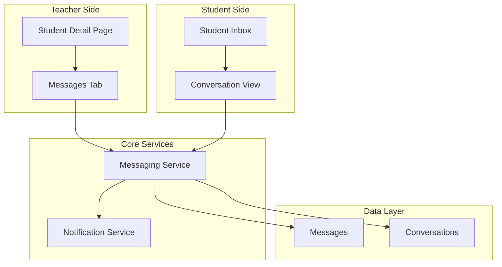
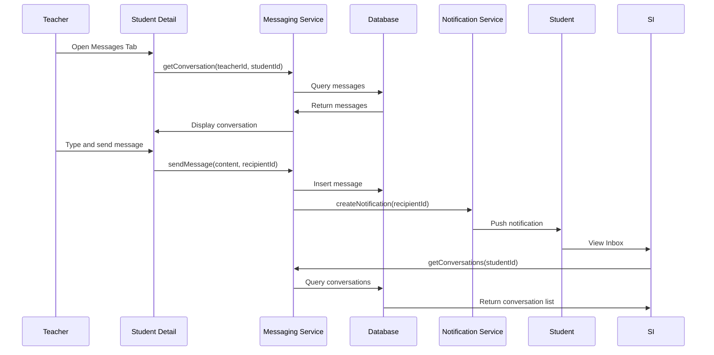

# Design Document: Teacher-Student Messaging System

## Overview

Hệ thống Nhắn tin Giảng viên - Học viên cho LMS Maritime. Hệ thống cho phép trao đổi tin nhắn trực tiếp giữa giảng viên và học viên, tích hợp vào trang Student Detail và có inbox riêng cho học viên.

Thiết kế sử dụng Angular 20 với Signals, tích hợp với hệ thống Notification hiện có.

## Architecture

### High-Level Architecture



### Message Flow



## Components and Interfaces

### 1. Teacher Components

#### MessagesTabComponent (New)
- **Purpose**: Tab hiển thị cuộc hội thoại với học viên trong Student Detail
- **Location**: `fe/src/app/features/teacher/students/messages-tab.component.ts`
- **Features**:
  - Hiển thị lịch sử tin nhắn với học viên
  - Input để soạn và gửi tin nhắn mới
  - Tùy chọn đính kèm tham chiếu bài tập
  - Auto-scroll đến tin nhắn mới nhất

#### MessageInputComponent (New)
- **Purpose**: Component nhập tin nhắn có thể tái sử dụng
- **Location**: `fe/src/app/shared/components/message-input.component.ts`
- **Features**:
  - Textarea với auto-resize
  - Nút gửi tin nhắn
  - Dropdown chọn assignment reference
  - Keyboard shortcut (Enter để gửi)

### 2. Student Components

#### StudentInboxComponent (New)
- **Purpose**: Trang inbox hiển thị tất cả cuộc hội thoại
- **Location**: `fe/src/app/features/student/messages/student-inbox.component.ts`
- **Features**:
  - Danh sách cuộc hội thoại với giảng viên
  - Hiển thị unread count cho mỗi conversation
  - Search/filter conversations
  - Sort by most recent

#### ConversationViewComponent (New)
- **Purpose**: Hiển thị chi tiết một cuộc hội thoại
- **Location**: `fe/src/app/features/student/messages/conversation-view.component.ts`
- **Features**:
  - Hiển thị tất cả tin nhắn trong conversation
  - Input để trả lời
  - Mark as read khi mở
  - Assignment reference links

#### ConversationListItemComponent (New)
- **Purpose**: Item trong danh sách conversation
- **Location**: `fe/src/app/features/student/messages/conversation-list-item.component.ts`
- **Features**:
  - Avatar và tên giảng viên
  - Preview tin nhắn cuối
  - Timestamp
  - Unread badge

### 3. Shared Components

#### MessageBubbleComponent (New)
- **Purpose**: Hiển thị một tin nhắn
- **Location**: `fe/src/app/shared/components/message-bubble.component.ts`
- **Features**:
  - Phân biệt tin nhắn gửi/nhận (left/right alignment)
  - Timestamp
  - Read status indicator
  - Assignment reference card (nếu có)

### 4. Services

#### MessagingService (New)
- **Purpose**: Quản lý logic nhắn tin
- **Location**: `fe/src/app/core/services/messaging.service.ts`
- **Methods**:
  - `getConversations(userId)` - Lấy danh sách conversations
  - `getConversation(userId1, userId2)` - Lấy conversation giữa 2 người
  - `getMessages(conversationId)` - Lấy tin nhắn trong conversation
  - `sendMessage(content, recipientId, assignmentRef?)` - Gửi tin nhắn
  - `markAsRead(messageIds)` - Đánh dấu đã đọc
  - `archiveConversation(conversationId)` - Lưu trữ conversation
  - `searchMessages(query)` - Tìm kiếm tin nhắn
  - `getUnreadCount(userId)` - Lấy số tin chưa đọc

## Data Models

### Message Models

```typescript
// Message entity
interface Message {
  id: string;
  conversationId: string;
  senderId: string;
  senderName: string;
  senderRole: 'TEACHER' | 'STUDENT';
  content: string;
  assignmentReference?: {
    assignmentId: string;
    assignmentTitle: string;
    courseId: string;
    courseName: string;
  };
  isRead: boolean;
  createdAt: string;
}

// Conversation entity
interface Conversation {
  id: string;
  participants: {
    id: string;
    name: string;
    role: 'TEACHER' | 'STUDENT';
    avatar?: string;
  }[];
  lastMessage?: {
    content: string;
    senderId: string;
    createdAt: string;
  };
  unreadCount: number;
  isArchived: boolean;
  createdAt: string;
  updatedAt: string;
}

// Conversation list item (for display)
interface ConversationListItem {
  conversationId: string;
  otherParticipant: {
    id: string;
    name: string;
    avatar?: string;
  };
  lastMessagePreview: string;
  lastMessageTime: string;
  unreadCount: number;
  isArchived: boolean;
}
```

### API DTOs

```typescript
// Send message request
interface SendMessageRequest {
  recipientId: string;
  content: string;
  assignmentId?: string; // Optional assignment reference
}

// Send message response
interface SendMessageResponse {
  message: Message;
  conversationId: string;
}

// Get conversations params
interface GetConversationsParams {
  includeArchived?: boolean;
  search?: string;
}

// Mark as read request
interface MarkAsReadRequest {
  messageIds: string[];
}
```

## Correctness Properties

*A property is a characteristic or behavior that should hold true across all valid executions of a system-essentially, a formal statement about what the system should do. Properties serve as the bridge between human-readable specifications and machine-verifiable correctness guarantees.*

### Property 1: Message Delivery Guarantee
*For any* message sent by a user, the message SHALL appear in the conversation for both sender and recipient with correct content, timestamp, and sender information.
**Validates: Requirements 1.2, 1.3, 2.3**

### Property 2: Message Chronological Order
*For any* conversation, messages SHALL be displayed in chronological order with oldest first (ascending by timestamp).
**Validates: Requirements 1.4**

### Property 3: Conversation List Display
*For any* conversation in the inbox, the list item SHALL display the other participant's name, last message preview, and timestamp.
**Validates: Requirements 2.4**

### Property 4: Unread Count Accuracy
*For any* conversation, the unread count SHALL equal the number of messages not marked as read by the current user.
**Validates: Requirements 2.5, 3.5**

### Property 5: Read Status Update
*For any* message marked as read, the unread count for that conversation SHALL decrease by exactly one.
**Validates: Requirements 3.4**

### Property 6: Search Results Relevance
*For any* search query, all returned conversations SHALL contain the query text in message content, sender name, or subject.
**Validates: Requirements 4.1, 4.2**

### Property 7: Assignment Reference Display
*For any* message with an assignment reference, the message SHALL display the assignment title and a valid link to the assignment.
**Validates: Requirements 5.2, 5.4**

### Property 8: Conversation Sort Order
*For any* inbox view, conversations SHALL be sorted by last message timestamp in descending order (most recent first).
**Validates: Requirements 6.1**

### Property 9: Archive Round-Trip
*For any* conversation, archiving and then restoring SHALL return the conversation to the active inbox with all messages intact.
**Validates: Requirements 6.2, 6.3**

### Property 10: Empty Conversation Filtering
*For any* inbox view, conversations with zero messages SHALL NOT appear in the list.
**Validates: Requirements 6.4**

## Error Handling

### API Error Handling
- 400 Bad Request: Empty message content
- 403 Forbidden: User not authorized to message recipient
- 404 Not Found: Conversation or message not found
- 429 Too Many Requests: Rate limiting for spam prevention

### Validation Error Handling
- Empty message content
- Message too long (max 5000 characters)
- Invalid recipient ID

### State Error Handling
- Optimistic updates with rollback on failure
- Loading states for message sending
- Retry mechanism for failed sends
- Offline queue for messages

## Testing Strategy

### Unit Testing Framework
- **Framework**: Jasmine + Karma (Angular default)
- **Coverage Target**: 80% for services and utilities

### Property-Based Testing Framework
- **Framework**: fast-check
- **Configuration**: Minimum 100 iterations per property test
- **Location**: `*.property.spec.ts` files alongside source files

### Test Categories

#### Unit Tests
- Messaging service methods
- Message formatting utilities
- Unread count calculations
- Search functionality

#### Property-Based Tests
- **Feature: teacher-student-messaging, Property 1: Message Delivery Guarantee**
- **Feature: teacher-student-messaging, Property 2: Message Chronological Order**
- **Feature: teacher-student-messaging, Property 3: Conversation List Display**
- **Feature: teacher-student-messaging, Property 4: Unread Count Accuracy**
- **Feature: teacher-student-messaging, Property 5: Read Status Update**
- **Feature: teacher-student-messaging, Property 6: Search Results Relevance**
- **Feature: teacher-student-messaging, Property 7: Assignment Reference Display**
- **Feature: teacher-student-messaging, Property 8: Conversation Sort Order**
- **Feature: teacher-student-messaging, Property 9: Archive Round-Trip**
- **Feature: teacher-student-messaging, Property 10: Empty Conversation Filtering**

### Test File Structure
```
fe/src/app/
├── core/services/
│   ├── messaging.service.ts
│   ├── messaging.service.spec.ts
│   └── messaging.service.property.spec.ts
├── features/
│   ├── teacher/
│   │   └── students/
│   │       ├── messages-tab.component.ts
│   │       └── messages-tab.component.spec.ts
│   └── student/
│       └── messages/
│           ├── utils/
│           │   ├── message-utils.ts
│           │   └── message-utils.property.spec.ts
│           ├── student-inbox.component.ts
│           └── conversation-view.component.ts
```
