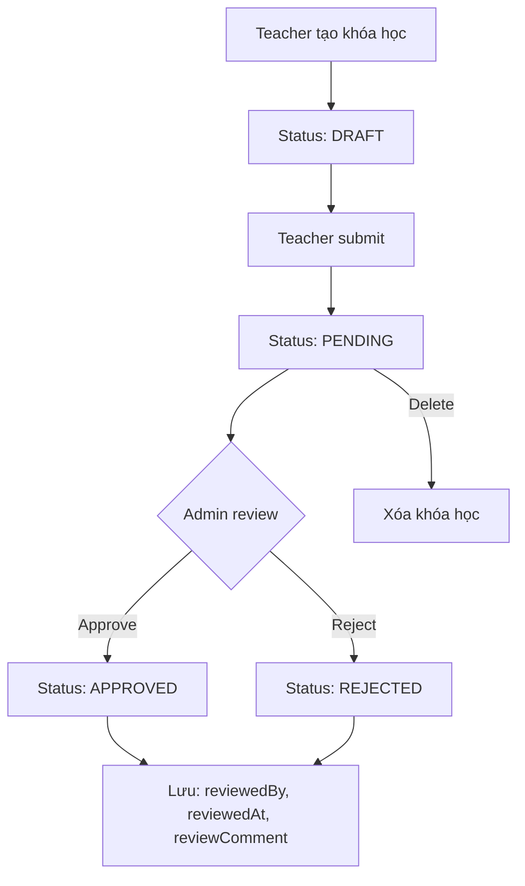

# 📚 ADMIN COURSE MANAGEMENT - COMPLETE GUIDE

## 🎯 Tổng quan

Hệ thống quản lý khóa học cho Admin trong LMS Hàng Hải đã được cải tiến với các tính năng mới:

✅ **DELETE endpoint** - Xóa khóa học  
✅ **Review tracking** - Track ai duyệt, khi nào, lý do gì  
✅ **Audit trail** - Lịch sử duyệt/từ chối khóa học  
✅ **Database migration** - Tự động cập nhật schema  

---

## 📂 Cấu trúc Files

```
LMS_hohulili/
├── ADMIN_COURSE_MANAGEMENT_API_REPORT.md    # Báo cáo API đầy đủ
├── ADMIN_COURSE_API_SUMMARY.md              # Tóm tắt API nhanh
├── IMPLEMENTATION_SUMMARY.md                # Tóm tắt triển khai
├── ADMIN_COURSE_MANAGEMENT_README.md        # File này
│
├── api/
│   ├── MIGRATION_GUIDE.md                   # Hướng dẫn migration
│   ├── src/main/java/com/example/lms/
│   │   ├── controller/
│   │   │   └── AdminController.java         # ✅ Đã thêm DELETE endpoint
│   │   ├── service/
│   │   │   └── AdminService.java            # ✅ Đã cập nhật logic
│   │   └── entity/
│   │       └── Course.java                  # ✅ Đã thêm review fields
│   └── src/main/resources/db/migration/
│       └── V3__add_course_review_fields.sql # ✅ Migration script
│
└── fe/
    ├── src/app/api/endpoints/
    │   └── admin.endpoints.ts               # ✅ Đã có endpoints
    └── src/app/features/admin/
        └── infrastructure/services/
            └── admin.service.ts             # ✅ Đã có service methods
```

---

## 🚀 Quick Start

### 1. Backend Setup

```bash
# Clone repository
git clone https://github.com/linhlinhlin/LMS_hohulili.git
cd LMS_hohulili/api

# Build project
mvn clean install

# Run application (migration sẽ tự động chạy)
mvn spring-boot:run
```

### 2. Verify Migration

```bash
# Check database
psql -U postgres -d lms_db

# Verify columns
\d courses
# Should see: review_comment, reviewed_at, reviewed_by_id
```

### 3. Test API

```bash
# Get pending courses
curl http://localhost:8080/api/v1/admin/courses/pending \
  -H "Authorization: Bearer YOUR_TOKEN"

# Approve course
curl -X PATCH http://localhost:8080/api/v1/admin/courses/{id}/approve \
  -H "Authorization: Bearer YOUR_TOKEN"

# Delete course
curl -X DELETE http://localhost:8080/api/v1/admin/courses/{id} \
  -H "Authorization: Bearer YOUR_TOKEN"
```

---

## 📖 Documentation

### 1. **API Documentation**

Đọc file: [`ADMIN_COURSE_MANAGEMENT_API_REPORT.md`](./ADMIN_COURSE_MANAGEMENT_API_REPORT.md)

Bao gồm:
- Chi tiết 6 API endpoints
- Request/Response examples
- DTOs và data structures
- Error handling
- Authorization requirements

### 2. **Quick Reference**

Đọc file: [`ADMIN_COURSE_API_SUMMARY.md`](./ADMIN_COURSE_API_SUMMARY.md)

Bao gồm:
- Bảng tổng hợp API
- Flow diagram
- Examples ngắn gọn
- Checklist

### 3. **Implementation Details**

Đọc file: [`IMPLEMENTATION_SUMMARY.md`](./IMPLEMENTATION_SUMMARY.md)

Bao gồm:
- Các thay đổi đã thực hiện
- Code snippets
- Testing guide
- Deployment steps

### 4. **Migration Guide**

Đọc file: [`api/MIGRATION_GUIDE.md`](./api/MIGRATION_GUIDE.md)

Bao gồm:
- Cách chạy migration
- Troubleshooting
- Rollback guide
- Best practices

---

## 🎯 API Endpoints

| Endpoint | Method | Description | Status |
|----------|--------|-------------|--------|
| `/api/v1/admin/courses/pending` | GET | Lấy khóa học chờ duyệt | ✅ |
| `/api/v1/admin/courses/{id}/approve` | PATCH | Duyệt khóa học | ✅ |
| `/api/v1/admin/courses/{id}/reject` | PATCH | Từ chối khóa học | ✅ |
| `/api/v1/admin/courses/all` | GET | Lấy tất cả khóa học | ✅ |
| `/api/v1/admin/courses/{id}` | DELETE | Xóa khóa học | ✅ NEW |
| `/api/v1/admin/analytics` | GET | Thống kê hệ thống | ✅ |

---

## 🔄 Workflow



---

## 🗄️ Database Schema

### Bảng: `courses`

```sql
CREATE TABLE courses (
    id UUID PRIMARY KEY,
    code VARCHAR(64) UNIQUE NOT NULL,
    title VARCHAR(255) NOT NULL,
    description TEXT,
    status VARCHAR(20) NOT NULL,
    teacher_id UUID NOT NULL,
    created_at TIMESTAMP NOT NULL,
    updated_at TIMESTAMP,
    
    -- ✅ NEW: Review fields
    review_comment TEXT,
    reviewed_at TIMESTAMP,
    reviewed_by_id UUID,
    
    FOREIGN KEY (teacher_id) REFERENCES users(id),
    FOREIGN KEY (reviewed_by_id) REFERENCES users(id)
);
```

---

## 🧪 Testing

### Unit Tests

```bash
cd api
mvn test -Dtest=AdminServiceTest
mvn test -Dtest=AdminControllerTest
```

### Integration Tests

```bash
mvn test -Dtest=AdminControllerIntegrationTest
```

### Manual Testing

```bash
# 1. Create test course
curl -X POST http://localhost:8080/api/v1/courses \
  -H "Authorization: Bearer TEACHER_TOKEN" \
  -H "Content-Type: application/json" \
  -d '{
    "code": "TEST001",
    "title": "Test Course",
    "description": "Test Description"
  }'

# 2. Submit for review
curl -X PATCH http://localhost:8080/api/v1/courses/{id}/submit \
  -H "Authorization: Bearer TEACHER_TOKEN"

# 3. Admin approve
curl -X PATCH http://localhost:8080/api/v1/admin/courses/{id}/approve \
  -H "Authorization: Bearer ADMIN_TOKEN"

# 4. Verify review info
curl http://localhost:8080/api/v1/admin/courses/{id} \
  -H "Authorization: Bearer ADMIN_TOKEN"
```

---

## 🔐 Security

### Authorization

Tất cả admin endpoints yêu cầu:
- ✅ Valid JWT token
- ✅ Role: `ADMIN`

```java
@PreAuthorize("hasRole('ADMIN')")
```

### Validation

- ✅ Course ID phải tồn tại
- ✅ Chỉ xóa được khóa học chưa APPROVED
- ✅ Chỉ duyệt được khóa học PENDING
- ✅ Lý do từ chối không được rỗng

---

## 📊 Monitoring

### Logs

```bash
# View application logs
tail -f api/logs/spring.log

# Filter admin actions
tail -f api/logs/spring.log | grep "AdminController\|AdminService"

# Filter course reviews
tail -f api/logs/spring.log | grep "reviewCourse\|approveCourse\|rejectCourse"
```

### Metrics

```bash
# Check Flyway migrations
curl http://localhost:8080/actuator/flyway

# Check database health
curl http://localhost:8080/actuator/health
```

---

## 🐛 Troubleshooting

### Issue 1: Migration không chạy

**Triệu chứng:** Columns mới không xuất hiện trong database

**Giải pháp:**
```bash
# Check Flyway status
mvn flyway:info

# Run migration manually
mvn flyway:migrate

# Verify
psql -d lms_db -c "\d courses"
```

---

### Issue 2: DELETE endpoint trả về 404

**Triệu chứng:** `404 Not Found` khi gọi DELETE

**Giải pháp:**
```bash
# Verify endpoint exists
curl -X OPTIONS http://localhost:8080/api/v1/admin/courses/{id}

# Check logs
tail -f logs/spring.log | grep "DELETE.*courses"

# Rebuild and restart
mvn clean install
mvn spring-boot:run
```

---

### Issue 3: reviewedBy luôn null

**Triệu chứng:** `reviewed_by_id` không được lưu

**Giải pháp:**
```java
// Check AdminService.approveCourse()
// Ensure currentUser is passed to reviewCourse()
reviewCourse(courseId, request, currentUser); // ← Must pass currentUser
```

---

## 📈 Performance

### Database Indexes

```sql
-- Already created by migration
CREATE INDEX idx_courses_reviewed_by ON courses(reviewed_by_id);
CREATE INDEX idx_courses_reviewed_at ON courses(reviewed_at);
CREATE INDEX idx_courses_status ON courses(status);
```

### Query Optimization

```sql
-- Efficient query for pending courses
SELECT c.*, u.full_name as teacher_name
FROM courses c
JOIN users u ON c.teacher_id = u.id
WHERE c.status = 'PENDING'
ORDER BY c.created_at DESC
LIMIT 10;

-- Use index on status
EXPLAIN ANALYZE SELECT * FROM courses WHERE status = 'PENDING';
```

---

## 🔄 Future Improvements

### Phase 2 (Chưa làm):

- [ ] **Notification Service** - Email/SMS khi duyệt/từ chối
- [ ] **Validation Service** - Validate khóa học trước khi submit
- [ ] **Audit Log** - Chi tiết log tất cả hành động admin
- [ ] **Bulk Actions** - Duyệt/từ chối nhiều khóa học cùng lúc
- [ ] **Review History** - Xem lịch sử review của khóa học

### Phase 3 (Future):

- [ ] **Advanced Analytics** - Dashboard phân tích chi tiết
- [ ] **Auto-approval** - Tự động duyệt dựa trên tiêu chí
- [ ] **Review Templates** - Template nhận xét có sẵn
- [ ] **Reviewer Assignment** - Phân công reviewer cho khóa học

---

## 🤝 Contributing

### Quy trình đóng góp:

1. Fork repository
2. Create feature branch: `git checkout -b feature/new-feature`
3. Commit changes: `git commit -m 'Add new feature'`
4. Push to branch: `git push origin feature/new-feature`
5. Create Pull Request

### Code Style:

- Java: Follow Google Java Style Guide
- TypeScript: Follow Angular Style Guide
- SQL: Use lowercase with underscores

---

## 📞 Support

### Liên hệ:

- **Email:** support@lms-hanghhai.edu.vn
- **GitHub Issues:** https://github.com/linhlinhlin/LMS_hohulili/issues
- **Documentation:** https://docs.lms-hanghhai.edu.vn

### Resources:

- [Spring Boot Documentation](https://spring.io/projects/spring-boot)
- [Flyway Documentation](https://flywaydb.org/documentation/)
- [Angular Documentation](https://angular.io/docs)

---

## 📝 Changelog

### Version 1.0.0 (2025-11-16)

**Added:**
- DELETE endpoint for courses
- Review tracking fields (reviewComment, reviewedAt, reviewedBy)
- Database migration V3
- Comprehensive documentation

**Changed:**
- AdminService.reviewCourse() now accepts reviewer parameter
- Course entity with new review fields

**Fixed:**
- Missing DELETE endpoint
- No audit trail for course reviews

---

## 📄 License

Copyright © 2025 LMS Hàng Hải. All rights reserved.

---

**Last Updated:** 16/11/2025  
**Version:** 1.0.0  
**Maintainer:** Kiro AI Assistant
