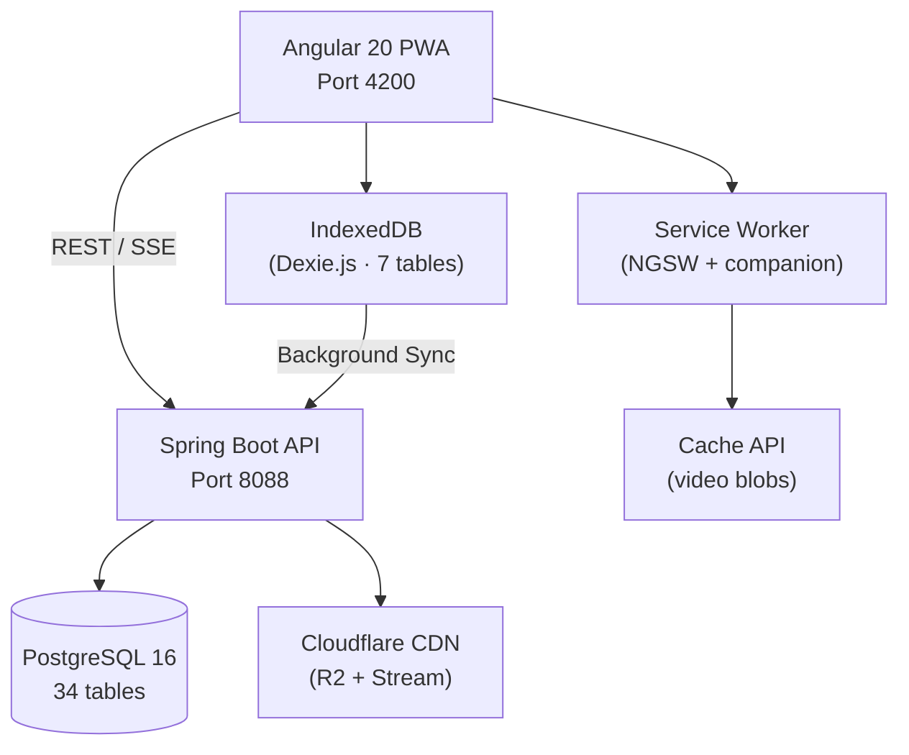

<div align="center">

# Maritime LMS

**AI-Powered Learning Management System for Maritime Education**

A production-ready e-learning platform built with Clean Architecture, featuring intelligent tutoring,
adaptive video streaming, offline-first PWA, and a 4-tier role-based access system.

[](https://angular.dev)
[](https://spring.io/projects/spring-boot)
[](https://www.postgresql.org)
[](https://openjdk.org)
[](https://www.typescriptlang.org)
[](#quality-assurance)
[](#license)

[Features](#features) · [Quick Start](#quick-start) · [Architecture](#architecture) · [API Docs](#api-documentation) · [Tech Stack](#tech-stack) · [Roadmap](#roadmap)

</div>

---

## About

Maritime LMS is a comprehensive learning management system designed for maritime education institutions. It provides a complete suite of tools for course authoring, student enrollment, assessment, video-based learning, and AI-assisted tutoring — all accessible offline via Progressive Web App technology.

The system supports four distinct user roles — **System Admin**, **Operations Admin**, **Teacher**, and **Student** — each with carefully scoped permissions and escalation prevention built into the architecture.

### Key Numbers

| Metric | Value |
|--------|-------|
| Backend | 381 Java files · 216 endpoints · 527 tests (0 failures) |
| Frontend | 236 components · 56 services · 70+ routes · 100% OnPush |
| Database | 34 tables · 94 indexes · 45 migrations |
| Architecture | Clean Architecture / DDD · 8 modules · 64 use cases |

---

## Features

### Course Management
- Course authoring with chapters, lessons, and content blocks
- 3-step course creation wizard (mode, title, category)
- Drag-and-drop curriculum reorder (3-level tree: chapter, lesson, section)
- Course review and approval workflow
- Dual delivery modes: self-paced and instructor-led

### Assessment
- Assignments with file submissions and rubric-based grading
- Speed grader with batch grading support
- Quiz engine with 6+ question types (MCQ, essay, matching, true/false, short answer)
- Question bank management (12 endpoints)
- Auto-grading, timed attempts, question shuffling

### Learning Delivery
- Adaptive video streaming via Shaka Player (maritime-optimized ABR)
- Lesson progress tracking with video segment analysis
- Gamification (badges, points, leaderboards, streaks)
- Certificate auto-generation on course completion
- Learning class enrollment management

### AI Assistant (Wiii)
- SSE streaming with real-time token rendering
- Maritime knowledge base with source citations
- Exponential backoff retry (3 attempts: 1s / 2s / 4s)
- 180s response timeout with 15s heartbeat monitoring
- Available across student, teacher, and admin portals

### PWA & Offline-First
- Angular Service Worker with 6 cached data groups
- IndexedDB offline storage via Dexie.js (7 tables)
- Full course download for offline learning
- Background sync with conflict resolution (additive merge for video, server-wins for grades)
- 3-tier network detection (none / slow / fast) with status indicator
- Storage quota management with 90% pre-check

### Multi-Tier Admin
- **ADMIN**: Full system access — settings, logs, delete users/courses
- **ORG_ADMIN**: Operations — course review, user CRUD (teacher/student only), analytics
- **TEACHER**: Course authoring, grading, student management
- **STUDENT**: Learning, enrollment, assignments, quizzes

Escalation prevention: ORG_ADMIN cannot promote users to admin roles.

<details>
<summary><b>More features</b></summary>

- Internal messaging (student-teacher conversations)
- VNPay payment integration (checkout flow)
- Cloudflare R2 file storage (S3-compatible)
- Real-time notifications with notification bell
- Global search across courses and content
- Vietnamese-localized UI (0 English user-facing messages)
- Design token system (#0056D2 primary, Coursera-style)
- WCAG 2.5.7 keyboard reorder for drag-and-drop

</details>

---

## Quick Start

### Prerequisites

| Tool | Version | Purpose |
|------|---------|---------|
| Docker | Latest | Database + API containers |
| Node.js | 22.x | Frontend build |
| Java JDK | 21+ | Backend (if running without Docker) |

### Option 1: Docker (Recommended)

```bash
# Backend (PostgreSQL + Spring Boot API)
cd backend && docker compose up -d

# Wait ~60s for startup, then verify:
curl -s http://localhost:8088/actuator/health
# {"status":"UP"}

# Frontend (new terminal)
cd fe && npm install && npm start
```

### Option 2: Manual Setup

```bash
# Backend
cd backend
./mvnw spring-boot:run -Dspring-boot.run.profiles=dev

# Frontend
cd fe && npm install && npm start
```

### Access Points

| Service | URL |
|---------|-----|
| Frontend | http://localhost:4200 |
| Backend API | http://localhost:8088/api/v3 |
| Swagger UI | http://localhost:8088/swagger-ui |
| pgAdmin | http://localhost:8081 |

### Test Accounts

All accounts are auto-created on first startup.

| Role | Email | Password |
|------|-------|----------|
| System Admin | `admin@maritime.edu` | `admin123` |
| Operations Admin | `orgadmin@maritime.edu` | `orgadmin123` |
| Teacher | `teacher@maritime.edu` | `teacher123` |
| Student | `student@maritime.edu` | `student123` |

---

## Architecture

### System Overview



### Backend — Clean Architecture + DDD

```
backend/src/main/java/com/example/lms/
├── identity/              # Auth, JWT, Roles, Multi-tier Admin
├── course_authoring/      # Course, Chapter, Lesson, ContentBlock, Category, Review
├── learning_delivery/     # Class, Enrollment, Progress, Gamification, Video, Certificate
├── assessment/            # Assignment, Quiz, Question, Submission, Rubric, QuestionBank
├── communication/         # Messages, Conversations
├── ai_assistant/          # AI Chat (SSE streaming)
├── shared/                # Value objects, events, file service, sync, payment
└── config/                # Security, CORS, JWT, rate limiting
```

Each module follows the same layered structure:

```
{module}/
├── domain/
│   ├── model/             # Pure domain entities (no framework annotations)
│   ├── repository/        # Repository interfaces (ports)
│   └── valueobject/       # Value objects
├── application/
│   ├── usecase/           # Business logic
│   └── dto/               # Commands, responses
└── infrastructure/
    ├── persistence/
    │   ├── entity/        # JPA entities (*JpaEntity)
    │   ├── mapper/        # Entity ↔ Domain mappers
    │   └── *Adapter.java  # Port implementations
    └── web/               # REST controllers
```

### Frontend — Angular 20 + Signals

```
fe/src/app/
├── api/                   # 18 API clients · 23 endpoints · 19 types · 4 interceptors
├── core/                  # 21 services · 5 guards · Dexie.js DB
├── features/
│   ├── teacher/           # 68 components — Course editor, assignments, grading
│   ├── admin/             # 22 components — Dashboard, user/course management
│   ├── ai-chat/           # 15 components — Full DDD, SSE streaming
│   ├── learning/          # 13 components — Course viewer, quizzes
│   ├── student/           # 12 components — Enrollment, messages
│   ├── assignments/       # 12 components — Student assignment work (DDD)
│   ├── courses/           # 10+ components — Browse, categories, detail
│   └── (auth, payment, communication, profile, home)
├── shared/                # 48 reusable components · 8 services
└── state/                 # Global state (course, class, global)
```

<details>
<summary><b>Backend module statistics</b></summary>

| Module | Domain Models | Use Cases | Controllers | Endpoints |
|--------|:---:|:---:|:---:|:---:|
| identity | 2 | 7 | 2 | 21 |
| course_authoring | 6 | 23 | 6 | 53 |
| learning_delivery | 9 | 17 | 10 | 51 |
| assessment | 11 | 14 | 6 | 59 |
| communication | 4 | 1 | 1 | 6 |
| ai_assistant | 3 | 1 | 1 | 11 |
| shared | 3 | 1 | 3 | 9 |
| config | — | — | — | 5 |
| **Total** | **38** | **64** | **29** | **216** |

</details>

---

## API Documentation

Interactive API documentation is available at **http://localhost:8088/swagger-ui** when the backend is running.

All endpoints use the `/api/v3/` prefix and return standardized responses:

```json
{
  "success": true,
  "message": "Thao tác thành công",
  "data": { ... }
}
```

<details>
<summary><b>Core API endpoints</b></summary>

### Authentication
| Method | Endpoint | Description |
|--------|----------|-------------|
| POST | `/api/v3/auth/register` | User registration |
| POST | `/api/v3/auth/login` | Login (returns JWT) |
| POST | `/api/v3/auth/refresh` | Refresh access token |
| GET | `/api/v3/auth/profile` | Current user profile |

### Courses
| Method | Endpoint | Description |
|--------|----------|-------------|
| GET | `/api/v3/courses` | List courses (public) |
| GET | `/api/v3/courses/{id}` | Course detail |
| POST | `/api/v3/courses` | Create course (Teacher) |
| PUT | `/api/v3/courses/{id}` | Update course |
| GET | `/api/v3/courses/{id}/chapters` | List chapters |
| GET | `/api/v3/courses/{id}/chapters/{chId}/lessons` | List lessons |

### Assignments & Grading
| Method | Endpoint | Description |
|--------|----------|-------------|
| GET | `/api/v3/assignments` | Teacher assignments summary |
| POST | `/api/v3/assignments` | Create assignment |
| GET | `/api/v3/assignments/{id}/submissions` | List submissions |
| PATCH | `/api/v3/assignments/{id}/submissions/batch-grade` | Batch grade |

### Quiz
| Method | Endpoint | Description |
|--------|----------|-------------|
| GET | `/api/v3/quiz` | List quizzes |
| POST | `/api/v3/quiz` | Create quiz |
| POST | `/api/v3/quiz/{id}/attempt` | Start attempt |
| POST | `/api/v3/quiz/{id}/submit` | Submit answers |

### AI Chat (SSE)
| Method | Endpoint | Description |
|--------|----------|-------------|
| POST | `/api/v3/ai/chat` | Send message (SSE stream) |
| GET | `/api/v3/ai/sessions` | List chat sessions |
| GET | `/api/v3/ai/history/{userId}` | Chat history |

### Sync (Offline)
| Method | Endpoint | Description |
|--------|----------|-------------|
| POST | `/api/v3/sync/push` | Push offline changes (batch) |
| GET | `/api/v3/sync/pull` | Pull server changes |
| GET | `/api/v3/sync/status` | Sync status |

</details>

---

## Tech Stack

### Backend

| Technology | Version | Purpose |
|-----------|---------|---------|
| Java | 21 | Language |
| Spring Boot | 3.2.6 | Application framework |
| Spring Security | 6.x | JWT auth, RBAC |
| PostgreSQL | 16 | Database (34 tables, 94 indexes) |
| Flyway | 10.x | Schema migrations |
| JJWT | 0.12.3 | JWT token handling |
| SpringDoc OpenAPI | 2.5.0 | Swagger UI auto-generation |
| Caffeine Cache | managed | In-memory caching |
| AWS SDK S3 | 2.25.0 | Cloudflare R2 storage |
| Lombok | 1.18.32 | Boilerplate reduction |

### Frontend

| Technology | Version | Purpose |
|-----------|---------|---------|
| Angular | 20.3 | SPA framework (signals, OnPush) |
| TypeScript | 5.9 | Type safety |
| Tailwind CSS | 4.x | Utility-first styling |
| RxJS | 7.8 | Reactive streams |
| Dexie.js | 4.x | IndexedDB wrapper (offline storage) |
| Shaka Player | 5.x | Adaptive video (HLS, maritime ABR) |
| Angular Service Worker | 20.x | PWA caching |
| Chart.js | 4.x | Analytics visualization |

### Infrastructure

| Technology | Purpose |
|-----------|---------|
| Docker Compose | Container orchestration |
| Cloudflare R2 | File storage (S3-compatible) |
| Cloudflare Stream | Video transcoding + CDN |
| pgAdmin 4 | Database management UI |

---

## Quality Assurance

| Category | Score | Details |
|----------|:---:|---------|
| Backend Clean Architecture | 10/10 | Zero infra imports in domain, CQRS query ports, typed exceptions |
| Frontend Angular Patterns | 10/10 | 100% signals, 0 legacy patterns, 0 mock services |
| PWA / Offline-First | 9.5/10 | NGSW + Dexie.js, batch sync, conflict resolution |
| Security | 10/10 | 4-tier RBAC, escalation prevention, ownership verification |
| Code Cleanliness | 10/10 | 0 dead code, 0 English UI text, 0 generic color tokens |
| UX & Design | 10/10 | Coursera-style, #0056D2 design tokens, WCAG 2.5.7 DnD |
| Test Coverage | 8.7/10 | 527 tests, 0 failures, ~49% line coverage |

### Testing

```bash
# Backend
cd backend && docker compose exec api mvn test -B

# Frontend
cd fe && npm run build
```

---

## Database

**34 tables** with a carefully indexed schema optimized for educational workloads.

<details>
<summary><b>Schema highlights</b></summary>

- **94 indexes**: 60+ B-tree, 9 partial, 6 BRIN (time-series), 12 GIN (full-text + JSONB)
- **54 foreign keys** with appropriate CASCADE / SET NULL rules
- **24 triggers** for automatic `updated_at` and audit logging
- **2 materialized views** for analytics dashboards
- **Full-text search** via `pg_trgm` GIN indexes
- **Login attempt tracking** for brute force detection

Reference schema: `backend/src/main/resources/db/migration/V1__lms_complete_schema.sql` (1,249 lines)

</details>

---

## Project Structure

```
LMS_hohulili/
├── backend/                        # Spring Boot 3.2.6 + Java 21
│   ├── src/main/java/.../lms/
│   │   ├── identity/               # Auth, JWT, Roles
│   │   ├── course_authoring/       # Courses, Chapters, Lessons
│   │   ├── learning_delivery/      # Enrollment, Progress, Gamification
│   │   ├── assessment/             # Assignments, Quizzes, Rubrics
│   │   ├── communication/          # Messaging
│   │   ├── ai_assistant/           # AI Chat (SSE)
│   │   ├── shared/                 # Sync, File service, Value objects
│   │   └── config/                 # Security, CORS, JWT
│   └── src/main/resources/
│       ├── db/migration/           # Flyway V1 + V26-V45
│       └── application-*.yml       # Environment configs
│
├── fe/                             # Angular 20.3 PWA
│   ├── src/app/
│   │   ├── api/                    # 18 clients, 4 interceptors
│   │   ├── core/                   # 21 services, 5 guards, Dexie DB
│   │   ├── features/              # 10 feature modules (236 components)
│   │   ├── shared/                 # 48 reusable components
│   │   └── state/                  # Global state services
│   ├── ngsw-config.json            # Service Worker config
│   └── public/                     # Manifest, icons, browserconfig
│
├── CLAUDE.md                       # AI agent development guide
├── STREAMING_PWA_ROADMAP.md        # PWA/offline implementation roadmap
└── README.md                       # This file
```

---

## Environment Variables

<details>
<summary><b>Backend configuration</b></summary>

Configuration is managed via `application-dev.yml` and `application-prod.yml`.

| Variable | Description | Default |
|----------|-------------|---------|
| `SPRING_DATASOURCE_URL` | PostgreSQL connection string | `jdbc:postgresql://postgres:5432/lms` |
| `SPRING_DATASOURCE_USERNAME` | Database user | `lms` |
| `SPRING_DATASOURCE_PASSWORD` | Database password | `lms` |
| `JWT_SECRET` | JWT signing key | Auto-generated |
| `JWT_EXPIRATION` | Token expiry (ms) | `86400000` (24h) |
| `R2_ACCESS_KEY` | Cloudflare R2 access key | — |
| `R2_SECRET_KEY` | Cloudflare R2 secret key | — |
| `R2_BUCKET` | R2 bucket name | — |
| `R2_ENDPOINT` | R2 endpoint URL | — |

</details>

<details>
<summary><b>Frontend configuration</b></summary>

Edit `fe/src/environments/environment.ts`:

| Variable | Description | Default |
|----------|-------------|---------|
| `apiUrl` | Backend API base URL | `http://localhost:8088` |
| `production` | Production mode flag | `false` |

</details>

---

## Roadmap

| Phase | Focus | Status |
|-------|-------|--------|
| MVP Core | Auth, courses, assignments, quizzes, messaging | Done |
| Multi-Tier Admin | 4-role RBAC with escalation prevention | Done |
| Design System | #0056D2 tokens, Vietnamese localization, WCAG DnD | Done |
| PWA Offline-First | Service Worker, IndexedDB, background sync, adaptive video | Done |
| AI Integration | LLM connection, real-time streaming, knowledge base | In Progress |
| Payment & Email | VNPay integration, email verification, password reset | Planned |
| Production Readiness | MIME validation, cert PDF, audit logging, 80% coverage | Planned |

---

## Documentation

| Document | Description |
|----------|-------------|
| [`CLAUDE.md`](CLAUDE.md) | AI agent development guide (architecture, patterns, 216 endpoints) |
| [`backend/README.md`](backend/README.md) | Backend architecture, all endpoints, database schema |
| [`fe/FRONTEND_ARCHITECTURE.md`](fe/FRONTEND_ARCHITECTURE.md) | Frontend architecture, 236 components, services, state |
| [`STREAMING_PWA_ROADMAP.md`](STREAMING_PWA_ROADMAP.md) | PWA offline-first implementation details |
| [`ONBOARDING.md`](ONBOARDING.md) | 15-minute team setup guide |

---

## License

Proprietary software for Maritime Education. All rights reserved.

---

<div align="center">

Built with Clean Architecture · Powered by Spring Boot + Angular · Offline-First PWA

</div>
