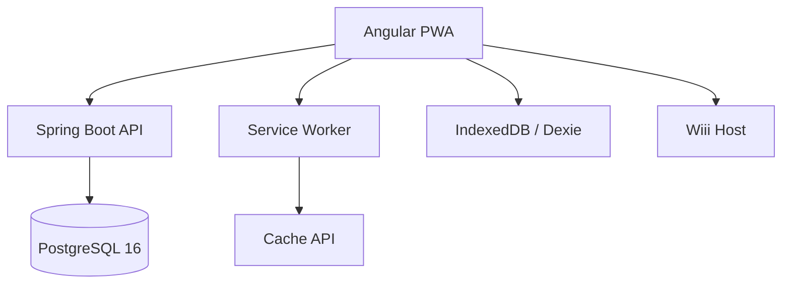

<div align="center">

# Maritime LMS

Hệ thống quản lý học tập dành cho đào tạo hàng hải, vận hành theo hướng production-first.

[Khởi động nhanh](#khởi-động-nhanh) · [Bản đồ tài liệu](#bản-đồ-tài-liệu) · [Kiến trúc](#kiến-trúc) · [Phát triển](#phát-triển) · [Triển khai](#triển-khai)

</div>

---

## Tổng quan

Maritime LMS là một LMS full-stack cho đơn vị đào tạo hàng hải. Hệ thống hỗ trợ:

- biên soạn khóa học theo `Chương -> Bài -> Mục`
- học tập có theo dõi tiến độ, quiz, assignment, chứng chỉ
- thanh toán và quản trị doanh thu
- PWA/offline cho bối cảnh mạng yếu hoặc gián đoạn
- AI assistant tích hợp
- mô hình quyền nhiều tầng: `ADMIN`, `ORG_ADMIN`, `TEACHER`, `STUDENT`

## Năng lực chính

- Course authoring với chapter, lesson, section, reorder, review workflow
- Learner flow với progress, quiz, assignment, messaging, certificate
- PWA/offline dùng Angular Service Worker, IndexedDB, Cache API, background sync
- Payment/payout với guard vai trò, revoke access, history
- Hạ tầng production bằng Docker Compose, Caddy, nginx, PostgreSQL

## Công nghệ chính

| Lớp | Stack |
|-----|-------|
| Frontend | Angular 20, TypeScript 5.9, RxJS, Sass, Dexie.js, Shaka Player |
| Backend | Java 21, Spring Boot 3.2.6, Spring Security, Spring Data JPA |
| Database | PostgreSQL 16, Flyway |
| Hạ tầng | Docker Compose, Caddy, nginx, Cloudflare R2 |

## Khởi động nhanh

### Quy ước runtime

- Frontend local: `http://localhost:4200`
- Backend local trên host: `http://localhost:8088`
- Port nội bộ Spring Boot/container: `8080`
- Production API: same-origin dưới `https://holilihu.online/api/*`
- Chỉ hỗ trợ topology bằng `docker-compose.yml` + `docker-compose.dev.yml` / `docker-compose.prod.yml`

### Yêu cầu

| Công cụ | Khuyến nghị |
|--------|-------------|
| Docker Desktop | Bản ổn định mới |
| Node.js | 22.x |
| Java | 21 |
| Maven | 3.9+ |

### Cách 1: Backend bằng Docker, frontend chạy local

```bash
cp .env.dev.example .env
docker compose -f docker-compose.yml -f docker-compose.dev.yml up -d db backend

cd fe
npm install
npm start
```

### Cách 2: Chạy toàn bộ bằng Docker

```bash
cp .env.dev.example .env
docker compose -f docker-compose.yml -f docker-compose.dev.yml up -d --build --wait
```

### Kiểm tra nhanh

```bash
curl -s http://localhost:8088/actuator/health
curl -I http://localhost:4200/
```

### Tài khoản mặc định

| Vai trò | Email | Mật khẩu |
|--------|-------|----------|
| ADMIN | `admin@maritime.edu` | `admin123` |
| ORG_ADMIN | `orgadmin@maritime.edu` | `orgadmin123` |
| TEACHER | `teacher@maritime.edu` | `teacher123` |
| STUDENT | `student@maritime.edu` | `student123` |

Tài khoản seed mở rộng nằm trong [docs/testing/TEST_CHECKLIST.md](docs/testing/TEST_CHECKLIST.md).

## Bản đồ tài liệu

Bắt đầu từ các tài liệu này:

| Tài liệu | Mục đích |
|---------|----------|
| [ONBOARDING.md](ONBOARDING.md) | Setup nhanh cho teammate mới |
| [CHANGELOG.md](CHANGELOG.md) | Lịch sử thay đổi cấp dự án |
| [CONTRIBUTING.md](CONTRIBUTING.md) | Quy tắc đóng góp, cập nhật docs, test trước khi ship |
| [backend/README.md](backend/README.md) | Runbook backend và DDD conventions |
| [fe/FRONTEND_ARCHITECTURE.md](fe/FRONTEND_ARCHITECTURE.md) | Cấu trúc frontend và feature architecture |
| [docs/README.md](docs/README.md) | Bản đồ tài liệu chi tiết |
| [docs/reference/BACKEND_OVERVIEW.md](docs/reference/BACKEND_OVERVIEW.md) | Tổng quan backend bằng tiếng Việt |
| [docs/reference/FRONTEND_OVERVIEW.md](docs/reference/FRONTEND_OVERVIEW.md) | Tổng quan frontend bằng tiếng Việt |
| [docs/reference/RUNTIME_CONVENTIONS.md](docs/reference/RUNTIME_CONVENTIONS.md) | Quy ước runtime chuẩn của repo |
| [docs/runbooks/PRODUCTION_SMOKE_TEST.md](docs/runbooks/PRODUCTION_SMOKE_TEST.md) | Smoke test sau deploy |
| [docs/testing/TEST_CHECKLIST.md](docs/testing/TEST_CHECKLIST.md) | Checklist QA thủ công |

## Kiến trúc

### Toàn hệ thống



### Backend

```text
backend/src/main/java/com/example/lms/
├── identity
├── course_authoring
├── learning_delivery
├── assessment
├── communication
├── ai_assistant
├── shared
└── config
```

Backend đi theo Clean Architecture / DDD:

```text
{module}/
├── domain
├── application
└── infrastructure
```

### Frontend

```text
fe/src/app/
├── api
├── core
├── features
├── shared
└── state
```

## Phát triển

### Lệnh thường dùng

```bash
# Frontend
cd fe
npm start
npm run build

# Backend
cd backend
mvn test -B
```

### Lưu ý cấu hình

- Frontend dev dùng `fe/proxy.conf.json` cho `/api/*`
- `environment.ts` dev chủ động dùng same-origin/proxy, không hardcode backend host vào code
- Production frontend dùng same-origin API sau Caddy

## Triển khai

- Base compose: `docker-compose.yml`
- Production overrides: `docker-compose.prod.yml`
- Reverse proxy: `Caddyfile`
- Script deploy: `deploy.sh`
- Runbook deploy: [docs/deployment/GITHUB_ACTIONS_DEPLOY.md](docs/deployment/GITHUB_ACTIONS_DEPLOY.md)

## Chất lượng tối thiểu trước khi ship

- `cd backend && mvn test -B`
- `cd fe && npm run build`
- kiểm tra manual theo [docs/testing/TEST_CHECKLIST.md](docs/testing/TEST_CHECKLIST.md)
- nếu có thay đổi runtime/workflow đáng kể, cập nhật `CHANGELOG.md` và tài liệu chuẩn liên quan
