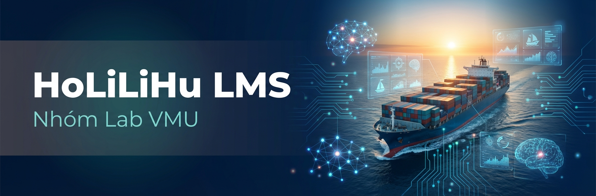

# Maritime LMS - Learning Management System

<div align="center">



[](https://angular.io)
[](https://spring.io/projects/spring-boot)
[](https://openjdk.org)
[](https://www.typescriptlang.org)
[](https://www.postgresql.org)
[](https://tailwindcss.com)

[](https://ai.google.dev)
[](https://langchain.com)
[](https://neo4j.com)

[](LICENSE)
[](/)
[](/)

**AI-Powered Learning Management System for Maritime Education**

*Comprehensive e-learning platform with intelligent tutoring, course management, and maritime knowledge base*

[Features](#key-features) | [Quick Start](#getting-started) | [API Docs](#api-documentation) | [Architecture](#architecture)

</div>

---

## Overview

Maritime LMS is a full-stack educational platform designed for maritime training institutions. The system combines traditional LMS functionality with cutting-edge AI capabilities to deliver personalized learning experiences.

### Why Maritime LMS?

| Challenge | Our Solution |
|-----------|--------------|
| Complex maritime regulations | AI-powered knowledge retrieval from COLREGs, SOLAS, MARPOL |
| Student engagement | Interactive AI tutor with personalized responses |
| Assessment management | Coursera-style assignments with rubric grading |
| Multi-role access | Dedicated interfaces for Students, Teachers, and Admins |

---

## Key Features

<table>
<tr>
<td width="50%">

### Learning Management
- Course creation and organization
- Section and lesson management
- File attachments (PDF, Video, Audio)
- Progress tracking and analytics
- Enrollment management

</td>
<td width="50%">

### AI-Powered Tutoring
- Intelligent Q&A with maritime knowledge
- Role-based responses (Student/Teacher)
- Source citations from regulations
- Semantic memory for personalization
- Multi-session conversation history

</td>
</tr>
<tr>
<td width="50%">

### Assignment System
- Multiple assignment types
- Rubric-based grading
- File submission support
- Deadline management
- Grade analytics

</td>
<td width="50%">

### Administration
- User management with RBAC
- Knowledge base management
- System analytics dashboard
- PDF document ingestion
- Chat history management

</td>
</tr>
</table>

---

## Architecture

```
                              MARITIME LMS ARCHITECTURE
                              
+------------------+         +------------------+         +------------------+
|                  |         |                  |         |                  |
|    FRONTEND      |  HTTP   |   LMS BACKEND    |  HTTP   |   AI BACKEND     |
|    (Angular)     |-------->|  (Spring Boot)   |-------->|   (FastAPI)      |
|    Port: 4200    |         |    Port: 8088    |         |   Port: 8000     |
|                  |         |                  |         |                  |
+--------+---------+         +--------+---------+         +--------+---------+
         |                            |                            |
         |                            |                            |
         v                            v                            v
+------------------+         +------------------+         +------------------+
|   localStorage   |         |   PostgreSQL     |         |   Neo4j          |
|   (Session Cache)|         |   (Supabase)     |         |   + pgvector     |
+------------------+         +------------------+         +------------------+
```

### Data Flow

```
User Request --> Angular Frontend --> Spring Boot API --> AI Service (if needed)
                      |                     |                    |
                      |                     v                    v
                      |              PostgreSQL DB         Neo4j + Gemini
                      |                     |                    |
                      v                     v                    v
              localStorage <-------- Response <----------- AI Response
```

---

## Project Structure

```
LMS_hohulili/                         # Monorepo Root
|
+-- api/                              # Backend (Java Spring Boot)
|   +-- src/main/java/com/example/lms/
|   |   +-- controller/               # REST Controllers
|   |   +-- service/                  # Business Logic
|   |   |   +-- ai/                   # AI Integration Layer
|   |   +-- entity/                   # JPA Entities
|   |   +-- repository/               # Data Access
|   |   +-- dto/                      # Data Transfer Objects
|   |   +-- config/                   # Configuration
|   +-- docker-compose.yml            # Local Database Setup
|   +-- pom.xml                       # Maven Dependencies
|
+-- fe/                               # Frontend (Angular)
|   +-- src/app/
|   |   +-- core/                     # Core Services
|   |   +-- shared/                   # Shared Components
|   |   +-- features/
|   |   |   +-- student/              # Student Module
|   |   |   +-- teacher/              # Teacher Module
|   |   |   +-- admin/                # Admin Module
|   |   |   +-- ai-chat/              # AI Chat Feature
|   |   |   +-- assignments/          # Assignment System
|   +-- package.json                  # NPM Dependencies
|
+-- assets/                           # Static Assets
|   +-- banner1.jpg                   # Project Banner
|
+-- Documents/                        # Documentation
|   +-- ai/                           # AI Integration Specs
|   +-- chuyengia/                    # Expert Reviews
|
+-- README.md                         # This File
```

---

## Tech Stack

### Frontend

| Technology | Version | Purpose |
|------------|---------|---------|
| Angular | 20.3.0 | Frontend Framework |
| TypeScript | 5.9.2 | Programming Language |
| TailwindCSS | 4.1.13 | Utility-First CSS |
| Angular Material | 20.2.5 | UI Components |
| RxJS | 7.8.0 | Reactive Programming |
| Chart.js | 4.5.1 | Data Visualization |
| fast-check | 4.3.0 | Property-Based Testing |
| Playwright | 1.55.0 | E2E Testing |

### Backend (LMS)

| Technology | Version | Purpose |
|------------|---------|---------|
| Java | 21 | Programming Language |
| Spring Boot | 3.5.6 | Application Framework |
| Spring Security | 6.x | Authentication & Authorization |
| Spring Data JPA | 3.x | Data Access Layer |
| PostgreSQL | 16 | Primary Database |
| JWT | 0.12.3 | Token Authentication |
| Flyway | 10.x | Database Migration |
| SpringDoc OpenAPI | 2.6.0 | API Documentation |

### Backend (AI Service)

| Technology | Version | Purpose |
|------------|---------|---------|
| Python | 3.11+ | Programming Language |
| FastAPI | 0.109 | Web Framework |
| LangChain | 0.1.9 | LLM Framework |
| LangGraph | 0.0.24 | Agent Orchestration |
| Neo4j | 5.28 | Knowledge Graph |
| pgvector | - | Vector Similarity Search |
| Google Gemini | 2.5 Flash | Large Language Model |

---

## Getting Started

### Prerequisites

| Requirement | Version | Installation |
|-------------|---------|--------------|
| Java JDK | 21+ | [Download](https://adoptium.net) |
| Node.js | 22.x | [Download](https://nodejs.org) |
| Docker | Latest | [Download](https://docker.com) |
| Maven | 3.6+ | [Download](https://maven.apache.org) |
| Git | Latest | [Download](https://git-scm.com) |

### Quick Start

```bash
# 1. Clone repository
git clone <repository-url>
cd LMS_hohulili

# 2. Start Backend
cd api
docker compose up -d          # Start PostgreSQL
mvn spring-boot:run           # Start Spring Boot

# 3. Start Frontend (new terminal)
cd fe
npm install
npm start

# 4. Access Application
# Frontend: http://localhost:4200
# Backend API: http://localhost:8088/api/v1
# Swagger UI: http://localhost:8088/swagger-ui
```

### Default Accounts

| Role | Email | Password |
|------|-------|----------|
| Admin | admin@maritime.edu | admin123 |
| Teacher | teacher@maritime.edu | teacher123 |
| Student | student@maritime.edu | student123 |

---

## API Documentation

### Authentication

| Endpoint | Method | Description |
|----------|--------|-------------|
| `/api/v1/auth/register` | POST | User registration |
| `/api/v1/auth/login` | POST | User login (JWT) |
| `/api/v1/auth/refresh` | POST | Refresh token |
| `/api/v1/auth/profile` | GET | Get user profile |

### Courses

| Endpoint | Method | Description |
|----------|--------|-------------|
| `/api/v1/courses` | GET | List all courses |
| `/api/v1/courses/{id}` | GET | Get course details |
| `/api/v1/courses` | POST | Create course |
| `/api/v1/courses/{id}/enroll` | POST | Enroll in course |

### AI Chat

| Endpoint | Method | Description |
|----------|--------|-------------|
| `/api/v1/ai/chat` | POST | Send message to AI |
| `/api/v1/ai/sessions` | GET | List chat sessions |
| `/api/v1/ai/sessions/{id}` | GET | Get session messages |
| `/api/v1/ai/health` | GET | AI service health |

### AI Admin (Admin Only)

| Endpoint | Method | Description |
|----------|--------|-------------|
| `/api/v1/ai/admin/knowledge/upload` | POST | Upload PDF |
| `/api/v1/ai/admin/knowledge/stats` | GET | Knowledge stats |
| `/api/v1/ai/admin/history/{userId}` | DELETE | Delete chat history |

---

## AI Integration

### Chat Request

```json
{
  "message": "Explain COLREGs Rule 15",
  "sessionId": "uuid-xxx-xxx"
}
```

### Chat Response

```json
{
  "status": "success",
  "data": {
    "sessionId": "uuid-xxx-xxx",
    "answer": "**Rule 15 (Crossing Situation):**\n...",
    "sources": [
      {"title": "COLREGs Rule 15", "content": "..."}
    ],
    "suggestedQuestions": [
      "Which vessel must give way?",
      "When does Rule 15 apply?"
    ]
  },
  "metadata": {
    "agentType": "rag",
    "processingTime": 2.5
  }
}
```

### Session Isolation

Each user has isolated chat sessions stored with user-specific keys:

```
localStorage keys:
  ai_chat_session_{userId}
  ai_chat_messages_{userId}
  ai_chat_last_session_id_{userId}
```

---

## Development

### Running Tests

```bash
# Frontend Unit Tests
cd fe && npm test

# Frontend E2E Tests
cd fe && npm run test:e2e

# Backend Tests
cd api && mvn test
```

### Code Quality

```bash
# Frontend Linting
cd fe && npm run lint

# Backend Build
cd api && mvn clean package
```

### Environment Configuration

**Backend** (`api/src/main/resources/application.yml`):
```yaml
spring:
  datasource:
    url: jdbc:postgresql://localhost:5432/lms
    username: lms
    password: lms

ai:
  service:
    url: https://maritime-ai-chatbot.onrender.com
    api-key: ${AI_API_KEY}
    timeout: 90
```

**Frontend** (`fe/src/environments/environment.ts`):
```typescript
export const environment = {
  production: false,
  apiUrl: 'http://localhost:8088/api/v1'
};
```

---

## Deployment

### Production Architecture

```
                    +------------------+
                    |   Cloudflare     |
                    |   (CDN + SSL)    |
                    +--------+---------+
                             |
            +----------------+----------------+
            |                                 |
    +-------v-------+                 +-------v-------+
    |   Frontend    |                 |   Backend     |
    |   (Vercel)    |                 |   (Render)    |
    +---------------+                 +-------+-------+
                                              |
                              +---------------+---------------+
                              |                               |
                      +-------v-------+               +-------v-------+
                      |   PostgreSQL  |               |   AI Service  |
                      |   (Supabase)  |               |   (Render)    |
                      +---------------+               +---------------+
```

### Deployment Checklist

- [ ] Configure production environment variables
- [ ] Set up SSL certificates
- [ ] Configure CORS for production domains
- [ ] Set up database backups
- [ ] Configure monitoring (Sentry, LogRocket)
- [ ] Test all API endpoints
- [ ] Verify AI service connectivity
- [ ] Load testing

---

## Documentation

| Document | Description |
|----------|-------------|
| [AI Chat Spec](Documents/ai/FRONTEND_AI_CHAT_SPEC.md) | Frontend AI chat requirements |
| [Session Isolation](Documents/ai/SESSION_ISOLATION_FIX.md) | User session isolation solution |
| [Admin API Spec](Documents/AI_ADMIN_API_SPEC.md) | Admin knowledge management API |
| [Implementation Report](Documents/chuyengia/IMPLEMENTATION_COMPLETE.md) | Implementation completion report |
| [AI Backend Docs](Documents/chuyengia/README.md) | Maritime AI Service documentation |

---

## Version History

| Version | Date | Highlights |
|---------|------|------------|
| 1.0.0 | 2025-12-05 | Production release with AI integration |
| 0.9.0 | 2025-12-04 | Session isolation security fix |
| 0.8.0 | 2025-12-03 | Admin knowledge management APIs |
| 0.7.0 | 2025-12-02 | Full-page AI chat interface |
| 0.6.0 | 2025-12-01 | Assignment system enhancements |

---

## Contributing

1. Fork the repository
2. Create feature branch (`git checkout -b feature/amazing-feature`)
3. Commit changes (`git commit -m 'Add amazing feature'`)
4. Push to branch (`git push origin feature/amazing-feature`)
5. Open a Pull Request

### Commit Convention

```
feat: Add new feature
fix: Bug fix
docs: Documentation update
style: Code style changes
refactor: Code refactoring
test: Add tests
chore: Maintenance tasks
```

---

## Support

For technical support and questions:

- Create an issue in the repository
- Check [Swagger UI](http://localhost:8088/swagger-ui) for API documentation
- Review [Documents](Documents/) folder for detailed specifications

---

## License

Proprietary software for Maritime Education.

---

<div align="center">

**Maritime LMS** - Empowering Maritime Education with AI

[](https://angular.io)
[](https://spring.io)
[](https://ai.google.dev)

</div>
