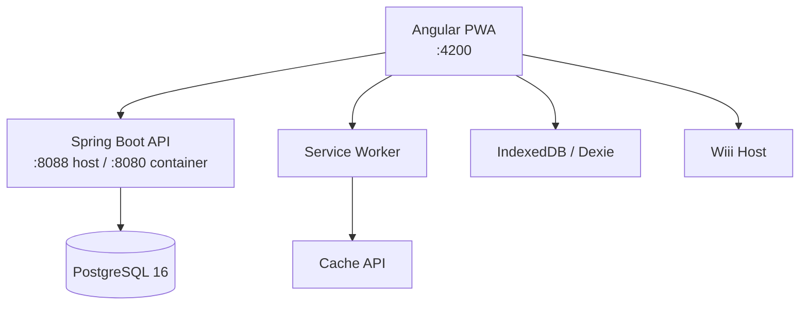

<div align="center">

# Maritime LMS

Production-oriented learning management system for maritime education.

[](https://angular.dev)
[](https://spring.io/projects/spring-boot)
[](https://www.postgresql.org)
[](https://openjdk.org)
[](https://www.typescriptlang.org)
[](#license)

[Quick Start](#quick-start) · [Architecture](#architecture) · [Docs Map](#docs-map) · [Development](#development) · [Deployment](#deployment)

</div>

---

## Overview

Maritime LMS is a full-stack LMS for maritime training providers. It supports course authoring, structured lesson delivery, assignments, quizzes, progress tracking, payments, and an embedded AI assistant.

The system is designed around three practical requirements:

- role-based operations for `ADMIN`, `ORG_ADMIN`, `TEACHER`, and `STUDENT`
- offline-first learning for unstable maritime connectivity
- production deployment with Docker, reverse proxying, and environment-based configuration

## Core Capabilities

- Course authoring with chapters, lessons, sections, curriculum reorder, and review workflow
- Student learning flow with progress tracking, certificates, assignments, quizzes, and messaging
- Offline/PWA support using Angular Service Worker, IndexedDB, Cache API, and background sync
- AI assistant integration with SSE streaming and embedded Wiii experience
- Payment and file storage integration through VNPay and Cloudflare-compatible storage
- Multi-tier administration with escalation prevention for organization admins

## Tech Stack

| Layer | Stack |
|------|-------|
| Frontend | Angular 20, TypeScript 5.9, RxJS, Sass, Dexie.js, Shaka Player |
| Backend | Java 21, Spring Boot 3.2.6, Spring Security, Spring Data JPA |
| Database | PostgreSQL 16, Flyway |
| Infra | Docker Compose, Caddy, nginx, Cloudflare R2 |

## Quick Start

### Runtime Conventions

- Frontend dev URL: `http://localhost:4200`
- Backend dev URL on host: `http://localhost:8088`
- Spring Boot internal container/app port: `8080`
- Production API: same-origin `/api/*` behind `https://holilihu.online`
- Root `docker-compose*.yml` files are the only supported Docker runtime topology

### Prerequisites

| Tool | Version |
|------|---------|
| Docker | Current |
| Node.js | 22.x |
| Java | 21+ |
| Maven | 3.9+ (host-native backend only) |

### Option A: Full Stack in Docker

```bash
# 1. Prepare local env
cp .env.dev.example .env

# 2. Build and boot the full dev stack
docker compose -f docker-compose.yml -f docker-compose.dev.yml up -d --build --wait

# 3. Verify backend + frontend
curl -s http://localhost:8088/actuator/health
curl -I http://localhost:4200/
```

### Option B: Docker Backend + Local Frontend

```bash
# 1. Prepare local env
cp .env.dev.example .env

# 2. Start only the backend services needed for local FE work
docker compose -f docker-compose.yml -f docker-compose.dev.yml up -d db backend

# 3. Start frontend locally
cd fe
npm install
npm start
```

Optional local pgAdmin:

```bash
docker compose -f docker-compose.yml -f docker-compose.dev.yml --profile devtools up -d pgadmin
```

### Host-Native Backend

```bash
cd backend
SERVER_PORT=8088 mvn spring-boot:run -Dspring-boot.run.profiles=dev
```

### Access Points

| Service | URL |
|---------|-----|
| Frontend | http://localhost:4200 |
| Backend API | http://localhost:8088/api/v3 |
| Swagger UI | http://localhost:8088/swagger-ui |
| pgAdmin (optional `devtools` profile) | http://localhost:8081 |

### Default Accounts

| Role | Email | Password |
|------|-------|----------|
| ADMIN | `admin@maritime.edu` | `admin123` |
| ORG_ADMIN | `orgadmin@maritime.edu` | `orgadmin123` |
| TEACHER | `teacher@maritime.edu` | `teacher123` |
| STUDENT | `student@maritime.edu` | `student123` |

For expanded manual QA coverage, use [docs/testing/TEST_CHECKLIST.md](docs/testing/TEST_CHECKLIST.md).

## Docs Map

Start here depending on what you need:

| Document | Purpose |
|----------|---------|
| [ONBOARDING.md](ONBOARDING.md) | 15-minute teammate setup guide |
| [backend/README.md](backend/README.md) | Backend runbook, API, schema, backend-specific workflows |
| [fe/FRONTEND_ARCHITECTURE.md](fe/FRONTEND_ARCHITECTURE.md) | Frontend structure, state, feature architecture |
| [docs/README.md](docs/README.md) | Documentation map and folder semantics |
| [docs/architecture/STREAMING_PWA_ROADMAP.md](docs/architecture/STREAMING_PWA_ROADMAP.md) | Offline/PWA implementation roadmap |
| [docs/architecture/LESSON_VIEW_ARCHITECTURE.md](docs/architecture/LESSON_VIEW_ARCHITECTURE.md) | Lesson learning experience reference |
| [docs/testing/TEST_CHECKLIST.md](docs/testing/TEST_CHECKLIST.md) | Manual QA checklist |
| [CLAUDE.md](CLAUDE.md) | Internal agent/developer context file |
| [.github/workflows/ci.yml](.github/workflows/ci.yml) | Backend tests, frontend build, compose validation, and Docker smoke test |

## Architecture

### System Snapshot



### Backend Modules

```text
backend/src/main/java/com/example/lms/
├── identity
├── course_authoring
├── learning_delivery
├── assessment
├── communication
├── ai_assistant
├── shared
└── config
```

The backend follows a modular Clean Architecture layout:

```text
{module}/
├── domain
├── application
└── infrastructure
```

### Frontend Structure

```text
fe/src/app/
├── api
├── core
├── features
├── shared
└── state
```

The frontend uses standalone Angular features, lazy route loading, service-level state, and PWA/offline services.

## Development

### Common Commands

```bash
# Frontend
cd fe
npm start
npm run build

# Backend tests
cd backend
mvn test -B
```

### Configuration Notes

- Dev frontend uses `fe/proxy.conf.json` for `/api/*`
- Dev frontend `apiUrl` is intentionally empty in `fe/src/environments/environment.ts`
- Production frontend uses same-origin API calls behind Caddy
- Production Wiii embed/app URL points to `https://wiii.holilihu.online`

### Repository Layout

```text
.
├── backend/     # Spring Boot application
├── fe/          # Angular application
├── docs/        # Architecture, plans, reports, testing docs
├── scripts/     # Operational helper scripts
├── docker-compose.yml
├── docker-compose.dev.yml
├── docker-compose.prod.yml
├── Caddyfile
├── ONBOARDING.md
└── README.md
```

## Deployment

Production deployment is container-based.

- Base compose: `docker-compose.yml`
- Production overrides: `docker-compose.prod.yml`
- Reverse proxy: `Caddyfile`
- Deploy helper: `deploy.sh`
- Dev environment template: `.env.dev.example`
- Production environment template: `.env.prod.example`
- CI workflow: `.github/workflows/ci.yml`
- Manual deploy workflow: `.github/workflows/deploy.yml`
- Deploy runbook: `docs/deployment/GITHUB_ACTIONS_DEPLOY.md`

For production setup details, use `deploy.sh` together with `docker-compose.prod.yml` and the environment templates in the repository root.

## Quality Checks

Minimum checks before shipping:

```bash
# Backend
cd backend && mvn test -B

# Frontend
cd fe && npm run build
```

For manual verification flows, use [docs/testing/TEST_CHECKLIST.md](docs/testing/TEST_CHECKLIST.md).

## License

Proprietary software for maritime education. All rights reserved.
