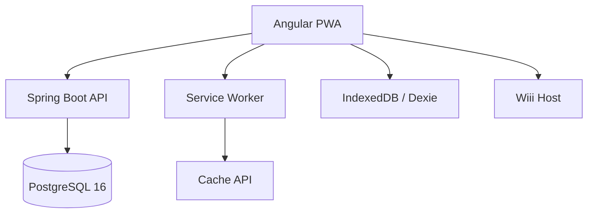

<div align="center">

# Maritime LMS

Hệ thống quản lý học tập dành cho đào tạo hàng hải, vận hành theo hướng production-first.

[Khởi động nhanh](#khởi-động-nhanh) · [Bản đồ tài liệu](#bản-đồ-tài-liệu) · [Kiến trúc](#kiến-trúc) · [Phát triển](#phát-triển) · [Triển khai](#triển-khai)

</div>

---

## Tổng quan

Maritime LMS là một LMS full-stack cho đơn vị đào tạo hàng hải. Hệ thống hỗ trợ:

- biên soạn khóa học theo `Chương -> Bài -> Mục`
- học tập có theo dõi tiến độ, quiz, assignment, chứng chỉ
- thanh toán và quản trị doanh thu
- PWA/offline cho bối cảnh mạng yếu hoặc gián đoạn
- video pipeline nội bộ với `Cloudflare R2 private + Shaka Packager`, adaptive `HLS/DASH`, signed playback, và offline MP4 profiles
- AI assistant tích hợp
- mô hình quyền nhiều tầng: `ADMIN`, `ORG_ADMIN`, `TEACHER`, `STUDENT`

## Năng lực chính

- Course authoring với chapter, lesson, section, reorder, review workflow
- Learner flow với progress, quiz, assignment, messaging, certificate
- PWA/offline dùng Angular Service Worker, IndexedDB, Cache API, background sync
- Payment/payout với guard vai trò, revoke access, history
- Hạ tầng production bằng Docker Compose, Caddy, nginx, PostgreSQL

## Công nghệ chính

| Lớp | Stack |
|-----|-------|
| Frontend | Angular 20, TypeScript 5.9, RxJS, Sass, Dexie.js, Shaka Player |
| Backend | Java 21, Spring Boot 3.2.6, Spring Security, Spring Data JPA |
| Database | PostgreSQL 16, Flyway |
| Hạ tầng | Docker Compose, Caddy, nginx, Cloudflare R2, Shaka Packager |

## Khởi động nhanh

### Quy ước runtime

- Frontend local: `http://localhost:4200`
- Backend local trên host: `http://localhost:8088`
- Port nội bộ Spring Boot/container: `8080`
- Production API: same-origin dưới `https://holilihu.online/api/*`
- Chỉ hỗ trợ topology bằng `docker-compose.yml` + `docker-compose.dev.yml` / `docker-compose.prod.yml`

### Yêu cầu

| Công cụ | Khuyến nghị |
|--------|-------------|
| Docker Desktop | Bản ổn định mới |
| Node.js | 22.x |
| Java | 21 |
| Maven | 3.9+ |

### Cách 1: Backend bằng Docker, frontend chạy local

```bash
cp .env.dev.example .env
docker compose -f docker-compose.yml -f docker-compose.dev.yml up -d db backend

cd fe
npm install
npm start
```

### Cách 2: Chạy toàn bộ bằng Docker

```bash
cp .env.dev.example .env
docker compose -f docker-compose.yml -f docker-compose.dev.yml up -d --build --wait
```

### Kiểm tra nhanh

```bash
curl -s http://localhost:8088/actuator/health
curl -I http://localhost:4200/
```

### Tài khoản mặc định

| Vai trò | Email | Mật khẩu |
|--------|-------|----------|
| ADMIN | `admin@maritime.edu` | `admin123` |
| ORG_ADMIN | `orgadmin@maritime.edu` | `orgadmin123` |
| TEACHER | `teacher@maritime.edu` | `teacher123` |
| STUDENT | `student@maritime.edu` | `student123` |

Tài khoản seed mở rộng nằm trong [docs/testing/TEST_CHECKLIST.md](docs/testing/TEST_CHECKLIST.md).

## Bản đồ tài liệu

Bắt đầu từ các tài liệu này:

| Tài liệu | Mục đích |
|---------|----------|
| [ONBOARDING.md](ONBOARDING.md) | Setup nhanh cho teammate mới |
| [CHANGELOG.md](CHANGELOG.md) | Lịch sử thay đổi cấp dự án |
| [CONTRIBUTING.md](CONTRIBUTING.md) | Quy tắc đóng góp, cập nhật docs, test trước khi ship |
| [backend/README.md](backend/README.md) | Runbook backend và DDD conventions |
| [fe/FRONTEND_ARCHITECTURE.md](fe/FRONTEND_ARCHITECTURE.md) | Cấu trúc frontend và feature architecture |
| [docs/README.md](docs/README.md) | Bản đồ tài liệu chi tiết |
| [docs/reference/BACKEND_OVERVIEW.md](docs/reference/BACKEND_OVERVIEW.md) | Tổng quan backend bằng tiếng Việt |
| [docs/reference/FRONTEND_OVERVIEW.md](docs/reference/FRONTEND_OVERVIEW.md) | Tổng quan frontend bằng tiếng Việt |
| [docs/reference/RUNTIME_CONVENTIONS.md](docs/reference/RUNTIME_CONVENTIONS.md) | Quy ước runtime chuẩn của repo |
| [docs/runbooks/CLOUDFLARE_R2_VIDEO_SETUP.md](docs/runbooks/CLOUDFLARE_R2_VIDEO_SETUP.md) | Lấy Account ID, R2 keys, bucket, public URL, và CORS cho video pipeline |
| [docs/runbooks/CLOUDFLARE_MEDIA_DOMAIN_EDGE_AUTH_RUNBOOK.md](docs/runbooks/CLOUDFLARE_MEDIA_DOMAIN_EDGE_AUTH_RUNBOOK.md) | Cấu hình `media.holilihu.online`, edge auth, và cache rules cho phase scale playback |
| [cloudflare/workers/media-edge-auth-worker.js](cloudflare/workers/media-edge-auth-worker.js) | Worker fallback cho Cloudflare Free để validate `verify` token và đọc object trực tiếp từ `lms-storage` |
| [docs/runbooks/VIDEO_R2_SHAKA_CUTOVER_CHECKLIST.md](docs/runbooks/VIDEO_R2_SHAKA_CUTOVER_CHECKLIST.md) | Checklist cutover video production sang `R2 + Shaka` |
| [docs/runbooks/DEDICATED_VIDEO_WORKER_RUNBOOK.md](docs/runbooks/DEDICATED_VIDEO_WORKER_RUNBOOK.md) | Tách `video-worker` sang VM riêng để tăng ingest throughput mà không chèn CPU của web app |
| [docs/runbooks/PRODUCTION_SMOKE_TEST.md](docs/runbooks/PRODUCTION_SMOKE_TEST.md) | Smoke test sau deploy |
| [docs/architecture/2026-03-19-video-worker-and-playback-scale-plan.md](docs/architecture/2026-03-19-video-worker-and-playback-scale-plan.md) | Plan chi tiết cho worker riêng, chất lượng encode, và scale concurrent playback |
| [docs/architecture/2026-03-19-media-domain-edge-auth-plan.md](docs/architecture/2026-03-19-media-domain-edge-auth-plan.md) | Plan cho `custom media domain + edge auth` để bỏ backend khỏi hot path segment playback |
| [docs/testing/TEST_CHECKLIST.md](docs/testing/TEST_CHECKLIST.md) | Checklist QA thủ công |

## Kiến trúc

### Toàn hệ thống



### Backend

```text
backend/src/main/java/com/example/lms/
├── identity
├── course_authoring
├── learning_delivery
├── assessment
├── communication
├── ai_assistant
├── shared
└── config
```

Backend đi theo Clean Architecture / DDD:

```text
{module}/
├── domain
├── application
└── infrastructure
```

### Frontend

```text
fe/src/app/
├── api
├── core
├── features
├── shared
└── state
```

## Phát triển

### Lệnh thường dùng

```bash
# Frontend
cd fe
npm start
npm run build

# Backend
cd backend
mvn test -B
```

### Lưu ý cấu hình

- Frontend dev dùng `fe/proxy.conf.json` cho `/api/*`
- `environment.ts` dev chủ động dùng same-origin/proxy, không hardcode backend host vào code
- Production frontend dùng same-origin API sau Caddy

## Triển khai

- Base compose: `docker-compose.yml`
- Production overrides: `docker-compose.prod.yml`
- Reverse proxy: `Caddyfile`
- Script deploy: `deploy.sh`
- Video production stack: public `lms-cdn` + private `lms-storage` trên R2 + `Shaka Packager` trong backend container
- Production compose now supports a dedicated `video-worker` service so ingest can be separated from the web backend
- `video-worker` trong `docker-compose.prod.yml` giờ nằm sau profile `video-worker`; giữ `ENABLE_LOCAL_VIDEO_WORKER=true` nếu muốn worker chạy cùng app VM, hoặc đặt `false` khi đã có worker VM riêng
- `video-worker` must have outbound network access to R2; do not attach it only to an `internal` Docker network or ingest will fail on source/object fetches
- Repo có thêm `docker-compose.video-worker.yml`, `.env.video-worker.example`, và `deploy-video-worker.sh` để deploy worker-only lên VM riêng
- Nếu worker VM nối DB qua private forwarder trên app VM, `SPRING_DATASOURCE_URL` nên thêm `?sslmode=disable`
- Nếu app VM dùng `socat` để expose PostgreSQL cho worker VM, forwarder phải resolve động IP hiện tại của `lms-db-1` thay vì hardcode Docker IP
- Video setup: [docs/runbooks/CLOUDFLARE_R2_VIDEO_SETUP.md](docs/runbooks/CLOUDFLARE_R2_VIDEO_SETUP.md)
- Media domain + edge auth: [docs/runbooks/CLOUDFLARE_MEDIA_DOMAIN_EDGE_AUTH_RUNBOOK.md](docs/runbooks/CLOUDFLARE_MEDIA_DOMAIN_EDGE_AUTH_RUNBOOK.md)
- Current production bucket split: public `lms-cdn` via `https://cdn.holilihu.online` + private `lms-storage` for presigned learner video/storage
- Backend now supports manifest rewrite to direct `media.holilihu.online` object URLs via `VIDEO_MEDIA_DOMAIN`, `VIDEO_EDGE_AUTH_MODE=media_hmac_query`, and `VIDEO_EDGE_HMAC_SECRET`
- Production edge auth is now live on Cloudflare Free via Worker custom domain: invalid/no-token media requests return `403`, while signed HLS/DASH object requests return `200`
- Current production topology: app VM runs `backend/db/frontend/caddy`, local `video-worker` is disabled, and ingest runs on the dedicated worker VM
- Current production playback baseline from a controlled synthetic batch:
  - `HLS master manifest`: `50` conns about `102 req/s` avg latency `435 ms`; `100` conns about `147 req/s` avg latency `664 ms`
  - `backend /object redirect`: `100` conns about `473 req/s` and `200` conns about `491 req/s`, both returning `302` as expected
  - `media-domain HLS segment`: `100` conns about `342 req/s`, `200` conns about `293 req/s`, `300` conns about `412 req/s` with one client-side error across the whole burst
  - `media-domain DASH object`: `100` conns about `615 req/s`, `200` conns about `1171 req/s`
- Controlled distributed playback baseline from two origins (`local machine + dedicated worker VM`) with fresh signed URLs:
  - `media-domain HLS object`: `100 + 100` conns sustained about `1441 req/s` combined with app health still `UP`
  - `media-domain HLS object`: `200 + 200` conns sustained about `2826 req/s` combined with app health still `UP`
  - `HLS master manifest`: `50 + 50` conns sustained about `491 req/s` combined with app health still `UP`
- Interpret the baselines carefully: the first batch is a one-client synthetic test and the second is a two-origin distributed synthetic test. Both are useful for operational confidence and relative tuning, but neither replaces a many-region load test with real viewer behavior.
- Video cutover/smoke: [docs/runbooks/VIDEO_R2_SHAKA_CUTOVER_CHECKLIST.md](docs/runbooks/VIDEO_R2_SHAKA_CUTOVER_CHECKLIST.md)
- Runbook deploy: [docs/deployment/GITHUB_ACTIONS_DEPLOY.md](docs/deployment/GITHUB_ACTIONS_DEPLOY.md)
- Nếu teacher thêm hoặc đổi `videoAssetId` trên course đã `APPROVED`, phải `submit-for-approval` lại và để admin duyệt lại trước khi learner thấy thay đổi, vì learner đọc từ `course_publications` snapshot chứ không đọc draft trực tiếp
- Baseline production hiện tại: file mẫu khoảng `156 MB` / `1080p` mất hơn `20 phút` để lên `READY/READY` trên VM hiện có; điều này ảnh hưởng thời gian teacher chờ video sẵn sàng và throughput ingest, nhưng không làm chậm playback của asset đã `READY`
- Thời gian `upload -> READY` không chủ yếu đi theo mạng người dùng; sau khi upload xong, worker còn phải `download source -> ffprobe -> ffmpeg renditions -> Shaka package -> upload adaptive files`, nên nghẽn thường nằm ở CPU/IO của worker
- Repo giờ có 3 núm tuning ingest an toàn qua env: `VIDEO_PACKAGE_UPLOAD_CONCURRENCY`, `VIDEO_ADAPTIVE_SEGMENT_DURATION_SECONDS`, `VIDEO_FFMPEG_PRESET`
- Repo hiện đã hỗ trợ multipart direct upload cho video lớn thay vì chỉ dựa vào single presigned PUT; đây là hướng đúng cho file lớn và đường truyền dễ gián đoạn
- Production smoke cũng đã xác nhận `multipart_upload_id` từ R2 có thể vượt `255` ký tự, nên schema `upload_sessions.multipart_upload_id` phải là `text`
- Ingest hiện đã đổi sang one-pass multi-rendition cho các profile cần transcode, nên worker không còn decode cùng một source nhiều lần chỉ để tạo `360p` và `720p`
- Sau khi bật `VIDEO_FFMPEG_PRESET=superfast` và one-pass transcode, production sample `~156 MB / 1080p` đã giảm từ hơn `21 phút` xuống khoảng `14 phút 19 giây` để lên `READY/READY`; trade-off hiện tại là `SAVER` và `STANDARD` dùng nhiều bitrate/storage hơn so với preset `veryfast`
- Repo có script smoke production có thể tái dùng ở `scripts/prod-video-smoke.ps1` để chạy lại `upload -> confirm -> from-upload -> READY -> preview manifest`
- Playback hot path giờ có cache ngắn hạn cho raw manifest và presigned object redirect để giảm đọc R2 lặp lại và giảm ký URL lặp lại khi nhiều learner cùng xem một asset
- `docker-compose.prod.yml` giờ hỗ trợ tăng/giảm tài nguyên bằng env như `VIDEO_WORKER_CPU_LIMIT`, `VIDEO_WORKER_MEMORY_LIMIT`, `BACKEND_CPU_LIMIT` thay vì phải sửa tay file compose mỗi lần tuning

## Chất lượng tối thiểu trước khi ship

- `cd backend && mvn test -B`
- `cd fe && npm run build`
- kiểm tra manual theo [docs/testing/TEST_CHECKLIST.md](docs/testing/TEST_CHECKLIST.md)
- nếu có thay đổi runtime/workflow đáng kể, cập nhật `CHANGELOG.md` và tài liệu chuẩn liên quan
