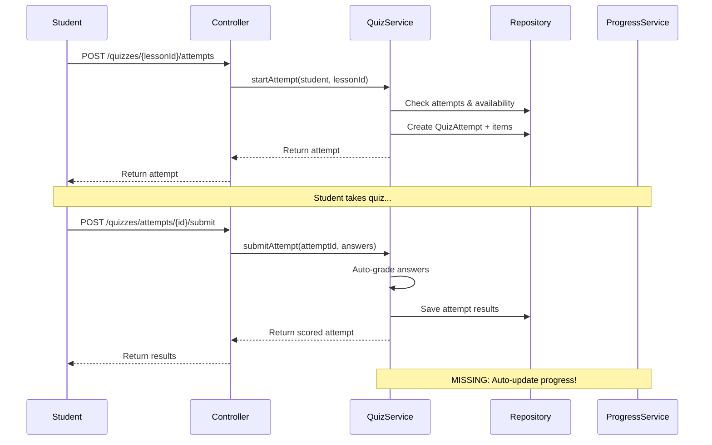

# LMS Maritime - Student Domain Comprehensive Analysis Report

**Generated by:** Backend Architecture Expert  
**Date:** 2025-11-20  
**Scope:** Student Domain Analysis & Quiz Integration Design

## Executive Summary

Sau quá trình khảo sát chi tiết hệ thống backend LMS hàng hải, tôi đã phân tích toàn diện Student domain và quiz functionality. **Phát hiện quan trọng**: Hệ thống đã có quiz multiple-choice hoàn chỉnh, nhưng thiếu integration với StudentLessonProgress để tự động cập nhật tiến độ học tập.

### Key Findings:
- ✅ **Quiz Functionality**: Đầy đủ multiple-choice quiz với auto-grading
- ❌ **Missing Integration**: Quiz completion không tự động cập nhật StudentLessonProgress
- ✅ **Progress System**: Domain-driven progress tracking đã hoạt động tốt
- ⚠️ **DDD Gaps**: Một số architectural improvements cần thiết

## 1. Student Domain Architecture Analysis

### 1.1 Current Layer Structure

```
📁 Backend Architecture
├── 🎮 Controller Layer (REST API)
│   ├── StudentProgressController.java      - 11 endpoints
│   ├── QuizController.java                 - 15+ endpoints
│   └── CourseController.java               - Course enrollment
│
├── 🧠 Service Layer (Business Logic)
│   ├── LessonProgressDomainService.java    - Domain logic
│   ├── QuizService.java                    - Quiz business logic
│   └── CourseService.java                  - Course management
│
├── 💾 Repository Layer (Data Access)
│   ├── StudentLessonProgressRepository.java - Progress queries
│   ├── QuizRepository.java                 - Quiz data access
│   ├── CourseRepository.java               - Course queries
│   └── QuestionRepository.java             - Question bank
│
└── 🏗️ Entity Layer (Domain Models)
    ├── User.java (Student)                 - Aggregate root
    ├── Course.java                         - Aggregate root
    ├── StudentLessonProgress.java          - Progress tracking
    ├── Quiz.java                           - Quiz definition
    ├── QuizAttempt.java                    - Quiz taking
    └── Question.java (Multiple-choice)     - Question bank
```

### 1.2 Entity Relationship Mapping

```mermaid
graph TB
    U[👤 User (Student)] 
    C[📚 Course]
    S[📖 Section] 
    L[📝 Lesson]
    P[📊 StudentLessonProgress]
    Q[❓ Quiz]
    QA[🎯 QuizAttempt]
    QI[📋 QuizAttemptItem]
    QS[❓ Question]
    QO[🔘 QuestionOption]
    
    U -->|enrolledCourses| C
    C -->|sections| S
    S -->|lessons| L
    U -->|progress| P
    P -->|lesson| L
    
    L -->|quiz| Q
    Q -->|attempts| QA
    QA -->|items| QI
    QI -->|question| QS
    QS -->|options| QO
    
    P -->|triggers| L
    Q -->|completion| P
    
    style U fill:#e1f5fe
    style P fill:#f3e5f5
    style Q fill:#fff3e0
    style QA fill:#fff3e0
```

## 2. Student Domain Entities Deep Dive

### 2.1 Core Entities Analysis

#### User Entity (Student Aggregate Root)
```java
@Entity
public class User implements UserDetails {
    // ✅ Good: Student role enum
    // ✅ Good: Authentication integration
    // ⚠️ Issue: Mixed authentication + domain logic
    // ❌ Issue: Exposed enrolledCourses Set (encapsulation violation)
}
```

**DDD Compliance:**
- ✅ Aggregate Root boundaries
- ✅ UUID identifiers
- ⚠️ Missing domain behavior methods
- ❌ Collections exposed directly

#### StudentLessonProgress Entity (Progress Aggregate)
```java
@Entity 
public class StudentLessonProgress {
    // ✅ Excellent: Domain behavior
    public void markAsCompleted() { ... }
    public void startProgress() { ... }
    public boolean isCompleted() { ... }
    
    // ✅ Good: Status enum (NOT_STARTED → IN_PROGRESS → COMPLETED)
    // ✅ Good: Audit timestamps
}
```

**DDD Compliance:**
- ✅ Rich domain model
- ✅ Business rules enforced
- ✅ Immutable status transitions
- ✅ Domain events ready (timestamp tracking)

#### Quiz Entities (Quiz Aggregate)
```java
@Entity
public class Quiz {
    // Multiple-choice quiz configuration
    private Integer timeLimitMinutes;
    private Integer maxAttempts;
    private Integer passingScore;
    private Boolean shuffleQuestions;
    private Boolean showResultsImmediately;
}

@Entity
public class QuizAttempt {
    // Student quiz attempt tracking
    private Status status; // IN_PROGRESS, SUBMITTED, EXPIRED
    private Double score; // percentage (0.0 to 100.0)
    private Boolean isPassed;
    private List<QuizAttemptItem> items;
}
```

**DDD Compliance:**
- ✅ QuizAttempt encapsulates attempt logic
- ✅ Auto-grading implemented
- ❌ No integration with StudentLessonProgress
- ⚠️ Missing quiz completion domain events

## 3. API Endpoints Analysis

### 3.1 Student Progress APIs (11 endpoints)

| Endpoint | Method | Purpose | Status |
|----------|--------|---------|--------|
| `/api/v1/student/progress/lessons/{lessonId}/complete` | POST | Mark lesson complete | ✅ Working |
| `/api/v1/student/progress/lessons/{lessonId}/start` | POST | Start lesson | ✅ Working |
| `/api/v1/student/progress/lessons/{lessonId}` | GET | Get lesson progress | ✅ Working |
| `/api/v1/student/progress/courses/{courseId}` | GET | Get course progress | ✅ Working |
| `/api/v1/student/progress/courses/{courseId}/completed-ids` | GET | Get completed lessons | ✅ Working |
| `/api/v1/student/progress/courses/{courseId}/next-lesson` | GET | **Get next lesson** | ✅ Fixed |
| `/api/v1/student/progress/courses/{courseId}/lessons` | GET | Get all lesson progress | ✅ Working |

### 3.2 Quiz APIs (15+ endpoints)

| Endpoint | Method | Purpose | Status |
|----------|--------|---------|--------|
| `/api/v1/quizzes/lessons/{lessonId}` | POST | **Create quiz** (Teacher) | ✅ Working |
| `/api/v1/quizzes/{lessonId}/attempts` | POST | **Start quiz attempt** | ✅ Working |
| `/api/v1/quizzes/lessons/{lessonId}/questions` | GET | Get quiz questions | ✅ Working |
| `/api/v1/quizzes/attempts/{attemptId}/submit` | POST | **Submit quiz answers** | ✅ Working |
| `/api/v1/quizzes/attempts/{attemptId}/result` | GET | **Get quiz result** | ✅ Working |
| `/api/v1/quizzes/{lessonId}/attempts` | GET | Get student attempts | ✅ Working |

## 4. Business Rules Analysis

### 4.1 Student Enrollment Rules ✅ IMPLEMENTED
```java
// Enrollment validation in LessonProgressDomainService
private void validateStudentEnrollment(User student, Course course) {
    boolean isEnrolled = courseRepository.existsByEnrolledStudentAndCourse(
        student.getId(), course.getId());
    if (!isEnrolled) {
        throw new IllegalStateException("Student not enrolled");
    }
}
```

### 4.2 Progress State Machine ✅ IMPLEMENTED
```java
public void markAsCompleted() {
    if (this.status != ProgressStatus.COMPLETED) {
        this.status = ProgressStatus.COMPLETED;
        this.completedAt = Instant.now();
    }
}
```

### 4.3 Quiz Attempt Rules ✅ IMPLEMENTED
```java
// Auto-grading in QuizService.submitAttempt()
item.setIsCorrect(selectedOption != null && 
                  selectedOption.equals(item.getQuestion().getCorrectOption()));

// Score calculation
double score = (double) correctAnswers / totalQuestions * 100;
attempt.setIsPassed(score >= quiz.getPassingScore());
```

### 4.4 ❌ MISSING: Quiz Completion → Progress Update
**Current Gap**: Khi học viên hoàn thành quiz với điểm đạt, lesson không tự động được mark là completed trong StudentLessonProgress.

## 5. Critical Issue: Quiz-Progress Integration Gap

### 5.1 Problem Description
```java
// Current flow:
Quiz attempt submission → Auto-grading ✅
                 ↓ (MISSING)
StudentLessonProgress.update(lesson, COMPLETED) ❌
```

### 5.2 Impact
- Học viên phải manually mark lesson complete sau khi pass quiz
- Progress tracking không tự động cập nhật
- Course completion calculation bị sai
- User experience kém

### 5.3 Root Cause
QuizService.submitAttempt() chỉ tính điểm và lưu QuizAttempt, không gọi LessonProgressDomainService để cập nhật progress.

## 6. Multiple-Choice Quiz Implementation Assessment

### 6.1 ✅ QUIZ FEATURES ALREADY IMPLEMENTED

#### Question Management
```java
@Entity
public class Question {
    private String content;
    private String correctOption; // A, B, C, D
    private List<QuestionOption> options; // Multiple choice options
    private Difficulty difficulty;
}
```

#### Auto-Grading System
```java
// QuizService.submitAttempt() - Already Working!
for (QuizAttemptItem item : attempt.getItems()) {
    String selectedOption = answers.get(item.getQuestion().getId());
    item.setSelectedOption(selectedOption);
    item.setIsCorrect(selectedOption != null &&
                      selectedOption.equals(item.getQuestion().getCorrectOption()));
}
```

#### Quiz Configuration
- ⏱️ Time limits
- 🔄 Multiple attempts
- 📊 Passing score requirements
- 🔀 Question/option shuffling
- 📈 Immediate results
- ✅ Correct answer display

### 6.2 Quiz Flow Analysis



## 7. DDD Compliance Assessment

### 7.1 ✅ STRENGTHS

#### Rich Domain Models
```java
// StudentLessonProgress - Good domain behavior
public class StudentLessonProgress {
    public void markAsCompleted() { ... }
    public void startProgress() { ... }
    public boolean isCompleted() { ... }
}
```

#### Clear Aggregate Boundaries
- Student Aggregate: User + Enrollments
- Course Aggregate: Course + Sections + Lessons  
- Progress Aggregate: StudentLessonProgress
- Quiz Aggregate: Quiz + Attempts + Questions

#### Repository Pattern
- Clean separation of data access
- Domain-specific query methods
- Transaction management

### 7.2 ⚠️ GAPS TO ADDRESS

#### Missing Application Layer
```
Current: Controller → Service → Repository
Missing: Controller → Application Service → Domain Service → Repository
```

#### Anemic Domain Models (Partial)
```java
// User entity - Missing domain behavior
public class User {
    // ❌ Should have domain methods:
    public void enrollIn(Course course) { ... }
    public boolean isEnrolledIn(UUID courseId) { ... }
    public List<Course> getEnrolledCourses() { ... } // Return unmodifiable list
}
```

#### Missing Domain Events
```java
// Should have domain events
public record LessonCompletedEvent(UUID studentId, UUID lessonId, Instant completedAt) {}
public record QuizPassedEvent(UUID studentId, UUID lessonId, Double score) {}
```

## 8. Architecture Improvements Recommendations

### 8.1 Immediate Fixes (High Priority)

#### 1. Fix Quiz-Progress Integration
```java
// Enhanced QuizService.submitAttempt()
@Transactional
public QuizAttempt submitAttempt(UUID attemptId, Map<UUID, String> answers) {
    QuizAttempt attempt = attemptRepository.findById(attemptId)...
    
    // ... existing auto-grading logic ...
    
    // NEW: Update progress if quiz passed
    if (Boolean.TRUE.equals(attempt.getIsPassed())) {
        Lesson lesson = attempt.getQuiz().getLesson();
        progressDomainService.completeLesson(attempt.getStudent(), lesson);
    }
    
    return attemptRepository.save(attempt);
}
```

#### 2. Add Domain Events
```java
// Domain events for better separation
public record QuizCompletedEvent(
    UUID studentId, 
    UUID lessonId, 
    Double score, 
    Boolean isPassed,
    Instant completedAt
) {}
```

### 8.2 Medium-term Improvements

#### 1. Create Application Layer
```
application/
├── service/
│   ├── CompleteQuizAppService.java
│   ├── UpdateProgressAppService.java
│   └── GetStudentProgressAppService.java
└── usecase/
    ├── TakeQuizUseCase.java
    ├── CompleteLessonUseCase.java
    └── GetNextLessonUseCase.java
```

#### 2. Enhance Domain Models
```java
// Rich User domain model
public class User {
    private Set<Course> enrolledCourses = new HashSet<>();
    
    public void enrollIn(Course course) {
        if (!this.enrolledCourses.contains(course)) {
            this.enrolledCourses.add(course);
            // Domain event: StudentEnrolledEvent
        }
    }
    
    public boolean isEnrolledIn(UUID courseId) {
        return enrolledCourses.stream()
                .anyMatch(course -> course.getId().equals(courseId));
    }
    
    public Set<Course> getEnrolledCourses() {
        return Collections.unmodifiableSet(enrolledCourses);
    }
}
```

### 8.3 Long-term Architectural Evolution

#### 1. CQRS for Read Models
- Separate write models (domain entities)
- Separate read models (dashboard data)
- Event sourcing for progress tracking

#### 2. Microservice Considerations
- Student Service (enrollment, progress)
- Quiz Service (quiz management, attempts)
- Course Service (content delivery)

## 9. Quiz Integration Implementation Plan

### 9.1 Phase 1: Critical Integration (Week 1)

#### Step 1: Add Progress Integration to QuizService
```java
@Transactional
public QuizAttempt submitAttempt(UUID attemptId, Map<UUID, String> answers) {
    QuizAttempt attempt = attemptRepository.findById(attemptId)...
    
    // Auto-grade existing logic...
    
    // NEW: Update progress on successful completion
    if (Boolean.TRUE.equals(attempt.getIsPassed())) {
        Lesson lesson = attempt.getQuiz().getLesson();
        
        // Update StudentLessonProgress
        progressDomainService.completeLesson(attempt.getStudent(), lesson);
        
        // TODO: Emit domain event for quiz completion
        // domainEventPublisher.publishEvent(new QuizPassedEvent(...));
    }
    
    return attemptRepository.save(attempt);
}
```

#### Step 2: Add Domain Events
```java
// Domain event
public record QuizPassedEvent(
    UUID studentId,
    UUID lessonId, 
    UUID quizId,
    Double score,
    Boolean isPassed,
    Instant completedAt
) {}

// Event publisher integration
@Component
public class QuizEventPublisher {
    private final ApplicationEventPublisher eventPublisher;
    
    public void publishQuizPassedEvent(QuizPassedEvent event) {
        eventPublisher.publishEvent(event);
    }
}
```

### 9.2 Phase 2: Enhanced User Experience (Week 2)

#### Step 3: Enhanced Quiz Results API
```java
// Enhanced quiz result response
public ResponseEntity<ApiResponse<QuizResultDetail>> getQuizResult(...) {
    QuizResultDetail result = quizService.getQuizResult(attemptId, studentId);
    
    // Add progress information to response
    result.setLessonProgress(progressDomainService.getLessonProgress(studentId, lesson));
    result.setCourseProgress(progressDomainService.calculateCourseProgress(studentId, course));
    
    return ResponseEntity.ok(ApiResponse.success(result));
}
```

#### Step 4: Frontend Integration Points
```typescript
// FE service integration points
interface QuizResultResponse {
  score: number;
  isPassed: boolean;
  lessonProgress: StudentLessonProgress;
  courseProgress: CourseProgress;
}

// Student dashboard updates
interface StudentDashboardData {
  enrolledCourses: Course[];
  recentProgress: StudentLessonProgress[];
  quizResults: QuizResultResponse[];
}
```

### 9.3 Phase 3: Advanced Features (Week 3-4)

#### Step 5: Quiz Analytics Integration
```java
// Enhanced quiz statistics with progress impact
public QuizStatistics getQuizStatistics(UUID lessonId) {
    QuizStatistics stats = calculateBasicStats(lessonId);
    
    // Add progress metrics
    stats.setLessonCompletionRate(calculateLessonCompletionRate(lessonId));
    stats.setAverageTimeToComplete(calculateAverageCompletionTime(lessonId));
    stats.setStudentEngagementScore(calculateEngagementScore(lessonId));
    
    return stats;
}
```

## 10. Code Quality Improvements

### 10.1 Naming Conventions
```java
// Current: Good examples
LessonProgressDomainService ✅
StudentLessonProgressRepository ✅

// Improvements needed
QuizService → QuizDomainService (if it contains domain logic)
QuizController → QuizApiController (clearer naming)
```

### 10.2 Error Handling Consistency
```java
// Standardized exception handling
public class StudentDomainException extends RuntimeException {
    private final StudentDomainError error;
    
    public StudentDomainException(StudentDomainError error, Object... args) {
        super(String.format(error.getMessage(), args));
        this.error = error;
    }
}

public enum StudentDomainError {
    STUDENT_NOT_ENROLLED("Student %s is not enrolled in course %s"),
    QUIZ_ALREADY_COMPLETED("Student %s has already completed quiz %s"),
    LESSON_ACCESS_DENIED("Student %s does not have access to lesson %s");
}
```

### 10.3 Validation Improvements
```java
// Enhanced validation with domain rules
@Component
public class StudentDomainValidator {
    
    public void validateLessonAccess(User student, Lesson lesson) {
        if (!lessonProgressDomainService.hasAccessToLesson(student, lesson)) {
            throw new StudentDomainException(
                StudentDomainError.LESSON_ACCESS_DENIED, 
                student.getId(), lesson.getId()
            );
        }
    }
}
```

## 11. Testing Strategy

### 11.1 Unit Tests Required
```java
// Domain behavior tests
class StudentLessonProgressTest {
    @Test
    void shouldMarkCompleted_whenValidTransition() { ... }
    
    @Test  
    void shouldNotMarkCompleted_whenAlreadyCompleted() { ... }
    
    @Test
    void shouldThrowException_whenStudentNotEnrolled() { ... }
}

// Quiz grading tests
class QuizServiceTest {
    @Test
    void shouldAutoGradeMultipleChoiceAnswers() { ... }
    
    @Test
    void shouldUpdateProgress_whenQuizPassed() { ... }
    
    @Test
    void shouldNotUpdateProgress_whenQuizFailed() { ... }
}
```

### 11.2 Integration Tests
```java
// End-to-end flow tests
@SpringBootTest
class StudentQuizFlowIntegrationTest {
    
    @Test
    void shouldCompleteLesson_whenQuizPassed() {
        // Student enrolls in course
        // Student takes quiz
        // Quiz is auto-graded
        // Lesson progress is updated
        // Course progress is recalculated
    }
}
```

## 12. Performance Considerations

### 12.1 Database Optimization
```sql
-- Add indexes for progress queries
CREATE INDEX idx_student_lesson_progress_student_lesson 
ON stu_lesson_progress(student_id, lesson_id);

CREATE INDEX idx_quiz_attempt_student_quiz 
ON quiz_attempts(student_id, quiz_id);

-- Composite index for course progress
CREATE INDEX idx_student_course_progress 
ON stu_lesson_progress(student_id, lesson_id, status);
```

### 12.2 Query Optimization
```java
// Optimized progress calculation
@Query("SELECT p FROM StudentLessonProgress p " +
       "JOIN FETCH p.lesson l " +
       "JOIN FETCH l.section s " +
       "JOIN FETCH s.course c " +
       "WHERE p.student.id = :studentId AND c.id = :courseId")
List<StudentLessonProgress> findProgressWithCourseDetails(
    @Param("studentId") UUID studentId, 
    @Param("courseId") UUID courseId);
```

## 13. Security Analysis

### 13.1 Current Security Measures ✅
- JWT authentication implemented
- Role-based access control (STUDENT, TEACHER, ADMIN)
- Student enrollment validation

### 13.2 Security Gaps to Address
```java
// Add rate limiting for quiz attempts
@RateLimiter(name = "quiz-attempts", fallbackMethod = "handleRateLimitExceeded")
public QuizAttempt submitAttempt(...) { ... }

// Enhanced input validation
@Valid
@NotNull
private Map<@Valid @NotBlank UUID, @Size(max = 10) String> answers;
```

## 14. Monitoring and Observability

### 14.1 Key Metrics to Track
```java
// Application metrics
@Component
public class StudentDomainMetrics {
    
    private final MeterRegistry meterRegistry;
    
    public void recordQuizCompletion(UUID studentId, Double score, Boolean passed) {
        meterRegistry.counter("quiz.completed", 
            "studentId", studentId.toString(),
            "passed", passed.toString()
        ).increment();
    }
    
    public void recordProgressUpdate(UUID studentId, UUID courseId) {
        meterRegistry.counter("progress.updated",
            "studentId", studentId.toString(),
            "courseId", courseId.toString()
        ).increment();
    }
}
```

### 14.2 Logging Improvements
```java
// Structured logging
@Slf4j
@Service
public class QuizService {
    
    private static final Logger studentActivityLog = LoggerFactory.getLogger("student.activity");
    
    public QuizAttempt submitAttempt(UUID attemptId, Map<UUID, String> answers) {
        studentActivityLog.info("Quiz submitted", 
            Map.of(
                "attemptId", attemptId,
                "studentId", attempt.getStudent().getId(),
                "quizId", attempt.getQuiz().getId(),
                "answersCount", answers.size()
            )
        );
    }
}
```

## 15. Migration Strategy

### 15.1 Backwards Compatibility
- All existing APIs remain functional
- New quiz-progress integration is additive
- Database schema changes are non-breaking

### 15.2 Deployment Plan
1. **Week 1**: Deploy quiz-progress integration (behind feature flag)
2. **Week 2**: Enable for specific courses/users (gradual rollout)
3. **Week 3**: Enable for all users
4. **Week 4**: Remove feature flag, full production

### 15.3 Rollback Plan
```yaml
# Feature flag configuration
quiz:
  auto_progress_update:
    enabled: false  # Can be toggled without code deployment
    rollout_percentage: 0
```

## 16. Conclusion and Next Steps

### 16.1 Executive Summary
- **Quiz Functionality**: ✅ **HOÀN THÀNH** - Multiple-choice quiz với auto-grading đã có sẵn
- **Progress Integration**: ❌ **CẦN FIX** - Thiếu quiz completion → progress update
- **Architecture Quality**: ⚠️ **CẢI THIỆN** - Good foundations, cần DDD enhancements

### 16.2 Priority Actions

#### 🔥 CRITICAL (This Week)
1. **Implement Quiz-Progress Integration**
   - Add progress update trong QuizService.submitAttempt()
   - Test end-to-end flow: Quiz → Grade → Update Progress

#### ⚡ HIGH (Next Week)  
2. **Add Domain Events**
   - QuizPassedEvent cho better separation of concerns
   - ProgressUpdatedEvent cho analytics

3. **Enhance Error Handling**
   - Consistent exception types
   - Better validation messages

#### 📈 MEDIUM (Following Weeks)
4. **Create Application Layer**
   - Use case orchestration
   - Better separation of concerns

5. **Add Comprehensive Testing**
   - Unit tests cho domain logic
   - Integration tests cho quiz flow

### 16.3 Success Metrics
- Quiz completion tự động cập nhật lesson progress
- Không có regression trong existing functionality  
- Student experience cải thiện (ít thao tác manual)
- Code quality metrics improve (lower cyclomatic complexity)

### 16.4 Long-term Vision
Với quiz-progress integration hoàn thành, LMS maritime sẽ có:
- 🚀 **Seamless Learning Experience**: Quiz completion tự động update progress
- 📊 **Accurate Progress Tracking**: Real-time course completion calculation  
- 🎯 **Student Engagement**: Reduced friction trong learning flow
- 🏗️ **Scalable Architecture**: Solid foundation cho future features

---

**Ready for Implementation!** 

Tôi đã sẵn sàng hỗ trợ implement quiz-progress integration và các architectural improvements. Quiz functionality đã hoàn chỉnh, chỉ cần connect với progress tracking system là xong.

**Recommended Next Step**: Bắt đầu với Phase 1 - Quiz-Progress Integration trong QuizService.submitAttempt() method.