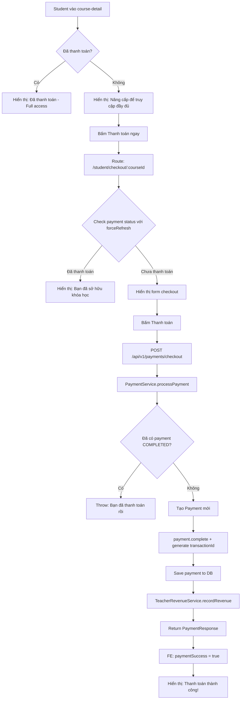
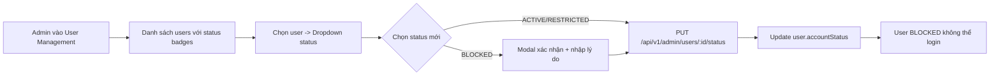
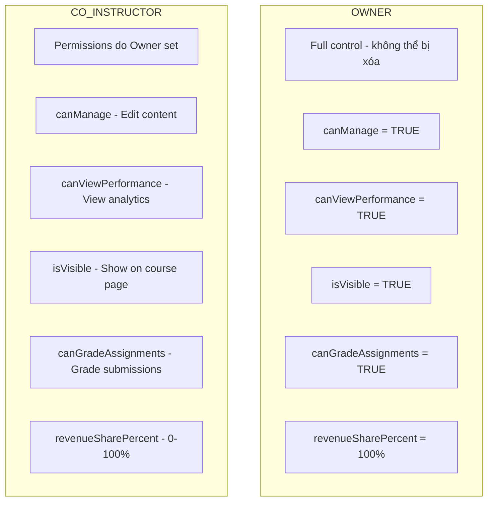
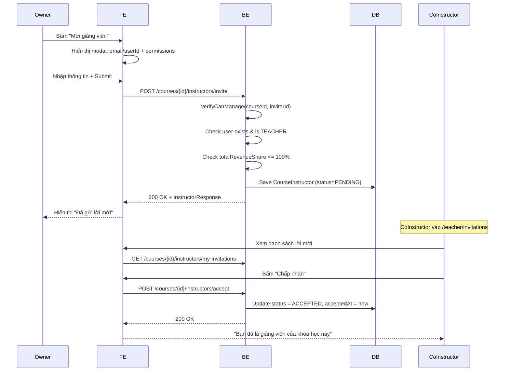

# 📊 Báo Cáo Chi Tiết 3 Nhiệm Vụ - LMS Payment & Admin System

> **Ngày**: 23/12/2025  
> **Tác giả**: Navigator AI  
> **Mục đích**: Tài liệu chi tiết về logic và luồng hoạt động cho team

---

## 📑 Mục Lục

1. [Payment System](#1-payment-system)
2. [Admin UI & User Management](#2-admin-ui--user-management)
3. [Teacher Hierarchy (Course Instructors)](#3-teacher-hierarchy-course-instructors)
4. [Known Issues & Recommendations](#4-known-issues--recommendations)

---

# 1. Payment System

## 1.1 Tổng Quan

**Mục tiêu**: Cho phép student mua khóa học, với 2 bài đầu miễn phí, full access sau khi thanh toán.

**Phương thức**: Giả lập thanh toán (simulated - luôn thành công)

## 1.2 Database Schema

```sql
-- V28__create_payments_table.sql
CREATE TABLE payments (
    id UUID PRIMARY KEY,
    student_id UUID NOT NULL,      -- FK to users
    course_id UUID NOT NULL,       -- FK to courses
    amount DECIMAL(19,2) NOT NULL,
    status VARCHAR(20) NOT NULL,   -- PENDING, COMPLETED, FAILED, REFUNDED
    payment_method VARCHAR(50),
    transaction_id VARCHAR(100),
    paid_at TIMESTAMP,
    created_at TIMESTAMP,
    notes VARCHAR(500),
    UNIQUE(student_id, course_id)   -- Mỗi student chỉ 1 payment/course
);
```

## 1.3 Luồng Hoạt Động



## 1.4 Chi Tiết Kỹ Thuật

### Backend

| File | Mô tả |
|------|-------|
| `Payment.java` | Entity với PaymentStatus enum (PENDING, COMPLETED, FAILED, REFUNDED), method `complete()`, `isValid()` |
| `PaymentRepository.java` | `findByStudentIdAndCourseId()`, `hasValidPayment()` |
| `PaymentService.java` | `processPayment()` tích hợp TeacherRevenueService, `canAccessLesson()`, FREE_LESSONS_COUNT=2 |
| `PaymentController.java` | 4 endpoints: checkout, status, my-payments, can-access |

### Frontend

| File | Mô tả |
|------|-------|
| `payment.service.ts` | Signals: _loading, _error, _paymentHistory. Cache: _paymentStatusCache. FREE_LESSONS_COUNT=2 |
| `checkout.component.ts` | States: isLoading, isProcessing, error, paymentSuccess, **alreadyPaid** |
| `course-detail.component.ts` | Signals: hasPaid, paymentLoading. Computed: accessibleLessonsCount |

### API Endpoints

| Method | Endpoint | Request | Response |
|--------|----------|---------|----------|
| POST | `/api/v1/payments/checkout` | `{courseId, amount, paymentMethod}` | PaymentResponse |
| GET | `/api/v1/payments/status/:courseId` | - | PaymentStatusResponse |
| GET | `/api/v1/payments/my-payments` | - | List<PaymentResponse> |
| GET | `/api/v1/payments/can-access/:courseId/lesson/:index` | - | LessonAccessResponse |

## 1.5 Logic Truy Cập Bài Học

```javascript
// Payment.service.ts
canAccessLessonLocal(courseId, lessonIndex) {
    const cached = this._paymentStatusCache.get(courseId);
    if (cached?.hasPaid) return true;  // Full access
    return lessonIndex < 2;             // Chỉ 2 bài đầu
}
```

## 1.6 ⚠️ Phát Hiện Tiềm Ẩn

1. **Tích hợp TeacherRevenue**: Khi payment thành công, tự động gọi `teacherRevenueService.recordRevenue()` nhưng dùng try-catch và **không fail transaction** nếu revenue recording lỗi.

2. **Cache Frontend**: `_paymentStatusCache` có thể stale. Đã có `forceRefresh` parameter nhưng chỉ dùng ở checkout page.

---

# 2. Admin UI & User Management

## 2.1 User Account Status

### Database Schema

```sql
-- V30__add_user_account_status.sql
ALTER TABLE users ADD COLUMN account_status VARCHAR(20) DEFAULT 'ACTIVE';
ALTER TABLE users ADD COLUMN status_reason VARCHAR(500);
```

### Status Types

| Status | Mô tả | Ảnh hưởng |
|--------|-------|-----------|
| ACTIVE | Hoạt động bình thường | Có thể login và sử dụng đầy đủ |
| BLOCKED | Bị khóa | **Không thể login** (isAccountNonLocked = false) |
| RESTRICTED | Hạn chế | Có thể login nhưng có giới hạn (chưa implement cụ thể) |

### Luồng Hoạt Động



### Tích hợp Spring Security

```java
// User.java
@Override
public boolean isAccountNonLocked() {
    return accountStatus == null || accountStatus != AccountStatus.BLOCKED;
}
```

Khi `isAccountNonLocked()` trả về `false`, Spring Security sẽ **từ chối login**.

## 2.2 Course Management Table

Frontend đã chuyển từ cards sang table view với 7 cột chuẩn.

---

# 3. Teacher Hierarchy (Course Instructors)

## 3.1 Tổng Quan

**Mục tiêu**: Cho phép 1 khóa học có nhiều giảng viên với phân quyền khác nhau.

## 3.2 Database Schema

```sql
-- V31__create_course_instructors.sql
CREATE TABLE course_instructors (
    id UUID PRIMARY KEY,
    course_id UUID NOT NULL,
    user_id UUID NOT NULL,
    role VARCHAR(20) NOT NULL,           -- OWNER, CO_INSTRUCTOR
    
    -- Permissions
    can_manage BOOLEAN DEFAULT FALSE,
    can_view_performance BOOLEAN DEFAULT FALSE,
    is_visible BOOLEAN DEFAULT FALSE,
    can_grade_assignments BOOLEAN DEFAULT FALSE,
    
    -- Revenue
    revenue_share_percent INTEGER DEFAULT 0,
    
    -- Invitation
    status VARCHAR(20) DEFAULT 'PENDING', -- PENDING, ACCEPTED, REJECTED, REMOVED
    invited_at TIMESTAMP,
    accepted_at TIMESTAMP,
    
    UNIQUE(course_id, user_id)
);
```

## 3.3 Roles & Permissions



## 3.4 Luồng Mời Instructor



## 3.5 Revenue Share Validation

```java
// CourseInstructorService.java
int currentShare = instructorRepository.sumRevenueShareByCourse(courseId);
int newShare = request.revenueSharePercent();
if (currentShare + newShare > 100) {
    throw new IllegalArgumentException("Tổng revenue share không được vượt quá 100%");
}
```

## 3.6 API Endpoints

| Method | Endpoint | Mô tả | Permission |
|--------|----------|-------|------------|
| POST | `/courses/{id}/instructors/invite` | Mời co-instructor | Owner or canManage |
| POST | `/courses/{id}/instructors/accept` | Chấp nhận lời mời | Invited user only |
| POST | `/courses/{id}/instructors/reject` | Từ chối lời mời | Invited user only |
| PUT | `/courses/{id}/instructors/{userId}` | Cập nhật quyền | Owner or canManage |
| DELETE | `/courses/{id}/instructors/{userId}` | Xóa instructor | Owner or canManage |
| GET | `/courses/{id}/instructors` | Danh sách instructors | Any authenticated |
| GET | `/courses/{id}/instructors/my-invitations` | Lời mời của tôi | Current user |

## 3.7 ⚠️ Phát Hiện Tiềm Ẩn

1. **OWNER không thể bị remove**: Entity có check, nhưng frontend cần **ẩn nút xóa** cho OWNER.

2. **Revenue share không tự động re-calculate**: Nếu remove co-instructor, revenue share của họ mất, tổng có thể < 100%.

3. **Chưa có notification system**: Khi mời instructor, chưa có email/push notification.

---

# 4. Known Issues & Recommendations

## 4.1 Vấn Đề Đã Biết

| # | Vấn đề | Module | Severity | Status |
|---|--------|--------|----------|--------|
| 1 | TeacherRevenue recording có thể fail mà payment vẫn thành công | Payment | Medium | By design |
| 2 | RESTRICTED status chưa có logic cụ thể | Admin | Low | TODO |
| 3 | Không có email notification cho invitation | Instructors | Low | TODO |
| 4 | Frontend cache có thể stale | Payment | Low | Có forceRefresh |

## 4.2 Khuyến Nghị

1. **Scheduled Job cho TeacherRevenue**: Cần job để tự động chuyển PENDING → AVAILABLE sau 30 ngày.

2. **Real Payment Gateway**: Khi tích hợp Momo/VNPay, cần sửa PaymentController.checkout() để await webhook.

3. **Access Control cho Lessons**: Hiện tại chỉ check ở frontend. Backend `/api/v1/lessons/:id` **CHƯA KIỂM TRA** payment status!

---

## 📁 Files Reference

### Backend
- `entity/Payment.java`, `entity/TeacherRevenue.java`, `entity/CourseInstructor.java`
- `service/PaymentService.java`, `service/TeacherRevenueService.java`, `service/CourseInstructorService.java`
- `controller/PaymentController.java`, `controller/CourseInstructorController.java`
- `migrations/V28, V29, V30, V31`

### Frontend
- `features/student/services/payment.service.ts`
- `features/student/pages/checkout.component.ts`
- `features/student/pages/course-detail.component.ts`
- `features/teacher/services/course-instructor.service.ts`
- `features/teacher/components/course-instructors.component.ts`
- `features/admin/components/user-management.component.ts`

---

*Báo cáo này được tạo tự động dựa trên phân tích mã nguồn thực tế.*
