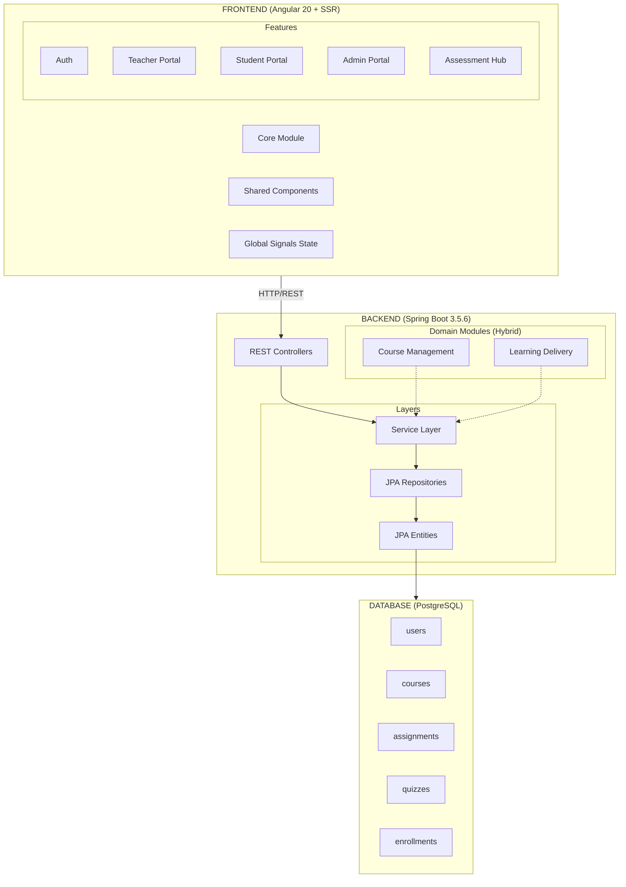

# GLOBAL ARCHITECTURE - LMS

Learning Management System Architecture - *Verified 2025*

---

## PROJECT INFO

| Property | Value |
|----------|-------|
| **Project** | LMS (Learning Management System) |
| **Type** | Full-stack Web Application |
| **Tech Stack** | Java 21 + Spring Boot 3.5.6 + Angular 20 + PostgreSQL |
| **Path** | `E:\LMS\lms_1\dev` |
| **Backend Package** | `com.example.lms` |
| **Artifact** | `backend-lms-postgres` |

---

## ARCHITECTURE DIAGRAM



---

## FILE STRUCTURE

```
E:\LMS\lms_1\dev/
├── api/                                # BACKEND
│   ├── pom.xml                         # Spring Boot 3.5.6
│   └── src/main/java/com/example/lms/
│       ├── controller/                 # REST Controllers
│       ├── service/                    # Business Logic
│       ├── repository/                 # Data Access
│       ├── entity/                     # JPA Model
│       ├── dto/                        # Data Transfer Objects
│       ├── config/                     # App Config
│       ├── course_management/          # Domain: Course Creation
│       ├── learning_delivery/          # Domain: Learning Process
│       ├── infrastructure/             # External Integrations
│       └── BackendLmsPostgresApplication.java
│
├── fe/                                 # FRONTEND
│   ├── package.json                    # Angular 20 + Tailwind 4
│   └── src/app/
│       ├── core/                       # Guards, Interceptors
│       ├── features/                   # Lazy Loaded Modules
│       │   ├── teacher/                # Assessment Hub inside
│       │   ├── student/
│       │   └── admin/
│       ├── shared/                     # Reusable Components
│       ├── state/                      # Global Signals
│       └── app.routes.ts               # Role-based Routing
│
└── ai-workspace-template/              # AI AGENT SYSTEM
    ├── ai-workspace/                   # Agent prompts
    │   ├── agents/                     # Specialist personas
    │   └── shared-context/             # This documentation
    └── luongngoai/                     # Human Interface
```

---

## DOMAIN MODEL (Verified from Schema)

### User & Auth
- **Users**: Core identity (Student, Teacher, Admin).
- **Roles**: Enum-based role management.

### Course Catalog
- **Courses**: The central product unit.
- **Chapters/Lessons**: Hierarchical content structure.
- **CourseVersions**: Version control for course content.

### Assessment Hub
- **Assignments**: Coursework and Tasks.
- **Quizzes**: Multiple choice assessments.
- **Rubrics**: Grading criteria.
- **Submissions**: Student work artifacts.
- **Grades**: Scoring and feedback.

### Learning Engine
- **Enrollments**: Student access to classes/courses.
- **LearningClasses**: Scheduled delivery of courses.
- **Progress**: Tracking completion status.

---

## KEY DECISIONS

| Decision | Choice | Rationale |
|----------|--------|-----------|
| **Backend Arch** | Hybrid Layered + Domain | Evolving DDD while keeping standard Spring conventions. |
| **Frontend State**| Angular Signals | High performance, fine-grained reactivity (2025 standard). |
| **Database** | PostgreSQL + Supabase | Robust relational data with JSONB flexibility for flexible content. |
| **API Style** | REST | Standard, cacheable, easy to document with OpenAPI. |

---

**Last Updated**: 2025-12-23 (Full Stack Audit)
