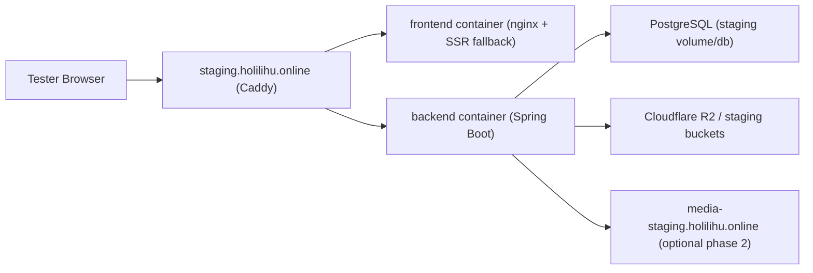

# Staging PWA Deploy Blueprint

Date: 2026-04-19
Status: Proposed blueprint before implementation
Owner surface: deploy, staging, PWA, release validation

## Objective

Create a production-like staging environment for LMS Maritime so the team can:

- validate Angular PWA behavior on a real HTTPS origin
- test offline download, service-worker update, and reset flows safely
- exercise auth, payment, media, and org-admin workflows without touching production
- keep the deploy path simple enough for the current team and infra footprint

## Current Truth From This Repo

The current codebase already has a serious production baseline:

- production deploy is Docker Compose + Caddy on a GCP VM via `deploy.sh`
- GitHub Actions deploy is manual and exact-SHA based via `.github/workflows/deploy.yml`
- the frontend deliberately does not enable Angular service worker on local browser runtimes in `fe/src/app/app.config.ts`
- `fe/nginx.conf` intentionally returns `404` for `/ngsw-worker.js` and `/ngsw.json` on `localhost` and `127.0.0.1`
- the frontend already ships PWA reset surfaces: `/reset-sw` and `/clear-site-data`
- media playback is already split from the main app path and can evolve separately

This means the real blocker for PWA validation is not feature work. It is the lack of a dedicated HTTPS staging origin that behaves like production.

## Decision Summary

### Approved direction

- use a dedicated staging origin, not `localhost`
- use a dedicated staging subdomain, not a `/staging` path under production
- keep Docker Compose on VM as the deployment model for now
- keep same-origin app + API on staging, just like production
- keep the staging path operationally close to production, but with lower blast radius

### Rejected for now

- Kubernetes migration now
- Cloud Run rewrite now
- shared production origin with a `/staging` path
- service-worker testing on localhost as the primary validation path

## Why This Is The Right Move

### 1. PWA correctness requires a real origin

Angular service workers are designed around versioned application snapshots. They are most reliable when deployed atomically on a real origin over HTTPS. This repo already encodes that assumption by disabling service-worker installation on local browser runtimes.

### 2. `/staging` under production origin is the wrong isolation boundary

Using `https://holilihu.online/staging` would mix:

- service worker scope
- IndexedDB
- localStorage/session state
- auth cookies or storage
- installability and update state

That would create false positives and false negatives during PWA testing.

### 3. Compose is still the right operational tool here

The system is not small, but it is also not yet at the scale where Kubernetes meaningfully reduces risk. Today the repo already has:

- a stable multi-container topology
- exact-SHA manual deploys
- edge termination via Caddy
- a separate video-worker pattern when needed

For this stage of maturity, the highest-value move is better environment isolation, not orchestration complexity.

## Target Environment Model

| Environment | Primary URL | Media URL | Purpose |
|---|---|---|---|
| Local | `http://localhost:4200` | local/dev | fast development only |
| Staging | `https://staging.holilihu.online` | `https://media-staging.holilihu.online` | production-like validation |
| Production | `https://holilihu.online` | `https://media.holilihu.online` | live learners |

## Recommended Topology

### Phase 1: Minimum viable staging

- one dedicated staging app VM
- Docker Compose on that VM
- separate staging database volume and `.env.staging`
- Caddy terminating HTTPS for `staging.holilihu.online`
- same-origin frontend + backend under the staging host
- optional local video-worker profile enabled on the same staging VM if dedicated staging worker is not ready yet

This is enough to validate:

- login and registration
- org-admin and student workflows
- Angular service worker install/update/reset
- IndexedDB offline behavior
- payment sandbox paths
- standard media playback smoke

### Phase 2: Production-like media parity

If staging media tests need to fully mirror production:

- add a dedicated staging video-worker VM
- expose `media-staging.holilihu.online`
- keep staging media bucket and signing config separate from production

This should happen only after phase 1 is stable.

## Reference Architecture

## Deployment Model

### GitHub side

Create a new GitHub Environment:

- `staging`

Set environment variables:

- `DEPLOY_HOST`
- `DEPLOY_PORT`
- `DEPLOY_USER`
- `DEPLOY_APP_DIR`
- `DEPLOY_URL=https://staging.holilihu.online`

Set environment secrets:

- `DEPLOY_SSH_PRIVATE_KEY`
- `DEPLOY_KNOWN_HOSTS`

The existing `.github/workflows/deploy.yml` already supports this pattern through `workflow_dispatch` and environment-scoped vars/secrets.

### Server side

Recommended staging server layout:

- dedicated repo clone, for example `/opt/lms-staging`
- separate env file: `.env.staging`
- separate Docker Compose project name, for example `lms-staging`
- separate persistent volumes from production

Do not reuse the production repo clone or production Compose project.

### Script strategy

### Near-term recommendation

Keep production stable and introduce staging with minimal risk:

- keep `deploy.sh` unchanged for production
- add a staging wrapper such as `deploy-staging.sh`
- the staging wrapper should mirror the current deploy flow but use `.env.staging`

This avoids risky refactoring on the production deploy path while the team is still bringing staging online.

### Medium-term cleanup

After staging is proven stable:

- unify production and staging under a single parameterized deploy script
- allow selecting env file, public URL, and Compose project name explicitly

Do not do this cleanup before staging first works end to end.

## Compose Strategy

Use the current pattern:

- `docker-compose.yml`
- environment-specific override files with `-f`

If staging behavior is close to production, prefer:

- `docker-compose.yml`
- `docker-compose.prod.yml`
- `--env-file .env.staging`

Only add `docker-compose.staging.yml` if staging truly needs environment-specific behavior beyond secret values and hostnames.

Examples of valid reasons for a staging-specific Compose override:

- different public port mapping
- enabling local staging video-worker profile while production uses remote worker
- extra inspection or debug tooling only in staging

## DNS and TLS

Required DNS:

- `staging.holilihu.online` -> staging app VM public IP
- `media-staging.holilihu.online` -> staging media edge path if phase 2 is enabled

TLS:

- let Caddy issue and renew the staging certificate automatically
- keep staging on the same HTTPS standard as production

## Google login staging prerequisite

If staging will validate the Google login rollout, do not register the Google OAuth client until the exact staging origin is finalized.

Use the live setup runbook for the auth side:

- `docs/runbooks/GOOGLE_LOGIN_GIS_SETUP_RUNBOOK.md`

Staging should have its own Google Web client and its own exact JavaScript origin entry, separate from production.

## Data Isolation Rules

Staging must not share mutable state with production:

- separate PostgreSQL database or volume
- separate object-storage prefixes or buckets
- separate service worker origin
- separate payment callback URLs when supported
- separate analytics/webhook destinations where practical

If any external integration cannot be split cleanly, document it as an exception and restrict staging use accordingly.

## PWA-Specific Requirements

### Must-have deploy properties

- atomic frontend deploy behavior
- `ngsw.json` and `ngsw-worker.js` must never be cached incorrectly at the edge
- hashed static assets stay immutable
- service-worker reset paths remain accessible

### Must-have smoke checks after every staging deploy

1. Open `https://staging.holilihu.online/manifest.webmanifest`
2. Open `https://staging.holilihu.online/ngsw.json`
3. Open `https://staging.holilihu.online/ngsw-worker.js`
4. Log in as a learner
5. Install the PWA from a clean browser profile
6. Download one self-paced course for offline use
7. Go offline and open text/video content already downloaded
8. Reconnect and verify sync resumes
9. Deploy a second frontend revision and confirm update flow is clean
10. Validate `/reset-sw` and `/clear-site-data`

### Debug surfaces

Use:

- `/ngsw.json`
- `/ngsw-worker.js`
- `/ngsw/state`
- `/reset-sw`
- `/clear-site-data`

These should be part of the staging smoke checklist, not just emergency tooling.

## Release Workflow Recommendation

### Staging

- manual deploy by exact SHA
- smaller blast radius
- used before major PWA, auth, and workflow releases

### Production

- stays manual and exact-SHA based
- promote only after staging smoke passes

Recommended promotion model:

1. merge to `main`
2. deploy exact SHA to `staging`
3. run browser and PWA smoke
4. deploy the same SHA to `production`

Do not rebuild different frontend artifacts between staging and production for the same release candidate.

## Rollback Model

### Fast rollback

- redeploy the previous known-good SHA to staging

### PWA-specific rollback

If the staged service worker is broken:

- redeploy previous good SHA
- if clients are still stuck, use `/reset-sw`
- if needed, use `/clear-site-data`
- last resort: temporarily remove or rename `ngsw.json` so Angular clients self-destruct their service worker caches

This last-resort behavior is supported by Angular service-worker failsafe guidance.

## Operational Risks

### Risk: staging accidentally behaves too differently from production

Mitigation:

- reuse the same Compose topology where possible
- avoid staging-only app logic
- prefer env and domain differences over code differences

### Risk: service-worker false positives due to reused browser state

Mitigation:

- use clean browser profiles or incognito
- document reset flow in the staging test checklist

### Risk: staging deploy breaks production deploy path

Mitigation:

- keep `deploy.sh` production-only during the first staging rollout
- introduce staging via a wrapper instead of modifying prod deploy behavior first

### Risk: media validation is incomplete in phase 1

Mitigation:

- explicitly label phase 1 as enough for general PWA testing
- add dedicated staging media parity only when the team needs it

## Implementation Backlog

### Phase 1

- add staging DNS
- provision staging VM
- create `.env.staging.example`
- create `.env.staging` on the server
- add `deploy-staging.sh`
- create GitHub Environment `staging`
- deploy first staging revision
- execute staging PWA smoke checklist

### Phase 2

- split staging media path if needed
- add dedicated staging video-worker if media parity becomes necessary
- unify deploy scripts after staging is stable
- optionally move to CI-built images + registry pull for stronger artifact immutability

## Success Criteria

- `https://staging.holilihu.online` serves the app over HTTPS
- Angular service worker installs on staging
- offline course download and reopen work on staging
- deploy by SHA to staging is repeatable and reviewable
- staging and production remain operationally isolated
- the team can validate PWA updates on staging before production rollout

## References

Official sources used:

- Angular service worker overview: https://angular.dev/ecosystem/service-workers
- Angular service worker devops: https://angular.dev/ecosystem/service-workers/devops
- Docker Compose docs: https://docs.docker.com/compose/
- Docker multiple Compose files: https://docs.docker.com/compose/how-tos/multiple-compose-files/

Repo sources used:

- `.github/workflows/deploy.yml`
- `deploy.sh`
- `fe/src/app/app.config.ts`
- `fe/nginx.conf`
- `docs/PWA_OFFLINE_RESEARCH.md`
- `docs/runbooks/PWA_OFFLINE_RUNBOOK.md`
