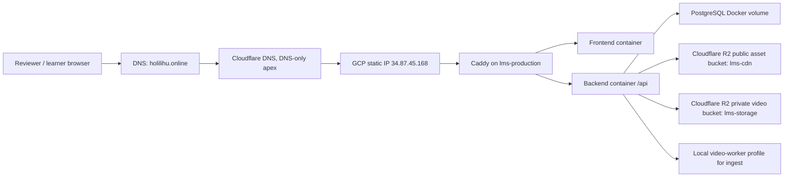
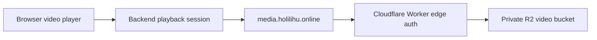
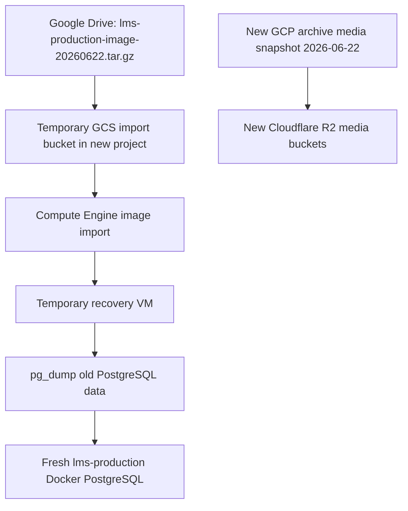

# GCP Redeploy Plan 2026-06-23

> Status: GCP review VM provisioned and old LMS database restored at `https://holilihu.online` and `http://34.87.45.168`.
> Apex DNS cutover was completed on `2026-06-23`: `holilihu.online` now points to the new VM IP `34.87.45.168`. Google OAuth, Wiii AI/webhook, and SePay have been enabled from reviewed legacy `.env` values. The old production PostgreSQL data was recovered from the archived VM image and restored into the new runtime on `2026-06-23`, bringing the public course count back to `174`. The LMS VM image backup and latest media snapshot have been copied into the new GCP archive bucket for safer restore workflows. On `2026-06-25`, Cloudflare R2/media/video ingest was wired into the VM-local `.env.prod` and adaptive playback was smoke-tested end to end. The VM is currently running for demo/review readiness; stop it after demo windows if 24/7 availability is not required.
> Purpose: prepare a convincing demo/evaluation production runtime after the 2026-06-22 archive/decommission.

## Current GCP account state

Verified on `2026-06-23`:

| Item | Value |
|---|---|
| Active gcloud account | `meomeokhp888@gmail.com` |
| Active project | `the-wiii-lab-500306` |
| Project name | `The Wiii Lab` |
| Project number | `14068163754` |
| Billing account | `0187C4-92C98C-DD93F1` (`My Billing Account`) |
| Billing state | enabled |
| Free trial credit | `VND 7,900,051.00` remaining, `100%` available |
| Credit window | `2026-06-23` to `2026-09-22` |
| Compute Engine API | enabled on `2026-06-23` |

Do not assume the historical GCP runtime still exists. It was archived and decommissioned on `2026-06-22`; see [GCP_SHUTDOWN_AND_ARCHIVE_2026-06-22.md](GCP_SHUTDOWN_AND_ARCHIVE_2026-06-22.md).

## Actual provisioned state

Provisioned on `2026-06-23` after owner approval:

| Resource | Value |
|---|---|
| VM name | `lms-production` |
| Status at provisioning | `RUNNING` |
| Zone | `asia-southeast1-c` |
| Machine type | `e2-standard-4` |
| Boot disk | `100 GB pd-balanced` |
| Internal IP | `10.148.0.2` |
| Static external IP | `34.87.45.168` |
| Static IP name | `lms-production-ip` |
| Network tags | `http-server`, `https-server`, `lms-production` |
| Labels | `app=lms-maritime`, `env=production`, `purpose=review-demo`, `managed_by=codex` |
| Firewall | `allow-lms-http-https` allows `tcp:80,tcp:443` to tag `lms-production` |
| Runtime packages | Docker Engine `29.6.0`, Docker Compose `v5.1.4`, Git, curl, CA certificates |
| Repo path on VM | `/home/Admin/apps/LMS_hohulili` |
| Repo commit on VM | `b8267c9e` at initial preparation time |
| `.env.prod` on VM | Generated on the VM with strong random secrets, `chmod 600`; not committed to git |
| Running containers after preparation | `db`, `gotenberg`, `backend`, `frontend`, `caddy` |
| Initial VM memory check | about `633MiB / 15GiB` used before app deploy |
| Initial disk check | about `2.9G / 96G` used before app deploy |

2026-06-23 verification after documentation/governance update:

| Check | Result |
|---|---|
| VM status | `RUNNING` after 2026-06-25 R2/media setup smoke |
| Public IP | `34.87.45.168` |
| Repo commit on VM | `b8267c9e` |
| `.env.prod` | generated review runtime env, `chmod 600`, secrets not printed |
| Review flags | `CLOUDFLARE_R2_ENABLED=true`, `VIDEO_INGEST_ENABLED=true`, `ENABLE_LOCAL_VIDEO_WORKER=true`, `GOOGLE_AUTH_ENABLED=true`, `GOOGLE_OAUTH_REDIRECT_FLOW_ENABLED=true`, `WIII_WEBHOOK_ENABLED=true`, `SEPAY_ENABLED=true` |
| Runtime containers | `db`, `gotenberg`, `backend`, `frontend`, `caddy`, `video-worker` all healthy during the 2026-06-25 media smoke |
| Restored DB state | old production DB restored on `2026-06-23`: `174` courses, `277` users, `454` enrollments, `2653` course publications, `338` file attachments, `85` video assets |

Cost guardrail created:

| Item | Value |
|---|---|
| Budget display name | `HoHoLiHu LMS monthly runtime guardrail` |
| Budget ID | `9e33d226-adc6-4dc1-9f17-824fee05dd43` |
| Budget amount | `4,000,000 VND/month` |
| Project filter | `projects/14068163754` |
| Thresholds | `50%`, `80%`, `100%` |

2026-06-25 live cost snapshot:

| Item | Value |
|---|---|
| Checked at | `2026-06-25 19:34 +07:00` |
| VM state | `RUNNING` |
| Last start time | `2026-06-25 19:11:21 +07:00` |
| Planning rate while running | `~4,900 VND/hour`, `~117K VND/day`, `~3.56M VND/month` |
| Estimated spend since latest start at check time | `~1,900 VND` |
| Billing truth source | Google Cloud Console `Billing > Reports`; `gcloud` budget APIs show guardrails, not exact live accrued spend |

When running, the VM serves the restored old production database through both `https://holilihu.online` and the direct IP fallback `http://34.87.45.168`. R2/media/video ingest is now configured and adaptive playback smoke passed on `2026-06-25`; still run upload and offline-media smoke before a real paid-user campaign.

## Review runtime deployed on 2026-06-23

The new VM first ran a clean fresh-seed demo stack, then the old production PostgreSQL dump was restored on `2026-06-23`:

| Item | Value |
|---|---|
| Primary review URL | `https://holilihu.online` |
| Direct VM fallback | `http://34.87.45.168` |
| Caddy site address | `LMS_SITE_ADDRESS=holilihu.online, http://34.87.45.168` |
| Compose command | `docker compose --env-file .env.prod -f docker-compose.yml -f docker-compose.prod.yml --profile video-worker up -d --wait --remove-orphans --force-recreate db gotenberg backend frontend caddy video-worker` |
| Runtime mode | Review/demo on production domain with restored old production DB |
| Storage mode | Cloudflare R2 enabled for media/upload runtime; local Docker volume remains only as legacy/fallback path where code still uses it |
| Data mode | Old production PostgreSQL restored from VM-image recovery dump |
| Media mode | R2 private media bucket + `media.holilihu.online` Worker edge auth + local `video-worker` profile configured |
| OAuth/integrations | Google OAuth, Wiii AI/webhook, SePay, R2/media, and video ingest enabled from reviewed runtime values |

Smoke results from outside the VM:

| Check | Result |
|---|---|
| `GET http://34.87.45.168/actuator/health` | `UP` |
| `GET http://34.87.45.168/auth/login` | `200`, login page renders |
| `GET http://34.87.45.168/api/v3/courses?page=0&size=1` | `200`, restored course data returned |
| `POST http://34.87.45.168/api/v3/auth/login` with `student@maritime.edu/student123` | `200`, token returned |
| `GET https://holilihu.online/actuator/health` | `UP` |
| `GET https://holilihu.online/auth/login` | `200`, login page renders |
| `GET https://holilihu.online/api/v3/courses?page=0&size=1` | `200`, restored course data returned, `totalElements=174` |
| `POST https://holilihu.online/api/v3/auth/login` with `student@maritime.edu/student123` | `200`, token returned |
| `GET https://holilihu.online/api/v3/auth/google/config` | Google OAuth enabled, redirect flow enabled |
| `GET https://holilihu.online/api/v3/ai/health` | AI service available, Wiii webhook enabled |
| `GET https://holilihu.online/api/v3/payments/available-methods` with admin JWT | `SEPAY` returned as available method |
| `GET https://holilihu.online/api/v3/payments/admin/gateway-status` with admin JWT | SePay enabled and webhook configured; VNPay/simulated disabled |
| `HEAD https://cdn.holilihu.online/course-thumbnails/a839e30d-7d26-457f-96b6-88cca84250f5.jpg` | `200`, restored DB thumbnail reference resolves through CDN |
| Container health | `db`, `gotenberg`, `backend`, `frontend`, `caddy`, `video-worker` healthy during the 2026-06-25 smoke |

Additional R2/media smoke on `2026-06-25`:

| Check | Result |
|---|---|
| `HEAD https://cdn.holilihu.online/course-thumbnails/a839e30d-7d26-457f-96b6-88cca84250f5.jpg` | `200`, public R2/CDN object reachable |
| `GET https://media.holilihu.online/video-packages/.../manifest.mpd` without `verify` token | `403`, private media bucket is protected |
| Backend playback API for a restored `READY` adaptive asset | playback URL issued |
| HLS manifest rewrite | segment URLs rewritten to `https://media.holilihu.online/...verify=...` |
| First signed media segment | `200` |
| Video stack startup | backend and `video-worker` both logged `Production video stack ready: R2 private storage + Shaka Packager.` |

Why `./deploy.sh` was not used for the initial 2026-06-23 review run:

- `deploy.sh` correctly blocks production deploys unless `CLOUDFLARE_R2_ENABLED=true` and R2 credentials are present.
- The initial review runtime intentionally used `CLOUDFLARE_R2_ENABLED=false` because R2 credentials were not yet in place.
- After the 2026-06-25 R2/media sync, future full production deploys may use `./deploy.sh` once upload/playback/offline smoke is repeated after VM start.

## Environment and integration status

Never print or commit secret values. Record only source and enablement state.

| Environment source | Status |
|---|---|
| Local `.env` | Exists in the local workspace and contains set values for Google, Wiii, and SePay-related keys. Treat it as local/dev context, not automatically trusted production config. |
| Local `.env.prod` | Missing from the local workspace, by design. Production env files must not be committed. |
| VM `.env.prod` | Exists at `/home/Admin/apps/LMS_hohulili/.env.prod`, permission `600`; generated review secrets plus intentionally synced Google/Wiii/SePay and Cloudflare R2/media values. A backup was created before the 2026-06-25 R2/media sync. |
| Historical old `.env.prod` | Not present on the new VM or in git. If needed, recover it from the retained old VM image backup in Google Drive, then migrate only approved keys. |

Current VM `.env.prod` safe flags:

| Key | Value |
|---|---|
| `APP_BASE_URL` | `https://holilihu.online` |
| `APP_CORS_ORIGINS` | `https://holilihu.online,http://34.87.45.168` |
| `LMS_SITE_ADDRESS` | `holilihu.online, http://34.87.45.168` |
| `R2_ENABLED` | legacy flag remains non-authoritative; use `CLOUDFLARE_R2_ENABLED` |
| `CLOUDFLARE_R2_ENABLED` | `true` |
| `CLOUDFLARE_R2_BUCKET` | `lms-cdn` |
| `CLOUDFLARE_R2_VIDEO_BUCKET` | `lms-storage` |
| `CLOUDFLARE_R2_PUBLIC_URL` | `https://cdn.holilihu.online` |
| `VIDEO_MEDIA_DOMAIN` | `https://media.holilihu.online` |
| `VIDEO_EDGE_AUTH_MODE` | `media_hmac_query` |
| `VIDEO_INGEST_ENABLED` | `true` |
| `ENABLE_LOCAL_VIDEO_WORKER` | `true` |
| `GOOGLE_AUTH_ENABLED` | `true` |
| `GOOGLE_OAUTH_REDIRECT_FLOW_ENABLED` | `true` |
| `WIII_WEBHOOK_ENABLED` | `true` |
| `SEPAY_ENABLED` | `true` |

Operational rule: do not copy local `.env` wholesale into VM `.env.prod`. Enable integrations one by one, starting with the lowest external side-effect path. For example: Google OAuth first, Wiii webhook next if needed, and SePay/payment only after webhook URL, bank metadata, sandbox/production mode, and rollback path are confirmed.

2026-06-23 integration sync note: the VM `.env.prod` was backed up, then updated from a minimal temporary env patch derived from the reviewed local `.env`. Secret values were not committed. Backend and Caddy were recreated, and smoke checks confirmed health `UP`, Google OAuth enabled, Wiii/AI available, and SePay available/configured.

2026-06-25 R2/media sync note: a new bucket-scoped Cloudflare R2 runtime token was created for `lms-cdn` and `lms-storage`, the `media.holilihu.online` Worker HMAC secret was rotated, and VM `.env.prod` was updated with the R2/media/video ingest settings. Secret values are intentionally absent from git and from this document. Backend, `video-worker`, and Caddy were recreated with `--profile video-worker`; smoke confirmed public CDN `200`, unsigned private media `403`, backend playback URL issuance, manifest rewrite to signed `media.holilihu.online` URLs, and first signed segment `200`. The VM was restarted after the setup pause and is currently running for demo/review readiness.

## Current IP and runtime flow

Current new review/demo IP:

| Purpose | Value |
|---|---|
| New VM public IP | `34.87.45.168` |
| New VM private IP | `10.148.0.2` |
| VM name | `lms-production` |
| Project | `the-wiii-lab-500306` |
| Zone | `asia-southeast1-c` |
| Historical old production IP | `35.187.245.201` |
| Old IP status | released/decommissioned; do not use for new DNS cutover |

Current app traffic flow after the 2026-06-23 DNS cutover:



Current adaptive media flow after the 2026-06-25 smoke:



Expected data restore flow if old production data is required:



Important: the new VM is a clean redeploy host with the old production PostgreSQL database restored into it. It is not the old VM. The apex DNS cutover is complete for review/demo visibility. Adaptive playback through R2/media edge auth is smoke-tested; upload and offline-media paths still need a fresh smoke after the VM is started for a real campaign.

## Cloudflare DNS cutover on 2026-06-23

The apex domain was moved through the Cloudflare API after the VM and IP smoke checks passed.

| Item | Value |
|---|---|
| Cloudflare zone | `holilihu.online` |
| Zone ID | `ff5dd4a60954f136d64b185cab41d26e` |
| Nameservers | `courtney.ns.cloudflare.com`, `marek.ns.cloudflare.com` |
| Apex record | `A holilihu.online -> 34.87.45.168` |
| Proxy mode | DNS-only (`proxied=false`) |
| Previous apex IP | `35.187.245.201` |
| Caddy HTTPS | Let's Encrypt certificate obtained successfully for `holilihu.online` |

DNS-only is intentional for this cutover. The current runtime now has R2/media integrations enabled, but orange-cloud proxying for the apex should still be evaluated separately because upload/media limits, Worker routes, WebSocket/SSE behavior, and large payload paths must be smoke-tested first. Cloudflare documents plan-based upload limits and the mitigation paths of chunking, DNS-only records, or plan upgrades: <https://developers.cloudflare.com/cache/concepts/default-cache-behavior/#upload-limits>.

Unchanged Cloudflare records:

- `wiii.holilihu.online`
- `cdn.holilihu.online`
- `media.holilihu.online`
- existing MX/TXT email records

## Data restore status

The new `lms-production` VM started as a fresh review/demo host, then the old production PostgreSQL database was recovered and restored on `2026-06-23`. The old VM itself had already been deleted, but recovery was still possible because the full VM image export was retained and copied into the new archive bucket.

Restore workflow completed on `2026-06-23`:

1. Imported `vm-images/lms-production-image-20260622.tar.gz` into a temporary recovery image.
2. Created temporary VM `lms-recovery-20260622` from that image.
3. Started the archived Docker runtime and verified the old PostgreSQL volume.
4. Exported the old database with `pg_dump` custom format.
5. Backed up the current fresh-seed production DB before restore.
6. Restored the old DB dump into the new `lms-production` PostgreSQL container.
7. Smoke-tested health, course API, login, and a CDN thumbnail.
8. Deleted the temporary recovery VM and temporary recovery image to avoid ongoing cost.

Restored DB evidence:

| Field | Value |
|---|---|
| Old DB dump | `gs://lms-archive-the-wiii-lab-500306-20260623/db-dumps/old-production-20260622-20260623T172022Z.dump` |
| Old DB dump size | `82,773,160` bytes |
| Old DB dump SHA-256 | `3cef85fd57f5ce1b82f5b7ba825edfe234064105ebfe8dddaec182760166ac7f` |
| Old DB manifest | `gs://lms-archive-the-wiii-lab-500306-20260623/db-dumps/old-production-20260622-20260623T172022Z.manifest.txt` |
| Pre-restore fresh-seed backup | `gs://lms-archive-the-wiii-lab-500306-20260623/db-dumps/current-freshseed-before-old-restore-20260623T172640Z.dump` |
| Pre-restore manifest | `gs://lms-archive-the-wiii-lab-500306-20260623/db-dumps/current-freshseed-before-old-restore-20260623T172640Z.manifest.txt` |
| Restore log | `gs://lms-archive-the-wiii-lab-500306-20260623/db-dumps/old-production-restore-20260623T1730Z.log` |
| Post-restore verify | `gs://lms-archive-the-wiii-lab-500306-20260623/db-dumps/post-restore-verify-20260623T1735Z.txt` |

Post-restore counts:

| Table | Count |
|---|---:|
| `courses` | `174` |
| `users` | `277` |
| `enrollments` | `454` |
| `course_publications` | `2653` |
| `file_attachments` | `338` |
| `video_assets` | `85` |

Current restore caveat: the database has been restored, and the public course API reports `totalElements=174`. Historical media references are present in the DB. CDN thumbnail and adaptive playback through signed `media.holilihu.online` segment URLs were smoke-tested successfully on `2026-06-25`. Full video upload and offline-media paths still require a separate runtime smoke before public paid-user operation.

New-project archive copy created on `2026-06-23`:

| Field | Value |
|---|---|
| Archive bucket | `gs://lms-archive-the-wiii-lab-500306-20260623` |
| Bucket location | `ASIA-SOUTHEAST1` |
| Bucket purpose | durable restore staging for LMS backup artifacts in the new GCP project |
| LMS VM image object | `gs://lms-archive-the-wiii-lab-500306-20260623/vm-images/lms-production-image-20260622.tar.gz` |
| LMS VM image size | `21,113,216,340` bytes |
| LMS checksum object | `gs://lms-archive-the-wiii-lab-500306-20260623/vm-images/lms-production-image-20260622.tar.gz.sha256` |
| LMS SHA-256 | `154db46d4f344c4f3edfa838ebc8b865aed082ea71c2c0ef760e64a21f3cc0cc` |
| Media snapshot prefix | `gs://lms-archive-the-wiii-lab-500306-20260623/media-snapshots/2026-06-22/` |
| Media snapshot object count | `26,107` |
| Media snapshot bytes | `57,025,622,379` |
| Manifest object | `gs://lms-archive-the-wiii-lab-500306-20260623/manifests/lms-backup-manifest-20260623.json` |
| Wiii VM image | intentionally not copied to the new project because Wiii is not part of the current LMS review/demo scope |
| Temporary sync VM | `lms-backup-sync-20260623`, deleted after LMS object verification |
| Old project billing after copy | `the-wiii-lab` billing disabled again after media verification |
| Temporary IAM after copy | temporary project/bucket bindings for `meomeokhp888@gmail.com` removed |

This archive copy is now both a retained recovery source and the source used for the completed DB restore. The `lms-production` review VM uses the restored old production DB and has R2 media settings enabled in VM-local `.env.prod`; new upload behavior still needs a fresh teacher-upload smoke before real users rely on it.

Verified backup sources through Google Drive on `2026-06-23`:

| Source | Status |
|---|---|
| Google Drive folder | `GCP VM Backups 2026-06-22` exists at <https://drive.google.com/drive/folders/12wjhV41H0x8W9HibBijp5EilJ0gK7VQq> |
| LMS VM image | `lms-production-image-20260622.tar.gz`, Drive ID `1bKaJdVwlHIlv-YKhPclPT5qvYcWt-U5o`, `21,113,216,340` bytes, retained in Drive |
| Wiii VM image | `wiii-production-image-20260622.tar.gz`, Drive ID `1pa2WNe9fC2zHYHjOC102NaOCTY6syONM`, `9,498,093,878` bytes, retained in Drive |
| Drive media folder | `gcs-lms-r2-backup-holilihu-media-20260622`, Drive ID `1lixLj8hUP6AL4IDuRams10fZILL8SkXg`, exists but the inspected folder listing was empty |
| GCS media snapshot | Source `gs://lms-r2-backup-holilihu/2026-06-22/` copied to `gs://lms-archive-the-wiii-lab-500306-20260623/media-snapshots/2026-06-22/` |
| Media copy verification | source and destination both measured `26,107` objects / `57,025,622,379` bytes |
| Access path used | old project billing was linked temporarily, bucket-level access was granted temporarily, then both were cleaned up after verification |
| Local DB dump | `backups/prod-2026-04-24.dump` exists, but it is old and small; do not treat it as the final production snapshot |

Restore choices and current decision:

1. **Chosen and completed: clean deploy plus old DB restore**. The old VM image was mounted through a temporary recovery VM, PostgreSQL was exported with `pg_dump`, and the dump was restored into the fresh Docker Compose runtime.
2. **Still available: exact old production VM restore**. Re-import the VM image tarball if the team must inspect old filesystem state or secrets. Do not run it as the new production host without review.
3. **Still available: fresh seed rollback**. Restore `current-freshseed-before-old-restore-20260623T172640Z.dump` only if the old DB restore causes a blocker.
4. **Remaining media work**: adaptive playback smoke passed against current R2 objects. Use `gs://lms-archive-the-wiii-lab-500306-20260623/media-snapshots/2026-06-22/` as the new-project source if Cloudflare R2/media objects need to be rebuilt or migrated later.

Do not delete the old retained GCS media snapshot until the owner explicitly accepts the new archive copy as sufficient and the restore path has been tested.

## Decision

For a review/demo runtime that should feel stable, use:

| Resource | Recommendation |
|---|---|
| VM | `e2-standard-4` |
| CPU / RAM | `4 vCPU / 16 GB RAM` |
| Zone | `asia-southeast1-c` or `asia-southeast1-b` |
| Disk | `100 GB pd-balanced` |
| OS | Ubuntu 24.04 LTS |
| Provisioning model | Standard VM, not Spot |
| Runtime model | Docker Compose + Caddy + GHCR images |
| Domain | `holilihu.online` is cut over to the new VM for the restored-DB review runtime |

`e2-standard-2` (`2 vCPU / 8 GB RAM`) is acceptable only for a budget/simple demo with light traffic and no heavy video ingest. The current Compose topology can include PostgreSQL, Spring Boot, frontend/nginx, Caddy, Gotenberg, and optionally `video-worker`; this makes `8 GB` tight when the goal is a smooth evaluation.

## Why `e2-standard-4`

Production Compose resource envelope:

| Service | Default cap |
|---|---:|
| PostgreSQL | `512M` |
| Backend | `1536M` |
| Optional local `video-worker` | `1536M` |
| Frontend | `384M` |
| Caddy | `128M` |
| Gotenberg | `4096M` |

The raw caps are already close to an `8 GB` host before Docker overhead, OS memory, page cache, image pulls, logs, and occasional JVM/video/document spikes. A `16 GB` host gives enough operational headroom for a convincing demo.

Use `e2-standard-2` only if all of these are true:

- The demo does not upload/process large videos.
- The demo uses prebuilt GHCR images and does not build on the VM.
- `ENABLE_LOCAL_VIDEO_WORKER=false` or the worker is not part of the demo.
- Gotenberg/document conversion is not stressed.
- The VM is used by one or a few reviewers at a time.

## Estimated cost guardrails

Use the official Google Cloud Pricing Calculator before creating the VM:

- Compute pricing: <https://cloud.google.com/compute/all-pricing>
- Machine families: <https://cloud.google.com/compute/docs/general-purpose-machines>
- Disk pricing: <https://cloud.google.com/compute/disks-image-pricing>
- Static IP pricing: <https://cloud.google.com/vpc/network-pricing>
- Stop/start behavior: <https://cloud.google.com/compute/docs/instances/stop-start-instance>
- Calculator: <https://cloud.google.com/products/calculator>

### 2026-06-23 monthly planning estimate

Assumptions:

- Region: `asia-southeast1` / Singapore.
- Month length: `730` hours.
- Disk: `100 GB pd-balanced`.
- One external static IPv4 address.
- FX estimate: `1 USD ~= 26,322 VND`.
- Not included: Cloudflare R2, logging overages, snapshots, extra disks, CDN egress, or one-off backup/export costs.

| Scenario | Estimate | VND estimate | Operational meaning |
|---|---:|---:|---|
| `e2-standard-4` running 24/7 + 100 GB disk + attached static IP | `~$135.34/month` | `~3.56M VND/month` | Recommended stable one-month review/demo runtime. |
| `e2-standard-2` running 24/7 + 100 GB disk + attached static IP | `~$75.00/month` | `~1.97M VND/month` | Budget runtime, but higher OOM/performance risk for this project. |
| VM stopped all month, keep 100 GB disk and attached static IP | `~$14.65/month` | `~386K VND/month` | CPU/RAM stop billing; persistent disk and IP still bill. |
| VM stopped all month, keep only 100 GB disk and release static IP | `~$11.00/month` | `~290K VND/month` | Cheapest suspend state, but DNS/static IP must be recreated later. |

The verified free trial credit is `VND 7,900,051`. At the estimate above, `e2-standard-4` 24/7 is roughly `2.2` months of credit before other services; `e2-standard-2` 24/7 is roughly `4.0` months by raw compute+disk+IP, but the credit expires on `2026-09-22`.

Operational rule:

- Set a budget alert before the VM is left running.
- Stop the VM when no demo/review is scheduled.
- Keep a static IP only while production DNS needs it.
- Do not keep duplicate disks, images, snapshots, or old media exports unless they are intentionally retained.

For a real review window that requires the site to be available any time during a full month, prefer `e2-standard-4` and budget `~4.0M VND/month` as a safer planning number after rounding and small incidental costs. If availability can be scheduled, stop the VM outside review periods; stopped VMs do not bill CPU/RAM, but persistent disks and static IPs still cost money.

## OOM risk assessment

### `e2-standard-4` (`4 vCPU / 16 GB`)

OOM risk is low for normal LMS usage:

- Login, Google login, course browsing, admin/org-admin screens.
- Teacher course authoring without large concurrent video processing.
- Student learning, quiz/assignment flows, PWA shell/offline viewing.
- A small number of reviewers using the site at the same time.

OOM risk becomes moderate when several heavy paths overlap:

- `ENABLE_LOCAL_VIDEO_WORKER=true` and a large video ingest/transcode is running.
- Gotenberg document conversion is active with the default `GOTENBERG_MEMORY_LIMIT=4096M`.
- Backend JVM, video worker JVM, PostgreSQL, Caddy, frontend, and Gotenberg all spike at once.
- Docker image builds are performed on the VM instead of pulling prebuilt GHCR images.
- Manual backups, exports, or large log growth happen during the demo.

### `e2-standard-2` (`2 vCPU / 8 GB`)

OOM risk is acceptable only for a controlled budget demo. It is not ideal for a serious 24/7 review because the default service envelope already reserves too much of the 8 GB host once OS memory, Docker overhead, page cache, logs, and spike behavior are included.

Use `e2-standard-2` only when all of these are true:

- No on-VM frontend/backend builds.
- Prebuilt images are pulled from GHCR.
- Video ingest/upload is not stressed, or `ENABLE_LOCAL_VIDEO_WORKER=false`.
- Gotenberg/document conversion is not stressed.
- Only one or a few reviewers use the site concurrently.

### OOM guardrails for first redeploy

- Use prebuilt GHCR images; do not build frontend/backend on the production VM.
- Keep `e2-standard-4` for the first convincing review runtime.
- Keep `ENABLE_LOCAL_VIDEO_WORKER=true` only if video upload/ingest must be demonstrated. Otherwise set it to `false` and demo playback/offline with prepared media.
- Keep Gotenberg enabled if document preview/export is part of the demo. If memory pressure appears, lower `GOTENBERG_MEMORY_LIMIT` to `2048M` only after a smoke test confirms conversions still pass.
- Do not run video ingest, document conversion, backup/export, and deploy at the same time.
- Watch memory during the first smoke:

```bash
free -h
docker stats
journalctl -k --no-pager | grep -i oom || true
docker compose --env-file .env.prod -f docker-compose.yml -f docker-compose.prod.yml ps
```

## Provisioning sequence

These commands document the approved provisioning sequence. They were executed on `2026-06-23` for the `lms-production` review VM.

1. Enable required APIs:

```bash
gcloud services enable \
  compute.googleapis.com \
  serviceusage.googleapis.com \
  iam.googleapis.com \
  billingbudgets.googleapis.com \
  cloudresourcemanager.googleapis.com \
  --project=the-wiii-lab-500306
```

2. Reserve a static IP:

```bash
gcloud compute addresses create lms-production-ip \
  --project=the-wiii-lab-500306 \
  --region=asia-southeast1
```

3. Create the VM:

```bash
gcloud compute instances create lms-production \
  --project=the-wiii-lab-500306 \
  --zone=asia-southeast1-c \
  --machine-type=e2-standard-4 \
  --image-family=ubuntu-2404-lts-amd64 \
  --image-project=ubuntu-os-cloud \
  --boot-disk-size=100GB \
  --boot-disk-type=pd-balanced \
  --address=34.87.45.168 \
  --tags=http-server,https-server,lms-production \
  --labels=app=lms-maritime,env=production,purpose=review-demo,managed_by=codex
```

4. Create firewall rules for the public edge only:

```bash
gcloud compute firewall-rules create allow-lms-http-https \
  --project=the-wiii-lab-500306 \
  --allow=tcp:80,tcp:443 \
  --target-tags=lms-production
```

Keep SSH restricted to trusted operators where possible.

5. Install runtime packages on the VM:

```bash
sudo apt-get update
sudo apt-get install -y ca-certificates curl git
curl -fsSL https://get.docker.com | sudo sh
sudo usermod -aG docker "$USER"
```

6. Prepare repo and `.env.prod` placeholder:

```bash
git clone https://github.com/linhlinhlin/LMS_hohulili.git
cd LMS_hohulili
cp .env.prod.example .env.prod
chmod 600 .env.prod
# Fill real secrets locally on the VM. Never commit .env.prod.
docker compose --env-file .env.prod -f docker-compose.yml -f docker-compose.prod.yml config -q
```

7. For final production, deploy from GHCR/prebuilt images only after `.env.prod` is complete and the VM is intentionally running:

```bash
./deploy.sh
```

8. For an explicit review/runtime restart with the already prepared R2/media settings, use the `video-worker` profile:

```bash
docker compose --env-file .env.prod -f docker-compose.yml -f docker-compose.prod.yml \
  --profile video-worker up -d --wait --remove-orphans --force-recreate db gotenberg backend frontend caddy video-worker
```

9. DNS cutover status:

- `holilihu.online` -> new static VM IP `34.87.45.168` (completed on `2026-06-23`, DNS-only)
- `media.holilihu.online` -> Cloudflare Worker/media route with HMAC query auth
- `cdn.holilihu.online` -> Cloudflare/R2 public asset route

## Required secrets and runtime values

The deploy script intentionally fails if production storage/auth secrets are missing.

Minimum production values to prepare:

- `POSTGRES_PASSWORD`
- `JWT_SECRET`
- `APP_BASE_URL=https://holilihu.online`
- `APP_CORS_ORIGINS=https://holilihu.online,http://34.87.45.168`
- `CLOUDFLARE_R2_ENABLED=true`
- `CLOUDFLARE_R2_ACCOUNT_ID`
- `CLOUDFLARE_R2_ACCESS_KEY`
- `CLOUDFLARE_R2_SECRET_KEY`
- `CLOUDFLARE_R2_BUCKET`
- `CLOUDFLARE_R2_VIDEO_BUCKET`
- `CLOUDFLARE_R2_PUBLIC_URL`
- `VIDEO_MEDIA_DOMAIN=https://media.holilihu.online`
- `VIDEO_EDGE_AUTH_MODE=media_hmac_query`
- `VIDEO_EDGE_HMAC_SECRET`
- `VIDEO_INGEST_ENABLED=true`
- `ENABLE_LOCAL_VIDEO_WORKER=true` if local ingest is required on the app VM

Optional but recommended if Google login is part of the demo:

- `GOOGLE_AUTH_ENABLED=true`
- `GOOGLE_WEB_CLIENT_ID`
- `GOOGLE_OAUTH_REDIRECT_FLOW_ENABLED=true`
- `GOOGLE_CLIENT_SECRET`
- `GOOGLE_OAUTH_REDIRECT_URI=https://holilihu.online/api/v3/auth/google/callback`
- `GOOGLE_OAUTH_FRONTEND_CALLBACK=https://holilihu.online/auth/google/callback`

## Deployment quality gates

Current review runtime:

```bash
docker compose --env-file .env.prod -f docker-compose.yml -f docker-compose.prod.yml --profile video-worker config -q
docker compose --env-file .env.prod -f docker-compose.yml -f docker-compose.prod.yml --profile video-worker ps
curl -s https://holilihu.online/actuator/health
curl -skI https://holilihu.online
curl -sk https://holilihu.online/actuator/health
```

Then run the production smoke checklist:

- [../runbooks/PRODUCTION_SMOKE_TEST.md](../runbooks/PRODUCTION_SMOKE_TEST.md)
- [../testing/TEST_CHECKLIST.md](../testing/TEST_CHECKLIST.md)

## Demo-specific notes

- Use `e2-standard-4` for the first convincing review demo.
- Use prebuilt GHCR images to avoid frontend/backend build pressure on the VM.
- Keep the optional `video-worker` enabled only if video ingest/upload is part of the demo.
- If the demo focuses on browsing, auth, teacher workflows, learner workflows, and PWA shell/offline viewing, keep video ingest workload controlled.
- If reviewers will stress upload/transcode, consider a second dedicated worker VM later instead of overloading the app VM.
- The data restore mode is now chosen and completed for PostgreSQL: clean deploy plus old DB restore. Adaptive media playback is smoke-tested; teacher upload and offline-media should still be smoke-tested if they are part of the demo.

## Not done yet

- Apex DNS cutover has been performed; `holilihu.online` resolves to `34.87.45.168`.
- `.env.prod` exists on the VM with generated review secrets plus intentionally synced Google/Wiii/SePay and Cloudflare R2/media values.
- Review Docker containers were healthy at `https://holilihu.online` during the last smoke; the VM is currently running for demo/review readiness.
- IP-based and DNS/HTTPS review smoke have passed.
- Old production PostgreSQL data has been restored into the new VM. Post-restore API count: `174` courses.
- Adaptive playback against current R2 objects is smoke-tested. Remaining media confidence work is teacher upload, ingest-from-new-upload, and offline download smoke after the VM is started.

## ORG logic deploy gate - 2026-06-26

The ORG/payment/academic changes are prepared on a clean local worktree but are not yet deployed to the review VM.

Current production truth:

| Item | Value |
|---|---|
| VM repo branch | `main` |
| VM repo commit | `b8267c9e` |
| VM local runtime diffs | `Caddyfile`, `docker-compose.prod.yml` only |
| VM containers | `db`, `gotenberg`, `backend`, `frontend`, `caddy`, `video-worker` healthy through Docker healthchecks |
| Backend internal health | `docker compose ... exec backend wget -qO- http://localhost:8080/actuator/health` returns `{"status":"UP"}` |

Why source-copy deploy is not enough:

- Production `docker-compose.prod.yml` runs prebuilt GHCR images: `ghcr.io/linhlinhlin/lms-backend:${IMAGE_TAG:-latest}` and `ghcr.io/linhlinhlin/lms-frontend:${IMAGE_TAG:-latest}`.
- Copying Java/Angular source files to `/home/Admin/apps/LMS_hohulili` will not change the running app unless a new image is built and pulled.
- The safe path is commit/PR/merge -> CI builds GHCR images -> deploy script pulls the new image tag.

Clean branch prepared for ORG:

```text
worktree: E:\Sach\Sua\LMS_hohulili_org_goal_clean
branch: codex/org-logic-completion-clean
base: origin/main @ b8267c9e
```

Verification before deploy:

```bash
git diff --check
# pass

cd backend
mvn "-Dtest=ManageAcademicCatalogUseCaseTest,AcademicCatalogControllerV3Test,CourseQueryControllerV3ContractTest,AdminCoursesControllerV3PendingFilterTest,AdminCoursesControllerV3Test,ClassControllerSecurityTest,LearningClassTest,CreateRevenueSplitUseCaseTest,OrgPaymentConfigTest,RequestPayoutUseCaseTest,PaymentControllerV3Test,AdminRevenueControllerV3Test" test
# Tests run: 88, Failures: 0, Errors: 0

mvn test -B
# Tests run: 1169, Failures: 0, Errors: 0

cd ../fe
npm ci
npm run build
# Application bundle generation complete

docker compose --env-file .env.prod.example -f docker-compose.yml -f docker-compose.prod.yml config -q
# pass
```

Deploy sequence for ORG branch:

1. Push `codex/org-logic-completion-clean`.
2. Open/merge PR after CI is green.
3. Confirm GHCR has new backend/frontend images for the merge SHA.
4. Deploy through the GitHub `Build & Deploy` workflow if `DEPLOY_ENABLED=true`; otherwise SSH to the VM and run:

```bash
cd /home/Admin/apps/LMS_hohulili
git fetch --prune origin
git checkout --force <merge-sha>
bash ./deploy.sh
```

5. Run post-deploy smoke:

```bash
curl -fsS https://holilihu.online/actuator/health
curl -fsS https://holilihu.online/api/v3/courses?page=0\&size=1
```

6. Browser/API smoke required for ORG:

- `ORG_ADMIN` login.
- `/org-admin/academic` renders VMU academic catalog.
- `/org-admin/organization?tab=payment-config` loads config, validates negative percentages and low minimum payout.
- `/org-admin/payouts` loads payout queue and all status filters return `200`.
- Course/class/payment API responses remain scoped to the signed-in organization.

## ORG deployment result - 2026-06-26

The ORG branch was merged and deployed to the current review runtime.

| Item | Value |
|---|---|
| PR | `#517` |
| Merge commit | `9e6e09401804e75e472b95da948b860c2bcfd2e9` |
| Runtime URL | `https://holilihu.online` |
| VM IP | `34.87.45.168` |
| VM app dir | `/home/Admin/apps/LMS_hohulili` |
| GitHub deploy env | `production` |

GitHub Environment `production` was corrected after the first failed deploy attempt:

- `DEPLOY_HOST=34.87.45.168`
- `DEPLOY_USER=Admin`
- `DEPLOY_APP_DIR=/home/Admin/apps/LMS_hohulili`
- `DEPLOY_SSH_PRIVATE_KEY` refreshed from the current VM admin SSH key.
- `DEPLOY_KNOWN_HOSTS` refreshed from the current VM host key.

Why this matters:

- The first deploy tried the archived VM IP `35.187.245.201` and timed out.
- Future deploys now target the active review VM and use the app directory created during the 2026-06-23 redeploy.

Post-deploy production smoke:

```text
VM HEAD: 9e6e09401804e75e472b95da948b860c2bcfd2e9
Docker: db, gotenberg, backend, frontend, caddy, video-worker healthy
GET /actuator/health -> UP
GET /api/v3/courses?page=0&size=3 -> 200, totalElements=174
HEAD /org-admin/academic -> 200
ORG_ADMIN login orgadmin@maritime.edu/orgadmin123 -> role ORG_ADMIN
GET /api/v3/organizations/{orgId}/academic/catalog -> 200
GET /api/v3/payments/admin/all?page=0&size=1 -> 200
GET /api/v3/admin/revenue/payouts?page=0&size=1 -> 200
```

Important demo note:

- Use `orgadmin@maritime.edu / orgadmin123` for ORG_ADMIN smoke and demo.
- `nguyenlanhuong@maritime.edu` is currently a restored production teacher account, not the ORG_ADMIN demo account.
