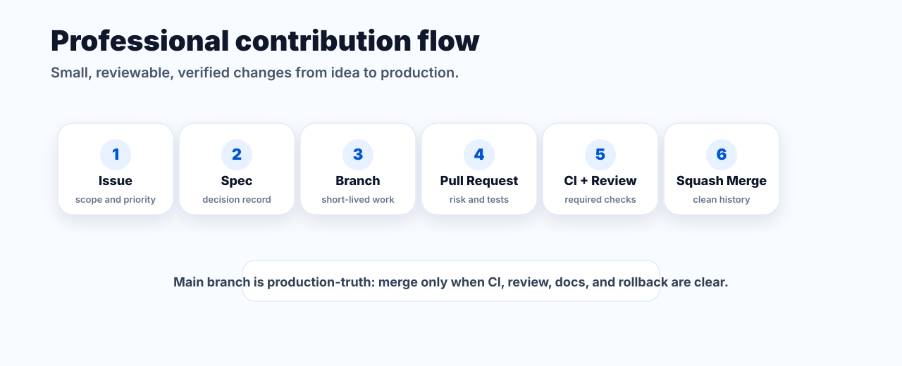
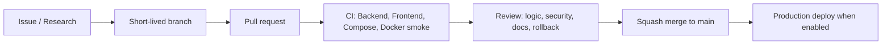

# GitHub governance

Tài liệu này là source of truth cho cách team vận hành GitHub trong repo `linhlinhlin/LMS_hohulili`. Mục tiêu là giữ nhịp phát triển nhanh nhưng vẫn có audit trail rõ ràng, giống cách các tổ chức lớn vận hành: mọi thay đổi đi qua issue/spec khi cần, branch ngắn, pull request nhỏ, CI bắt buộc, review có owner, merge sạch.

## 1. Operating model





Rules:

- `main` is the only integration and production-truth branch.
- No direct push to `main`.
- Prefer short-lived branches: `feat/`, `fix/`, `docs/`, `chore/`, `hotfix/`, or `codex/` for Codex-owned branches.
- PRs should be small enough to review with confidence. Split PRs larger than roughly 500 meaningful changed lines unless the change is mechanical.
- Use squash merge only for normal work so each PR maps to one auditable commit.

## 2. Roles and responsibilities

| Role | Responsibility |
|---|---|
| Project owner | `@meiiie` is the primary project owner for this repository and can make final product, architecture, merge, and governance decisions. |
| Repository owner/admin | GitHub repository owners and admins have full administrative authority over settings, rulesets, permissions, emergency merges, and rollback decisions. |
| Author | Defines scope, keeps diff focused, writes tests/docs, responds to review. |
| Reviewer | Looks for bugs, regressions, security risk, missing tests, and unclear rollback. |
| Code owner | Owns final review quality for critical paths listed in `.github/CODEOWNERS`. |
| Maintainer | Applies labels, resolves merge readiness, performs squash merge. |
| Agent | Can implement, audit, and propose comments, but cannot replace human ownership for risky decisions. |

Authority rule: if a policy conflict appears, `@meiiie` and repository owner/admins can make the final call. The decision should still leave an audit trail in the PR, issue, or runbook.

## 3. Issue lifecycle

New issues start with `needs-triage`.

| Stage | Required metadata |
|---|---|
| Intake | Type, area, priority, owner, reproduction or acceptance criteria. |
| Ready | Clear scope, non-scope, risk, and verification path. |
| In progress | Linked branch or PR exists. |
| Review | PR has summary, tests, risk, and docs notes. |
| Done | PR merged, issue closed, changelog/docs updated if needed. |

Do not use public issues for security vulnerabilities. Use `SECURITY.md`.

## 4. Label taxonomy

The canonical label registry is `.github/labels.json`. Sync it with:

```powershell
.\scripts\github\sync-labels.ps1 -Repo linhlinhlin/LMS_hohulili -Apply
```

Dimensions:

- `P0`, `P1`, `P2`, `P3`: priority and urgency.
- `type/*`: kind of work.
- `area/*`: product or architecture surface.
- `status/*`: workflow state.
- `risk/*`: extra review gate.
- `size/*`: review size.
- `agent/*`: AI-assisted implementation or review trace.

Apply at least one `type/*`, one `area/*`, and one priority label for non-trivial issues.

## 5. Pull request quality bar

A PR is mergeable only when all items below are true:

- CI is green: `Backend Tests`, `Frontend Build`, `Compose Validation`, `Docker Smoke Test`.
- Review conversations are resolved.
- At least one reviewer approved.
- Code owner review is satisfied for critical paths.
- Risk and rollback are clear in the PR body.
- UI changes include screenshot or browser verification notes.
- Runtime, deploy, API, migration, role, payment, video, or PWA changes update the relevant docs.
- Vietnamese user-facing copy has correct accents and professional meaning.

Blocking review comments use this severity convention:

| Severity | Meaning |
|---|---|
| P0 | Must fix immediately. Blocks production or security. |
| P1 | Must fix before merge. Core behavior or data risk. |
| P2 | Should fix before merge unless maintainer explicitly accepts risk. |
| P3 | Non-blocking improvement or polish. |

## 6. Branch protection target

Recommended settings are versioned in `.github/rulesets/main-protection.recommended.json`. Owner/admin should apply them from GitHub Settings because these rules can block the team.

Required branch rules for `main`:

- Require pull request before merging.
- Require at least 1 approval.
- Dismiss stale approvals when new commits are pushed.
- Require code owner review.
- Require approval of the latest reviewable push.
- Require conversation resolution.
- Require the 4 CI checks listed above.
- Require branch up to date before merge.
- Require linear history.
- Block force pushes and branch deletion.

## 7. Repository settings target

Recommended non-secret repository settings are versioned in `.github/repo-settings.recommended.json`.

Current known gap from the last audit:

- `deleteBranchOnMerge` is currently `false`.
- `mergeCommitAllowed` and `rebaseMergeAllowed` are currently `true`.
- Wiki is currently enabled.
- No custom Open Graph social image is configured.
- The current token has write access, not admin access, so Settings changes need the repository owner.

Use:

```powershell
.\scripts\github\audit-repo-settings.ps1 -Repo linhlinhlin/LMS_hohulili
```

## 8. Contributor experience

Contributor entry points:

- `README.md`: project overview and quick start.
- `CONTRIBUTING.md`: branch, commit, review, and verification rules.
- `CODE_OF_CONDUCT.md`: collaboration standard.
- `SUPPORT.md`: where to ask questions.
- `.github/ISSUE_TEMPLATE/*.yml`: structured intake.
- `.github/pull_request_template.md`: review-ready PR body.

## 9. Visual assets

Project-bound GitHub visuals are deterministic SVG assets under `docs/assets/github/`:

- `repository-card.svg`: social card and README visual.
- `contribution-flow.svg`: contribution workflow map.

Use SVG for repository identity, diagrams, and stable docs because it is versionable, accessible, small, and easy to review. Use generated bitmap assets only for marketing art or non-deterministic concept visuals.

## 10. References

- GitHub Docs: issue and pull request templates, https://docs.github.com/en/communities/using-templates-to-encourage-useful-issues-and-pull-requests/about-issue-and-pull-request-templates
- GitHub Docs: managing labels, https://docs.github.com/articles/labeling-issues-and-pull-requests
- GitHub Docs: CODEOWNERS, https://docs.github.com/en/repositories/managing-your-repositorys-settings-and-features/customizing-your-repository/about-code-owners
- GitHub Docs: rulesets, https://docs.github.com/repositories/configuring-branches-and-merges-in-your-repository/managing-rulesets/about-rulesets
- GitHub Docs: protected branches, https://docs.github.com/en/repositories/configuring-branches-and-merges-in-your-repository/managing-protected-branches
